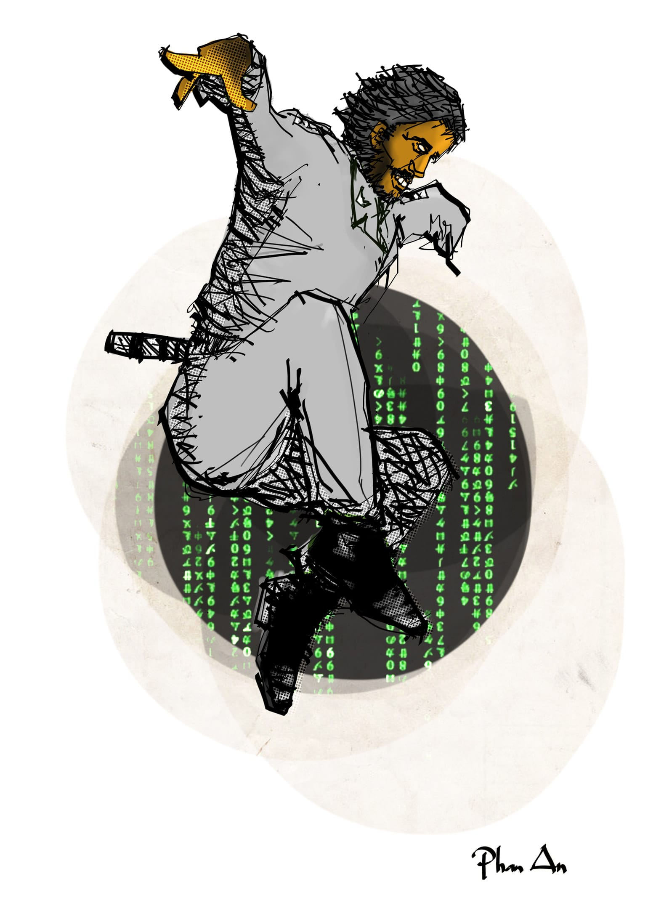

# 1

Tôi sẽ bỏ học.

Thật ra trên cái cõi đời ô trọc buồn tủi này, bỏ học không phải là một cái gì đó lạ lẫm. Từ giỏi đến dốt, từ bị thiểu năng hai cộng một bằng không cho chí thiên tài e bằng mờ xê bình, ai cũng có thể bỏ học. Ví dụ kinh điển: Steve Jobs, giám đốc đầu to của công ty Apple, bỏ trường cao đẳng Reed chỉ sau vỏn vẹn một học kì. Lão này giỏi chết mẹ. Tất nhiên bây giờ thì không chỉ mẹ lão mà đến lão cũng chết rồi, vì ung thư tuyến tụy hay lá lách hay tinh hoàn gì đó tôi không được rõ, vì dù sao lão cũng ở bên Mỹ. Lão chết vào một ngày mùa thu có lá vàng bay và một đống những đứa hôi nách ngồi khóc la ai oán rằng “Ôi vĩnh biệt Steve, cháu sẽ nhớ mãi bài hát _I just call to say I love you_ và băng đội trưởng Liverpool của anh.” Ví dụ kinh điển hơn: Bill Gates. Lão này đã cả gan đá đít một trường hoành tá tràng hơn nhiều tên là Harvard để thành lập Microsoft, sản xuất ra một chương trình máy tính dùng để điều khiển những chương trình máy tính khác, rất bá đạo, gọi là hệ điều hành, và vì đếm mãi không hết tiền mà nghiễm nhiên thành tỉ phú. Cái điên rồ là, thành tỉ phú rồi lão lại đem tiền đi mua thuốc chữa sốt rét vung vãi khắp nơi thế giới, và hệ quả tất yếu là ngày càng nghèo mạt đi, trong khi những thể loại sáng suốt là Cà Đô Lương và Cà Dái Dê của ta đã giàu lại cứ giàu lên mãi. Ví dụ kinh điển hơn nữa: Larry Ellison. Lão này bỏ học, thành lập Oracle, bạc lắm tiền nhiều, rồi nhảy vào lễ tốt nghiệp của trường người ta mà chửi um lên rằng “bên trái mày là đồ ăn hại bên phải mày là đồ ăn hại mày cũng là đồ ăn hại lũ chúng bay ăn hại cả lũ” và bị bọn bảo vệ có võ Giu-đô hăng hái nhảy lên đánh cho lòi kèn. Ví dụ kinh điển nhất và gần gũi nhất: thằng Thu hàng xóm của tôi hồi nhỏ, biệt danh âu yếm bạn bè đặt cho là Thu Đạm, bỏ học cấp hai trường Kim Đồng gần nhà vì không cùng chung lí tưởng với cô Hà hiệu trưởng. Sau khi dứt áo cùng cô phân nỗi niềm Nhất Linh đoạn tuyệt, nó cùng với thằng bạn chí cốt là Hưng Beo, hai thằng lựa nhà một cặp vợ chồng mới cưới, nửa đêm trèo lên mái nhà cạy ngói dòm xuống, vừa nhai bắp rang đựng trong một cái hộp, lại hút nước ngọt trong bịch nghe rồn rột, vừa bàn tán quả này bự quả kia to, và cười hí hí rất là một nhẽ vui tươi. Bên dưới, anh chồng đang hì hà hì hục dô ta dô hầy theo điệu hò kéo pháo Điện Biên thì tự nhiên chột dạ, vứt chị vợ tô hô ra đấy mà vác nòng pháo chạy ra nhìn lên trời đầy sao và gào to lên rất ai oán rằng “Giang ơi Giang ra đi!” “Em dang nãy giờ mà anh?” “Ra đây trời ơi tụi hắn thấy hết trơn rồi!” Như chỉ đợi có thế, đồng bào hàng xóm của ảnh vốn thao thức áp tai vào tường từ lúc chạng vạng nay nhất loạt bật đèn sáng choang và cầm cuốc thuổng gậy gộc xông ra, riêng ảnh cũng quấn ngay ngang lưng một cái khố, đội lên đầu cái mũ đỏ, tay cầm khẩu búa quyết phen này giết tươi chằn tinh, nhảy lên đội gạch lấy tiền và ăn nấm cứu công chúa. Hưng Beo thấy sự chẳng lành liền quăng bịch bắp, lật đật nhảy xuống, bèn gãy giò và bị chó cắn vào mông, xuyên qua hai lớp quần có lẻ, còn Thu Đạm thì với tay bám được vào hàng rào, như ninja, và nhanh chân tẩu thoát. Nhưng sự tẩu thoát của nó là một sự rất tạm thời, vì bác Tư Bề đội trưởng đội dân phòng chuyên nghiệp[^1] khu phố bốn đã lôi Hưng Beo còn đang ôm cái chân gãy cà lê cà lết vào đồn, ấn nó ngồi xuống cái ghế, rồi ôn tồn hỏi:

“Con đi một mình hay đi với ai?”

“Tui đi một mình. Ông đừng có dụ tui chi mất công, tui ăn bắp rang no bụng rồi không thèm cà lem của ông mô.” Hưng Beo khẳng khái đáp. Vì tất nhiên, nó là dân cô hồn các đảng, nó vừa xăm mình, vừa để tóc dài mà lại còn kẹp tóc bằng dây chun hồng, mà luật của dân cô hồn các đảng không cho phép nó phản bạn, cho dù đó là một thằng bạn kết nghĩa chó ỉa ba cục xin một cục không cho còn đòi năm tiền, ban nãy đã giành mất chỗ dòm rõ hơn, và khi từ hàng rào nhảy xuống còn giẫm vào lưng nó như giẫm lên con thú nhún, rồi bật nẩy vào bóng đêm mất dạng. Nếu hai tay nó không bị trói quặt ra sau lưng thì chắc Hưng Beo cũng đã ráng vỗ bàn một cái lấy thêm ít thớ. Nhưng khốn nỗi tay nó bị trói bốn vòng bằng cuộn dây gai chuyên dùng buộc lợn, lại móc khuyến mãi thêm cho cái còng vào thành ghế, nên chi Hưng Beo đành phải bằng lòng với việc trợn đôi mắt hí lên như Trương Phi, rồi nháy lia nháy lịa cho đỡ cay đôi mắt hí, vậy thôi. 

Thấy Hưng Beo trợn trạo hoành tráng quá, bác Tư Bề có vẻ chột dạ. Bác bèn ưu tư nghĩ suy dễ đến hai phút, trên trán bác hằn lên những nếp nhăn của âu lo, ở hai khóe mắt bác những dấu chân chim tuổi tác hiện ra càng rõ rệt. Thế rồi lẳng lặng, bác trở tay trái tát vào má thằng Hưng Beo một phát kêu “bốp,” lại trở tay phải dộng đầu nó vào tường một cái kêu “uỳnh,” làm cái tờ lịch có hình Diễm Hương bá cổ Lý Hùng đứng bên xe hơi trước ngôi nhà lầu[^2] rung rinh chút đỉnh. Xong rồi bác nhẹ nhàng hỏi lại:

“Con ngoan nói cho bác nghe, con đi một mình hay đi với ai?”

“Dạ thằng Thu... hu hu, thằng Thu...” Hưng Beo vừa khóc vừa ngoẹo cổ dùng vai lau máu đầu đang chảy thành dòng xuống cái má sưng vù, bệu bạo trả lời.

“Xóm mình có mấy thằng Thu lận, ý con là Thu nào?” Bác Tư Bề dịu dàng hỏi tiếp. Về tính kiên nhẫn thì không ai trong tổ dân phố này có thể bì với bác, người ta nói đó là nhờ bác xăm chữ Nhẫn trên vế và chữ Tâm giữa háng, nhưng đó chỉ là một trò đùa cũ rích rẻ tiền của những tụi cu cợ. Thật ra ngày xưa bác đã từng làm thầy giáo nuôi dạy trẻ, cũng đút bột cho con nít, tắm cho tụi nó bằng chân, và đem công an ra dọa cho chúng nó tè ra quần như ai. Sau thì số phận đẩy đưa, bác chịu hết thấu chuyện lũ con nít vô giáo dục cứ ngày ngày tè mục cả quần bác, nên quyết định bỏ cái nghề hèn mọn ấy mà xung phong vào lực lượng dân phòng. Với kinh nghiệm và bản lĩnh đối phó với các cháu nhi đồng cũng như đánh nhà báo vêu mõm được vài bận, bác lại nhân dịp Trung Thu đem biếu cấp trên được một con chó đẹp, nên chẳng mấy chốc mà bác được nhân dân tin yêu, bầu lên làm đội trưởng. Cỡ Hưng Beo thì còn khướt mới chơi trò tâm lí chiến với bác được, nên nó chỉ còn cách mếu máo: 

“Dạ thưa bác, Thu Đạm...”

“À, Đạm hả con? Này thì Đạm!” 

Nói rồi bác Tư Bề nhảy lên lơ lửng trên không, như Người Được Chọn trong phim Ma Trận, trời hốt nhiên tối sầm, số màu xanh từ đâu rơi xuống xung quanh bác tồ tồ như thác Bản Giốc nhánh nhỏ, rồi bác dùng một thế võ cổ truyền vật thằng Hưng Beo ngã ạch đụi, gãy nốt cái chân kia, chống cùi chỏ bò tới bò lui trong đồn. Hai hôm sau, khi nó đang nằm bệnh viện với cả hai chân bó bột trắng phếu và khởi sự viết thiên phóng sự “Một chuyện chép ở bệnh viện” thì bác Tư Bề đã trùm mền phục kích và tóm được Thu Đạm đang ngồi ngỏng cổ chơi Tenchu – Ninja Báo Thù và hét “Chém nó đi! Hiếp nó nào! Ối ối!” ngoài hàng bà Thanh đầu hẻm. Nghe nói để trừng trị tính tà dâm của Thu Đạm, bác Tư Bề đã bình tĩnh trói nghiến nó lại, tụt quần nó xuống, búng con chim tuổi dậy thì của nó cho ngỏng lên, xong nhét vào ống bô xe Cup 50, tra chìa khóa vào ổ, đạp nổ lạch bạch và vặn ga suốt từ sáng đến chiều, mặc cho thằng chủ chim nó kêu thành đủ ba mươi hai loại nhạc cụ. Sau hai tháng ròng rã miệt mài đi chàng hảng và đái ngồi, Thu Đạm có thêm một nghệ danh rất gợi hình và hợp lí là thằng Thu Cu Đen. Thu Cu Đen lớn thêm một tí nữa thì phạm tội hiếp dâm một con bé nghễnh ngãng, cà lăm, lưng có bướu, sống một mình ở đầu chợ và hay đi vẩn vơ bới xác mía ăn. Nó bị tống vào trung tâm cải tạo thiếu niên hư hỏng, cho dù giữa phiên tòa lưu động ấy nó đã cố sống cố chết thanh minh đến cạn khô nước bọt rằng do lúc ấy trời tối như cái tiền đồ ông Ngô Tất Tố nên bị cáo đã hiếp dâm nhầm người, rằng thà như sáng rõ thì có bị tử hình bị cáo cũng tâm phục khẩu phục. Từ bấy đến nay không ai gặp lại Thu Cu Đen nữa, chỉ nghe nói phong thanh là cải tạo thành công nó đã đi buôn ma túy vùng biên giới và sau khi tích cóp một số vốn kha khá đã trở thành một doanh nhân thành đạt, hiện đang là chủ một chuỗi nhà hàng thịt rừng đâu trên Kon Tum Đắc Lắc, có cả bụng phệ và cạc vi-dít ghi tên tiếng Anh là Mr. Black Bird Falls, nó lại bỏ tiền triệu ra thuê một đội lập trình viên máu mặt để xây dựng nguyên một cổng thông tin điện tử được cập nhật từng phút ở địa chỉ _thudam.com.vn_, và noi gương thần tượng American Got Idols là Bill Gates, nó đã tài trợ cho chừng hai trăm đứa sứt môi trên khắp ba miền đất nước được phẫu thuật và nở nụ cười tự nhiên. 

Nhưng cái vấn đề ở đây là, những vị anh hùng tôi vừa đề cập đến trên đây đều bỏ học một cách hoàn toàn tự nguyện. Steve Jobs cảm thấy trường học không dạy được gì ra hồn cho lão, lão bảo ta là thiên tài rồi, học hành làm gì nữa cho tốn cơm, thôi ta đi chế máy nghe mp3 đây, thế là lão bỏ. Bill Gates cũng thế. Larry Ellison cũng thế. Thu Đạm càng thế. Chẳng may, tôi không được cái vinh quang ấy. Tôi bỏ học sau khi bị đình chỉ. Chẳng qua, có học tiếp thì sớm muộn tôi cũng sẽ bị tống cổ ra khỏi trường mà thôi.

Nói chung là ngay lúc ấy, tôi quyết định bỏ học.

  

[^1]: Nói chuyên nghiệp là để phân biệt với đội dân phòng nghiệp dư chỉ mặc áo xanh, tay cầm cù nèo, nửa đêm đi ngang qua nhà dân móc xoài trên cây xuống ăn.
[^2]: Nếu các bạn còn nhớ, đây là ví dụ kinh điển của tất cả các thể loại lịch treo tường thời ấy, cùng với hình Việt Trinh tay sờ vành mũ cói đứng chúm chím một mình dưới gốc cây và Lý Thu Thảo chống nẹ cười tình với con ngựa bên luống hoa tu-líp.
