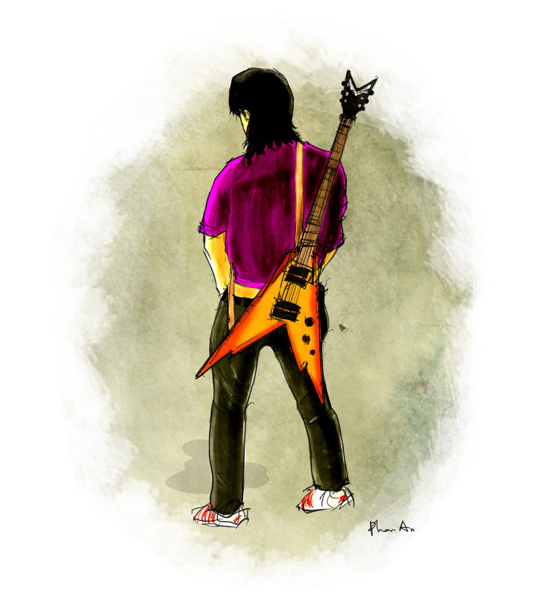

# 144

Đằng kia, thằng Kiên mũi gãy bên lớp A3 đã đứng lên và đang ra sức giải thích rằng hai ngày để vẽ bài quả thật là không đủ, nên chi cái việc bọn em đã làm quả thật là vạn bất đắc dĩ, lại nên chi theo các điều luật của nước Cộng hòa Xã hội Chủ nghĩa Việt Nam, bọn em đáng được hưởng tình tiết giảm nhẹ, đó là chưa kể ông nội em là liệt sĩ kì cựu trong ngành, đến nay đã được dễ bốn mươi năm liệt sĩ rồi. Nó hùng biện rất hay, như Gymnastoras. Các thầy lắng nghe màn hùng biện của nó với một vẻ dửng dưng, như những gốc cây cổ thụ. Tôi thì nhìn con nhện đang bám gần cửa sổ mà tự nhủ không biết nó kiếm đâu ra ruồi mà ăn trong cái phòng máy lạnh bít bùng này. Có thể nó cũng như tụi tôi, chật vật trầy trụa, cố gắng sống sót qua từng con trăng bằng một cách thức huyền bí nào đó chăng.

Nhưng thôi, trở lại với cái bài đồ án. Chuyện con nhện là chuyện lâu dài, vả nó vẫn còn toòng teng ở đó, muốn kể lúc nào cũng được. 

Khi tôi cũng đang nháo nhào cùng chúng bạn thì lão Bàng xuất hiện. Lão cùng quê với tôi, học trên tôi hai khóa nhưng lại thi năm lần mới đậu, thành ra lão hơn tôi đến bảy tuổi. Tôi quen lão nhờ một lần đi ké xe về quê. Nếu bạn là sinh viên, hoặc đã từng qua quãng đời sinh viên chính cống – tức là ở Việt Nam, trong một trường đại học Việt Nam – hoặc bạn là một thằng cha đi từ Quảng Ngãi vào Sài Gòn để ban ngày đi đánh giày, ban đêm bán dạo trứng cút với chả bò hai bên bờ kè, thì hẳn bạn biết về vấn nạn tàu xe ngày Tết. Năm hết Tết đến, người ta ùn ùn về quê để mặc đồ mới đi lên đi xuống trong xóm và sà vào mấy bàn bầu cua đặt hươu đặt nai. Khốn nỗi, ở nước ta hiện nay người mê bầu cua thì nhiều mà lượng tàu xe thì có hạn, nhất là khi dân vẫn ngửa cổ lên trời chờ đường sắt cao tốc đến phọt cả trái khế ra ngoài mà chẳng thấy tăm hơi đâu cả. Cho nên hằng năm cứ vào dịp tháng Chạp, các bến xe và ga tàu lại đông nghìn nghịt, người ta xếp hàng mua vé, người ta nằm ngồi la liệt, người ta chửi nhau như chưa bao giờ được chửi, trong khi đại diện hãng tàu xe cùng với đại diện bộ giao thông vận tải thì bá vai bá cổ nhau lên ti vi nói rằng năm nay về cơ bản đã giải quyết xong vấn nạn vé chợ đen, chúng tôi đã dùng sơn trắng quét tuốt luốt các loại chợ, giờ thì đừng hòng có chợ đen nữa nhé, goodbye chợ đen, you would never ask me why; và rằng mua vé ư thật là dễ dàng, bạn có thể mua vé trên mạng hoặc đến các đại lí trên cả địa bàn thành phố mà không hề để lại sẹo, tha hồ mặc xịp đi bơi cùng bạn bè khắp nơi ới, thế và xin cảm ơn kem nghệ Nazarel cùng với sơn Nippon đã tài trợ chương trình này. 

Năm đó tôi đã canh ngày còn hơn con gái canh tháng, đúng nửa đêm cái hôm bắt đầu bán vé trên mạng tôi đã xông lên trên trang web, gõ địa chỉ _staging.muavetau-nazarel-nippon.com.vn_ rồi gõ Enter cái “cộp” rất ngầu. Nhưng tôi không thấy bán vé gì sất, tôi chỉ thấy cái hàng chữ “Connectons too much, nazarel, please came back when latter, nippon” màu đỏ cứ vừa chạy ngang vừa nhấp nháy trên nền trắng, cùng với giọng một con mụ rỗi hơi cứ hát inh ỏi rằng “Ngày hôm nay thênh thang con đường lớn, tàu anh đi trong yêu thương chào đón” xen lẫn với tiếng còi tàu thỉnh thoảng lại tu tu, cùng với những tiếng thét vang vang khó hiểu mà tôi đồ rằng là của những thằng cu cợ bị tàu cán chết dẹp giữa đường ray. Thế là tôi liệng con chuột vào mặt thằng chủ hàng Internet mà chửi nó là đồ lừa đảo khốn nạn, rồi không trả tiền mà cứ thế lót tót chạy ra ga. Nhưng cho dù đã cầm cái ghế xúp mà lăn lộn ở nhà ga suốt ba đêm liên tục, mắt đỏ đòng đọc như mắt cá chép, mồm nhô má hóp như con cá ngão, tôi vẫn không kiếm được tấm vé nào. Đúng lúc tôi định ra bưu điện gửi thư tem thông báo cho gia đình rằng Tết này nhà ta không chừng sẽ thiếu một chân uýnh phỏm đấy, thì Quang Tèo bảo nó có quen một ông anh cùng quê với tôi, nhà rất giàu, làm tập đoàn khách sạn, có xe hơi riêng, rằng Tết này ổng đi xe hơi về quê, xe còn thừa chỗ, và rằng nó có thể xin cho tôi đi ké hoàn toàn miễn phí. Thấy tôi có vẻ chần chừ e ngại, nó bảo vứt mẹ cái sĩ diện giẻ rách của mày đi, mày muốn ngồi ghế nệm xe hơi máy lạnh ngửi nước hoa hay muốn chui hố xí xe lửa ngửi cứt, mà ông anh tao lại rất phóng khoáng chịu chơi, này nhé đây chỉ là đi ké xe thôi, ổng mà cao hứng thì có thể cho mày nguyên cả cái xe không tiếc. Thế là tôi gói ghém quần áo, cuộn cả tấm thư pháp “Vạn sự như ý” của thằng Hưng Sẹo lại mà đi nhờ xe nhà lão Bàng cùng với lão và ông anh họ lão, dọc đường cứ sờ tới sờ lui tấm thư pháp mà thầm nguyện cầu cho cái hứng của lão cao lên. 

Cuối cùng thì Trời Phật cũng thể theo ý nguyện của tôi, cái hứng của lão Bàng cao lên thật. Trời Phật lại hào phóng bổ sung thêm cho cái hứng của thằng cha tài xế và ông anh họ lão cũng cao nữa. Khoảng giữa trưa thì đi đến chân đèo Cù Mông, xe đang bon bon đột nhiên thắng “két,” đánh một vòng chữ U, tấp vào một cái quán lợp lá lụp xụp bên đường. Thấy ba người oai vệ xuống xe bước vào, lão Bàng còn quay lại ngoắc “Vô đi cu,” tôi cũng chân thấp chân cao lọt tọt bám theo, mồm hỏi “Ăn cơm gà hả anh? Ăn mì bò hả anh?” Nhưng hóa ra không phải. Thay cho hai món đặc sản ấy, có hai con mụ trạc ba mươi tuổi đang ngồi quanh chiếc chiếu rách chơi xóc dĩa với hai thằng cha hộ pháp mặt mày bặm trợn, trước bức tượng phật Di Lặc đang phễnh bụng cười hề hề. Một mụ mặc cái áo bà ba màu tím hoa cà, người gầy đét, cao dễ phải đến hai thước, răng hô một thước ra phía trước và một thước xuống dưới, tức là chiều dài răng bằng một căn bậc hai thước, mắt lại lác thiên lác địa. Mụ kia người lùn tịt, mặc cái quần jean bó cặp đùi núng nính và cái áo thun xanh lơ, cái mặt bự xự những phấn là phấn nhẫy nhụa mồ hôi. Thấy chúng tôi bước vào, hai mụ lập tức chồm dậy và lao về phía chúng tôi như hai con chó sói bị bỏ đói lâu ngày, các mụ không mặc xú chiêng, thành ra hai cặp vú dài thượt như mấy quả cà dái dê cứ quăng qua quăng lại, đũng quần các mụ ướt chèm nhẹp, tôi không biết nước chảy từ ngọn nguồn nào ra mà ruồi xanh bay theo thành từng đàn, vừa bay chúng nó vừa kêu vo ve xem chừng hí hửng. Lúc ấy tôi hốt hoảng nhảy qua một bên để tránh, còn lão Bàng thì đã dợm bước chân trái lên, nhưng thằng cha tài xế và ông anh họ của lão đã nhanh tay hơn, mỗi người cắp tay một mụ, hỉ hả đi ra chái sau. Thấy tôi với lão Bàng đứng tần ngần ở đó, một trong hai thằng hộ pháp hỏi:

“Răng hai anh không chơi?”

“Dạ em không biết chơi” Tôi rụt rè nói.

“Còn con mô mô mà chơi?” Lão Bàng thất vọng nói.

“Chơi em nề hí hí” Thằng hộ pháp kia đang xọc tay vào quần tự nhiên ngỏng lên cười duyên, nói.

“Thôi con lạy mợ” Lão Bàng ngao ngán nói.

“Không chơi thằng em em thì thôi, để em kêu con ni cho anh chơi. Hắn ngon lắm, múp rụp. Gấp mấy lần hai con tê.” Thằng hộ pháp đầu tiên nói.

“Rứa thì chơi” Lão Bàng hí hửng nói.

Thằng hộ pháp bèn bước ra đường và biến mất, để lại lão Bàng cứ nhấp nha nhấp nhổm nhìn ra cửa. Chừng mười lăm phút sau hắn quay trở lại cùng một con mụ. Con mụ này quả thật gấp ba lần hai mụ kia gộp lại, nếu tính về mặt thể tích. Mụ khoảng gần năm chục tuổi, tóc đã lốm đốm hoa râm, da đã bắt đầu điểm đồi mồi loang lổ, giá mụ không đi bộ mà ngồi chồm hổm nhảy chụm hai chân thì ắt hẳn người ta tưởng nhầm là một con cóc ghẻ vĩ đại. Mụ thở hào hển, mồ hôi mồ kê nhễ nhại, bốc mùi như nồi cám lợn mà xem chừng mụ đã bỏ dở trên bếp để ba chân bốn cẳng chạy đến đây. Cái bụng mụ béo phệ, to một cách thậm phi lí, vẫn còn phập phồng lên xuống, và mụ nhìn chúng tôi đắm đuối như nhìn đấng Sáng Thế, qua đuôi mắt rẽ chân chim chằng chịt của mụ ngời lên hàng trăm hàng vạn những tia hi vọng vầng dương tỏa sáng khó có thể diễn tả hết bằng lời. Thấy tôi lúng túng ngó ra chỗ khác, mụ hơi cụt hứng, bèn quay sang lão Bàng lúc này mặt mày như cái bị rách, lấm lét nhìn lão với một vẻ thẹn thùng quái dị. 

“Chơi không anh?” Hồi lâu mụ sè sẹ đánh tiếng hỏi.

“Chi như bà nội tui rứa mà chơi cái chi” Lão Bàng ngán ngẩm trả lời. 

“Anh nói kì hè, chơi thì chơi thôi răng phải nói em như bà nội hè. Mà chơi thì chơi cái nớ chớ còn chơi cái chi nữa hè.” Mụ cười ngượng ngập. Nụ cười vẽ lên trên cái mặt chè bè mốc meo của mụ thành một cảnh tượng vô cùng tởm lợm và quái gở, hơn cả nụ cười của đức Di Lặc vẫn đang ngồi nhe răng giữa mấy ngọn đèn xanh xanh đỏ đỏ chớp chớp trên nền nhà. 

“Thôi không chơi” Lão Bàng dứt khoát nói.

“Con em đang đói anh ơi, em không có sữa. Chồng em cũng đói, em cũng không có sữa anh ơi. Chơi em đi anh, em giảm giá cho còn hai chục ngàn.” Mụ khẩn khoản van nài, mắt mụ đẫm lệ. Những tia hi vọng đã vụt tắt ngóm như ánh nắng cuối chiều, hai con mắt mụ trở nên lờ đờ đằng sau mấy sợi lông quặm đầy rỉ nhèm, như mắt người chết trôi trên sông những năm trời lụt to.

Hình như chỉ đợi nghe có thế, lão Bàng vội vàng nhét hai chục ngàn vào tay mụ. Và hình như cũng chỉ chờ có chừng ấy, mụ vội vàng nhét tờ tiền vào cạp quần rồi quay đít đi, chắc đi mua sữa cho thằng chồng, cặp mông to như hai cái lồng bàn của mụ lúc lắc phải-trái, phải-trái. Vừa may lúc ấy thằng cha tài xế đã xong ca, đang cùng với mụ áo tím đi ra, mặt mũi hắn vừa bơ phờ vừa thỏa mãn. Như một chiếc xe tăng, lão Bàng liền rồ máy, quay xích sắt, xịt khói từ sau lưng, giương nòng, xình xịch lao đến mụ áo tím. Nhờ có bản năng nghề nghiệp đã thấm sâu và tuôn chảy trong máu từ thời hồng hoang hồng bàng hồng xiêm hay hồng lâu mộng gì gì đó, mụ hiểu ý ngay, liền lấy gót chân phải làm trụ, lấy mũi chân trái làm điểm đỡ, quay người sang phải một góc một trăm tám mươi độ, bước đi. Thằng cha tài xế lật đật dặn với theo: 

“Nhớ nói hắn rửa đít cho sạch Bàng hỉ.”

“Rửa đít cho sạch em hỉ.” Lão Bàng ngước lên dặn mụ áo tím, mụ nhìn xuống cười thấu hiểu, nhìn hai người như trong hình quảng cáo thuốc đánh răng, hàm răng mụ như muốn vồ vào chóp đầu của lão, rồi hai người khuất dạng đằng sau tấm liếp. Ngồi bên ngoài, tôi nghe tiếng nước chảy tỏng tỏng, rồi những tiếng da thịt đập vào nhau phành phạch, tiếng đầu giường tông vào cánh liếp bồm bộp, tiếng lão Bàng thở hì hà hì hục, và tiếng con mụ kêu la vang trời, ban đầu còn chậm, sau nhanh dần, lúc khoan thì như gió thoảng ngoài, lúc mau lại sầm sập như trời đổ mưa, thật là không thua kém một bản giao hưởng hào hùng nào của đoàn ca múa nhạc trung ương có các thể loại kèn trombone trumpet saxophone kèn đồng kèn lá chuối kèn Trần Mạnh Tuấn ò e. Thằng cha lái xe mới đầu còn gật gù ngồi nhịp một chân, sau lão đạp pedal đôi hai chân, tay lão vung vẩy đánh cắc tum và xèng, sau cùng thì chân cẳng bấn loạn không nhịp kịp, lão đành ngồi thõng ra mà trố mắt, chặc lưỡi: 

“Thằng Bàng ngó roi roi rứa mà kinh hè.”

Hai mươi phút sau thì chúng tôi đã an tọa trên xe. Lão Bàng lim dim mắt khoan khoái, nói “Cha cái bụ, hắn lắc như con lắc đồng hồ. Mà cái con hắn kêu mới đã chớ, như thiến heo.” Và lão cao hứng tới mức cứ đi một chút lại bắt xe dừng lại để vừa đứng đái bên vệ đường vừa ca hát ỏm tỏi. Nhưng tuyệt nhiên lão không đả động gì đến việc cho tôi chiếc xe. Thằng Quang Tèo chỉ bốc phét. 

Như thế, lão Bàng xuất hiện đúng lúc tôi đang ngồi bệt trên vỉa hè uống cà phê mà tâm trạng rối nùi. Lão để tóc dài đến vai, mặc cái quần jean bạc rách lòi cái quần tà lỏn màu cháo gà bên trong nhìn rất lãng tử, kết hợp với áo thun cổ lá trầu màu tím – vì rằng kể từ đợt về quê ấy lão đâm ra mê màu tím cũng như thích bài hát _Ngàn thu áo tím_ do ban nhạc Deep Purple trình diễn. Lão hất đầu qua một bên để giữ trọn tóc người cho đẹp, rồi bắt đầu quờ tay trước mặt tôi, bộ điệu như đuổi ruồi. Nhưng tôi không động đậy.

“Rầu thì đi chơi gái” Đuổi ruồi một hồi, cuối cùng lão nói.

“Không có tiền” Tôi nói.

“Tau cho mượn” Lão nói.

“Em vẫn chưa biết chơi” Tôi nói.

“Chưa biết tau chỉ cho dễ lắm” Lão nói.

“Bài đồ án chưa xong” Tôi nói.

“Rứa thì vẽ nhanh lên” Lão nói.

“Vẽ không kịp” Tôi nói.

“Không kịp thì cạo đi” Lão nói.

“Cạo là cái chi chi em không biết” Tôi nói.

“Không biết tau chỉ cho dễ lắm” Lão nói.

Thế là lão chỉ tôi cạo.

Để cạo bài, trước hết bạn phải kiếm được từ một thằng năm trên một cái bài cũ, điểm càng cao càng tốt. Cái bài này, ngoại trừ tên tuổi, mã số sinh viên, lớp khóa của thằng ấy sẽ còn có điểm, con dấu tròn của khoa, và chữ kí ông thầy chấm bài ở góc, cũng với các thể loại lời phê. Bạn sẽ dùng một con dao cạo, tỉ mẩn cạo tới cạo lui cho kì sạch mấy thứ ấy đi, rồi vẽ lung tung lên những là người và cây và xe hơi để che mọi dấu vết, cuối cùng đề tên của bạn vào rồi tươi tỉnh mang đi nộp. Rất đơn giản. Hóa ra cạo bài, cũng như chơi gái, theo cái cách của lão Bàng nói là một công việc đã có từ khi cái trường này được thành lập, nếu không muốn nói là từ thuở hồng hoang khai thiên lập địa. Lão nói cái sự tích bà Nữ Oa đội đá vá trời, hay nguồn gốc của những hình vẽ mắt hai bên thuyền độc mộc, hay chuyện quân sĩ nhà Trần xăm chữ Sát Thát lên cánh tay, chẳng qua đều là những ẩn dụ bóng gió xa xôi của việc sinh viên cạo bài, trải qua bao tháng năm vật đổi sao dời, bãi bể hóa nương dâu, qua hết miệng thơm đến mồm thối của những quân  bán nước và những phường cướp nước mới thành ra như ngày nay. Lão nói lão đã cạo năm lần như thế, cả năm lần đều trót lọt. Thậm chí có lần lão cạo một bài sáu điểm, khi chấm lại được chín, và cái thằng sáu điểm ấy, vì sự uất hận, đã chửi lão như con và toan đi tố cáo, cuối cùng lão phải đưa nó thêm hai trăm ngàn cho yên chuyện. 

“Tin tao đi, thần không biết quỷ không hay” Lão nói.

“Phép mầu” Tôi nói.

“Bách chiến bách thắng” Lão nói.

“Diệu ác kế” Tôi nói.

“Gia Cát tái sinh” Lão nói.

“Khổng Minh tái chế” Tôi nói.

Tôi lon ton đi tìm ông thầy Trạch. Ổng mở tủ sắt, lôi ra một bài thiết kế nhà hát được chín điểm của tụi năm ngoái. Nhưng ổng không đưa cho tôi vội. 

“Anh có chắc là anh muốn cạo không?” Ổng hỏi.

“Dạ em chắc thưa thầy” Tôi nói.

“Cái này năm ăn năm thua nhé” Ổng nói.

“Có ai biết đâu thầy” Tôi nói.

“Ai bảo anh thế? Hơ hơ.” Ổng cười phì qua lỗ mũi. “Cả cái trường này còn ai là không biết chuyện sinh viên các anh cạo bài?”

“Vậy hả thầy?” Tôi ngơ ngác hỏi. 

“Chứ còn gì nữa! Đợt đồ án nào xong lại chả có mấy chục anh đi xin bài về cạo. Các thầy biết cả đấy. Giống như khi các anh quay bài thôi, các thầy đứng trên bục các thầy nhìn thấy hết. Các anh tưởng các anh qua mặt được các thầy. Hơ hơ, các anh hơi bị nhầm. Trứng lại có đời nào khôn hơn vịt.”

Tôi chột dạ. Thì ra là thế. Chúng tôi là trứng, các thầy là vịt. Chúng tôi thì lăn lăn, các thầy thì vừa tắm ao, rỉa cánh, đạp chèo hồng, vừa mổ cho toác sọ. Thì ra là thế. Lão Bàng khốn nạn lại phét lác. Lão với Quang Tèo, hai anh em kết nghĩa phét lác đã thành tật.

“Vậy sao không thấy ai bị kỉ luật hả thầy?” Tôi lại hỏi.

“Chỉ tiêu. Hơ hơ. Hai chữ ấy thôi. Thế anh chưa biết à? Khỏi trả lời. Nhìn cái mặt anh là thấy anh đếch biết rồi. Chỉ tiêu, hai chữ ấy huyền diệu lắm. Không biết chỉ tiêu là gì à? Tưởng chỉ tiêu là cái loại chỉ khâu mổ trĩ à? Dốt! Hồi xưa các anh học được học sinh giỏi là nhờ đâu? Trường các anh thi tốt nghiệp đỗ chín mươi chín phẩy chín phần trăm đúng không? Khỏi gật, là nhờ đâu? Nhờ chỉ tiêu, chứ thi cử cái đếch gì mà siêu phàm thế, các anh cả thầy lẫn trò dốt như lợn, nước mẹ gì! Các anh mà giỏi thật như thế thì cái đất này nó đâu có đến cơ sự nghèo khó hèn mạt như bây giờ. Chỉ tiêu, cũng như cầu tiêu, là rất huyền diệu. Các thầy biết tỏng là bọn các anh làm trò gian lận, nhưng không đánh rớt các anh được. Vì đánh rớt các anh thì hụt chỉ tiêu. Trên sẽ hỏi: Dạy dỗ cái đếch gì mà để sinh viên mười thằng lại rớt mất bảy tám? Dạy kiểu lợn à? Các thầy sẽ bị đá đít khỏi trường. Nên phải giả mù sa mưa, nhắm mắt cho các anh đậu. Mà không phải chỉ riêng chuyện điểm số bài vở, nhé! Ví dụ, năm vừa rồi anh có nộp Đoàn phí không? Lại ngơ mặt ra đấy à? Anh còn đếch biết là có một thể loại phí là Đoàn phí đúng không? Tôi lạ đếch gì cái hạng các anh, lười như hủi, có bao giờ vác cái mặt tới trường đâu mà biết Đoàn phí với chẳng Đảng phí. Các anh thì biết đếch cái con mẹ gì về phí! Thế này, thằng Đoàn viên thì ở nhà ngủ khoèo, thằng chuyên cần đi học lại chỉ là Đội viên mốc mỏ. Cho nên năm vừa rồi các thầy thu Đoàn phí hụt mẹ nó cái chỉ tiêu. Hơ hơ. Hụt chỉ tiêu thì biết xử lí thế nào? Như anh thì anh xử lí thế nào? Đoán xem? Đấy, mặt lại đực ra như ngỗng ỉa. Nghe đây! Các thầy mới lấy tiền túi đắp vào, cho đủ chỉ tiêu Đoàn phí. Số tiền ấy, các thầy sẽ cạo lại các anh sau. Thấy huyền diệu chưa? Tôi đã bảo rồi, chỉ tiêu, cũng như là cầu tiêu, chính là những chữ huyền diệu lắm!” 

Ổng ngừng lại, thò tay móc mũi búng “tách” một phát, rồi nói tiếp:

“Anh muốn cạo bài thì tôi đưa bài cho anh cạo. Tôi chẳng tiếc gì anh tờ giấy bỏ đi. Nhưng tôi báo trước, kì này đang có động. Anh có làm gì thì cũng phải cẩn thận kĩ lưỡng. Có biến thì phải gọi tôi ngay, để tôi còn liệu đường mà cứu. Thôi bài đây, giờ thì cút!”

Ôi mặc kệ đời, tới đâu thì tới. Tôi ôm bài về. Lão Bàng đã chống cây chổi đợi sẵn nơi cửa như hòn vọng phu, liền sử dụng sức mạnh của kinh nghiệm, rút dao cạo giấu trong túi quần ra cạo khí thế. Lão chổng mông xoay bài ngang dọc, hết cạo tới lại cạo lui, phồng mồm ra sức thổi bột giấy phù phù. Xong lão lúi húi pha màu, lão trộn nguyên một lọ xanh cô-ban với một lọ đen thành một cục đặc sệt mà lão dùng để phệt vào bài từng mảng từng mảng, che hết những dấu giấy rách, rõ là vô cùng chuyên nghiệp. Chừng một tiếng sau, cái bài xinh tươi mĩ miều từ của một thằng Nguyễn Duy Hoàng ất ơ nào đó đã đường hoàng trở thành bài của tôi, có tên tôi to đùng chễm chệ. Trong cơn hứng chí lão còn định ghi thêm “Bài được hân hạnh cạo bởi Lê Bàng” nhưng may tôi can kịp. Lão đứng lên, phủi phủi đít quần, hất đầu qua một bên để giữ trọn tóc người cho đẹp, rồi nói: 

“Xong rồi hỉ.”

“Giờ đi chơi gái hả anh?” Tôi hỏi.

“Giỡn mi thôi chớ dầu sôi lửa bỏng ni mà gái gú cái chi chi. Chừ tau phải qua cạo giùm cho cu Quang Tèo nhà mình.” Lão nói.

“Xong rồi chơi gái?” Tôi lại hỏi.

“Không, xong Quang Tèo tau lại cạo cu Hải Lẹo” Lão nói.

“Xong Hải Lẹo thì chơi gái chứ?” Tôi vẫn chưa hết hi vọng.

“Không, xong cu Hải Lẹo tau lại qua cạo giùm cho tụi A3. Cu Kiên mũi gãy nhờ tao từ hôm qua rồi.” Lão nói “Mà cái thằng, làm trai cho đáng nên trai, không học hành thì thôi, đã lỡ học hành thì chí thú học hành. Mi suốt ngày nghĩ chuyện chơi gái như rứa thì rớt bài là phải rồi, không có oan ức chi mô na. Thôi tau đi đây, rứa hỉ.”

Thế là, hất cái đầu qua một bên để giữ trọn tóc người cho đẹp, lão đi.

Tôi vẫn chưa được chơi gái. 
