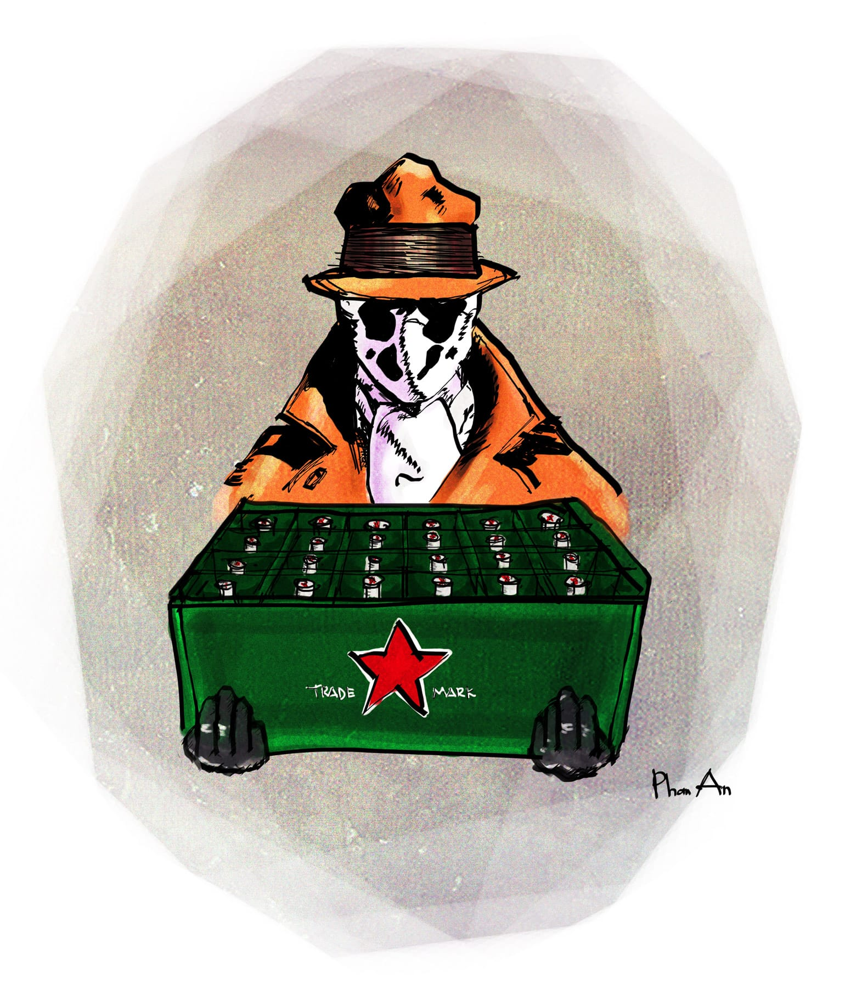

# 2

Với tôi nữa là hai.

Sau cú đập bàn dách lầu của lão thầy Hợi trưởng khoa, tôi biết là mọi sự đã an bài. 

Vì ai cũng biết rằng lão giỏi đập bàn lắm. Tay lão to như cái quạt tai voi, lại được ông trời thiên vị phú cho nhiều hơn con người ta một ngón, móng tay lão nhét đầy đất, đen ngòm ngòm. Nhờ cả số lượng lẫn chất lượng đều vượt tiêu chuẩn như thế nên mỗi lần lão đập bàn là một lần có sự nghiêm trọng xảy ra cho các bên quan hệ. Nghe đồn lần đầu tiên lão sử dụng món võ khí tuyệt diệu ấy là khi lão còn làm phó khoa. Lần đó, vì cái đập bàn của lão mà ông thầy Tứ trưởng khoa rớt chức – nhân tiện đây, bạn đừng nhầm ông thầy Tứ với ông thầy Tư, ông thầy Tư là một ông thầy khác với ông thầy Tứ từ ngoại hình cho đến tính cách, một lúc nào đó rảnh rỗi tôi sẽ kể cho bạn nghe về ổng. Ông thầy Tứ đẹp trai, vui tính, ga lăng, xung phong nâng đỡ một bà cô mới tốt nghiệp trong những bước đầu chập chững vào trường. Chẳng biết ổng hứng hoa và nâng trứng của bả thế quái nào mà một hôm bỗng dưng bả dắt một thằng nhóc vào trường, mặt thằng nhỏ với mặt ổng nói như Hải Lẹo là “giống nhau như hai hòn dái,” và bước thằng nhỏ đi cũng chập chững không kém gì bả. Thế là trường tổ chức một cuộc họp kín để giải quyết cái sự chập chững trùng hợp rất là mầu này. Nghe nói trong cuộc họp đó lão Hợi ngồi im lìm, đủng đỉnh dùng ngón tay thứ mười một đầy cáu ghét ngoáy mũi một hồi, rồi xuất kì bất ý rút tay ra khỏi mũi với tốc độ Rurouni Kenshin rút kiếm, đập xuống bàn một phát như người ta đập ruồi, rung chuyển cả phòng họp, bụi tung mịt mù, và quát lên:

“S-s-sao mà để vậy được? C-c-c-ô với thầy là giảng viên mà lại làm trò m-m-mèo mả gà đồng như vậy à? Còn m-m-mặt mũi đâu mà dạy dỗ sinh viên nữa?”

Đang ra sức bào chữa cho mình một cách rất hăng hái và quả quyết rằng Billie Jean ấy không phải người tình mà Billy The Kid cũng đếu hề là my son thì bỗng dưng bị phát đập trời giáng như sét đánh ngang mày, ông thầy Tứ mất hết cả hồn vía, bèn chuyển sang chế độ run lập cập mà bắt đầu nói nhảm rằng chính ổng là Bill Clinton cùng với Monica là một cặp uyên ương trên bàn làm việc đây. Sau đó ít ngày, trường ra quyết định thuyên chuyển công tác ổng về một nơi nào xa xôi lắm. Hôm đó người ta thấy ổng chập chững ra khỏi trường, mặt mày có vẻ thiểu não u sầu. Còn lão Hợi thì nghiễm nhiên chập chững lên làm trưởng khoa. Tin đồn về cú đập bàn của lão từ đó lan ra bốn phương tám hướng, nhanh như một cơn dịch hạch. Có đứa ác mồm còn đặt tên nó là “cú đập rớt chức.” Được thành công cổ võ, lão bắt đầu ra sức luyện chiêu đập bàn thành kinh điển. Nghe bảo lão đập khắp mọi nơi, trên giảng đường, trong phòng làm việc, trước sảnh, trong nhà xe, trong phòng ngủ, cả trên mông mụ vợ. Thậm chí khi la-va-bô trong phòng vệ sinh giáo viên nữ của trường bị bể, người ta cũng nghi ngờ do lão luyện đập giữa hai tiết học. Hôm nay đến lượt chúng tôi làm nạn nhân của lão, chỉ khác là “cú đập rớt chức” nay trở thành “cú đập đuổi học,” với sức mạnh được nâng cấp lên gấp mấy chục lần, lại nhắm vào những mục tiêu yếu ớt hèn hạ hơn nhiều.

Con Hương gà có thể chưa biết đến thần chưởng đập bàn của lão, hoặc cũng có thể nó chưa cam lòng nên có thử lấy củ hành tây giấu sẵn trong túi ra mà khóc một ít. Nhưng củ hành ấy không ăn thua. Vì con Hương gà, nó xấu như một con ngựa Đà Lạt. Chân nó ngắn, da nó đen đen vàng vàng, mỏ nó nhô như mỏ gà. Nó không có mông cũng chẳng có ngực. Mặt nó mụn mằn tệ hại như cái bánh tráng mè, do tác dụng phụ của mớ thuốc trợ tim mà nó phải uống mỗi ngày ba vốc. Bữa trước nó còn lăn ra xỉu một phát kinh điển, nên giờ da nó xanh lè lè. Quan trọng hơn cả, nó lại không được khôn lanh như một bà chị tiền bối khoảng ba năm về trước mà tôi không nhớ tên. Bà này cũng xấu, nhưng kết cấu bả đẹp như người mẫu quần lót mông nhẵn và đầu óc bả ranh ma giảo quyệt như ông bầu não nhăn. Sự là, bả động hớn thế nào lại đi chết mê chết mệt ông thầy dạy môn Nhiệt công trình[^1] còn trẻ trai đẹp mã bảnh tỏn đầu xức mút. Bả lẽo đẽo theo ổng từ ngày này qua tháng nọ, ổng xuất hiện ở đâu là y như rằng bả có mặt ở đó, giống như ổng có một cái dây vô hình một đầu buộc sau chỏm xương cụt, đầu kia tròng vô cổ bả, cứ thế kéo tới kéo lui như kép hát Quang Lê trong vai người phu kéo mo cau. Mỗi khi ổng cười, cái mặt bả thèm thuồng nhìn đã ngu lại càng đần thối đần nát, nước dãi bả chảy ra, và bả thè lưỡi ra liếm đến toạc cả môi. Bả chụp lén hình ổng đem về nhà trọ dán đầy tủ lạnh cùng với hình một trăm lẻ một con chó đốm – vì bả mê ông thầy thứ nhất, mê chó đốm thứ nhì. Ổng đang giảng bài, bả chạy lên đưa ổng bịch nước mía, bả nói đây là mía tự trồng ở vườn nhà, chăm sóc bằng phân hữu cơ. Ổng chấm bài tại chỗ thì bả đứng sau lưng quạt phành phạch rồi quành lên phía trước ỏn ẻn, mắt liếc tới lui xuôi ngược để đưa tình, bả nói đây là quạt tự trồng ở vườn nhà, chăm sóc bằng phân hữu cơ. Ban đầu ổng cũng thấy ớn với mớ phân hữu cơ sau vườn nhà bả nên né bả ra như người ta né một đứa hủi ở kì kinh cuối, nhưng được ít lâu thì con lợn lòng của ổng mới nhủ với con heo cật rằng bỏ miếng mồi thơm như thế cũng khí dại, mỡ treo lơ lửng miệng mèo tội gì không đớp thử một miếng xem mặn ngọt ra sao, có hoa liễu hay lậu mủ gì chăng các kiểu. Cho nên bữa nọ Chủ Nhật ổng mới kêu bả lên trường để giảng thêm về bài đồ án cách nhiệt cho nhà chung cư cao tầng. Hai người siêng năng dạy học tốt tốt lắm, được độ mươi phút đồng hồ thì ổng với bả vứt sự cách nhiệt chung cư cao tầng qua một bên mà chuyển sang cách nhiệt cho nhau, trước tiên cởi cái áo, sau đó đến cái váy, cuối cùng là xú chiêng quần xịp, và sau khi giải nhiệt triệt để thì cả hai lại khởi sự tạo nhiệt bằng cách làm tình rất hăng say, bút thước bay lên, sách vở lật tía lia. Một hồi sau ổng chịu nhiệt hết xiết, định rút cây bút ra thực hiện xuất tinh ngoài tức là một giải pháp kế hoạch hóa gia đình rất là một sự thịnh hành thời hậu hiện đại. Rủi thay, bả cao tay hơn, bèn vổng cặp giò lên kẹp cái mông ổng lại cứng ngắc. Mặc cho ổng vùng vẫy trong tuyệt vọng, bả nhất quyết không chịu buông. Thế là kế hoạch xuất tinh ngoài của ổng thất bại thảm hại, thành thử ổng đành phải nghiến răng vừa khóc thút thít vừa xuất tinh trong, và bả có bầu rất như ý, và trường tôi có một vụ giảng viên cưới sinh viên vô tiền khoáng hậu, nhiệt đến nỗi đến cả tụi bên Bách Khoa cách hai cái quận cũng biết. Con Hương gà đời nào đạt được cái đẳng cấp của bà này, nên màn khóc của nó không mang lại kết quả gì. Nó không phải Tây Thi, nên khi nhăn nhó thì nó đã xấu lại càng giống quỷ. Không ai xiêu lòng vì nó. Mọi sự đã an bài. Nó cùng lên đường với tôi. 

Mà kể ra ông trời cũng khéo xếp đặt. Chuyện ông thầy Nhiệt bảnh tỏn vì rút hàng không kịp mà đến nỗi phải cưới bà sinh viên mắt toét loa kèn chân đi chữ bát, đeo cục đá tảng lủng lẳng trên cổ đến mãn đời, sao nghe khí na ná như chuyện tôi vì rút bài không kịp mà thành thất học cho tới lúc khú đế. Khi nghe có biến, tôi đã lật đật phóng xe lên trường, nhưng ông thầy Trạch không có mặt ở đó. Đang lúc dầu sôi lửa bỏng ấy thì ổng đang vi vu cùng với hai thằng con và mụ vợ bơi ngửa và xem đua chó ở tít ngoài Vũng Tàu. Khốn nạn thật. Nếu ổng có mặt lúc đó thì hẳn ổng đã cứu kịp tôi. 

Nhân nói thêm, chuyện tôi quen ông thầy Trạch là cả một sự cao siêu huyền bí mà bạn bè tôi không đứa nào tường tận cả. Lũ thiển cận chúng nó có đứa thậm chí còn không thèm gọi ổng là thầy, chúng nó gọi ổng là chú Trạch, những đứa thoáng hơn nữa thì gọi là thằng cha Trạch vân vân. Vì nói cho đúng ra thì ổng không dạy học. Nhờ gia đình có công với cách mạng – bố ổng là liệt sĩ có lần thử dùng súng AK bắn máy bay ném bom B52, sau hòa bình lập lại thì mẹ ổng cũng giẫm mìn đế quốc Mỹ khi đi làm đồng, rủi thay mìn lép nên trượt chân té đập đầu vô cục đất chết – ổng được trường tôi thuê vào để làm một công việc vô cùng bé mọn là giữ chìa khóa phòng thu bài. Trường tôi có cái lệ “chấm điểm sau,” tức là sau khi vẽ xong thì bài của tụi sinh viên được xếp lại thành đống, bỏ vào phòng, khóa lại, đợi giảng viên đến chấm. Chìa khóa của cái phòng huyết mạch đó, ông thầy Trạch nắm rất vững. Sinh viên không ưa ổng vì mắt ổng trố, mặt ổng bự thịt, bóng loáng như Lý Đức bôi dầu ở những bó cơ không tiện nói ra đây. Ổng nhìn sinh viên với điệu câng câng, và ổng nói giọng Bắc Kì, theo kiểu “Ối giời cái lũ đàng điếm các anh thì làm được cái đếch gì, này tôi bảo thật nhé, cứ cái kiểu học hành của các anh thế thì sau này chỉ có nước bốc cứt mà ăn. Mà không phải cứt bình thường đâu, phải là loại cứt khô dễ bốc nữa kìa, loại táo bón ấy.” Xong rồi ổng cười khỉnh một cái, hơi từ trong hai cái lỗ mũi hếch đen ngòm của ổng phụt lên trời đánh “phì” một phát, làm mấy sợi lông mũi rung rung theo khắp các hướng. Bình thường thì ngoài việc giữ cái chìa khóa ra ổng chẳng phải làm gì cả, nên ổng kiêm luôn dịch vụ kinh doanh sim số đẹp. Đến kì thi, những khi trường thiếu người thì ổng cũng được cử làm giám thị, và trong những buổi thi như thế thì đại họa cho phòng nào được ổng coi thi. Ổng không nhân nhượng ai sất, thằng nào sọ sẹ dòm bài thì bị đánh dấu bài lần một, thằng nào hả họng hỏi bài thì ổng đuổi ra khỏi phòng ngay lập tức. Có lần ổng đuổi một lúc hai phần ba lớp, những đứa may mắn còn sót lại thì ngoan ngoãn ngồi im thin thít, mặt xanh mày xám như đít em bé, và rớt hết lượt. Nên chi sinh viên không ưa ổng. Thoạt đầu tôi cũng không ưa, nhưng phàm ở đời nhiều khi không ưa cũng không được, nên dần dần trong cái thế giới đại đồng này thì con người ta phải ưa nhau mà sống cả. Rorschach gọi đó là thỏa hiệp. Những người không xem phim Watchmen vì bận suốt ngày xách va-li đi dụ người ta mua bảo hiểm với làm thẻ tín dụng chỉ cần sổ hộ khẩu thôi anh rẻ lắm thì gọi đó là kĩ năng mềm. Nguyễn Hiến Lê với Dale Carnegie gọi là đắc nhân tâm. Cách nhau mấy ngàn năm, tôi và Euclide vô tình chí lớn gặp nhau mà cùng gọi đó là định đề cơ bản. 

Ấy là vào năm hai, khi tôi đang vẽ đồ án nhà liên kế. Nếu đây là lần đầu tiên bạn nghe thấy cái danh từ rất Hán Việt này thì nhà liên kế là mấy cái nhà liền nhau, bố cục phòng ốc cầu thang lan can nhà bếp giống y chang nhau, rất tiện lợi cho ba đối tượng chính là nhà thầu, ăn trộm, và nhà thầu kiêm ăn trộm, vốn là những đối tượng có số lượng ngày càng tăng trên toàn cõi Việt Nam ta. Những bài vẽ ở nhà như vậy thường tốn một tuần, tức là sinh viên phải bắt đầu vẽ bài từ thứ hai và nộp trước bốn giờ chiều thứ sáu. Mười một giờ tối thứ năm, tôi vừa cầm lấy cây rotring[^2] ngòi 0.7 kẻ hai nét tường bao thì Quang Tèo vác qua phòng tôi chai rượu. Năm giờ chiều hôm sau tôi ngủ dậy, tắm rửa sạch sẽ rồi đến trường gõ cửa phòng thu bài. Ông thầy Trạch từ trong phòng thò cái đầu hói bóng lưỡng ra, thấy tôi thì ngạc nhiên lắm.

“Anh muốn gì?” Ổng trợn mắt nhìn tôi. Mắt ổng lồi như cái bát. Ổng làm tôi nhớ tới cái bàn cúng, khi thiếu đế đèn cầy người ta hay úp cái bát xuống rồi cắm cây đèn cầy lên trên. Mắt ổng lúc đó nhìn cũng na ná như vậy.

“Dạ em đến xin thầy mấy bài mẫu để về em can lại, thứ hai tuần sau em nộp thầy. Chứ bây giờ bảo em tự vẽ thì em không vẽ kịp.” 

Đến giờ tôi cũng không hiểu tại sao lúc ấy mình lại có thể bình thản như thế. Có lẽ là, như nhà bác học chuyên nghiệp đã nói, đó là phản ứng tự nhiên của một con chó khi bị dồn vào đường cùng. Hoặc cũng có thể, như người ta nói, khi đầu óc mệt mỏi mơ màng thì lại hay nảy ra được những ý tưởng trí tuệ, ví dụ trường hợp ông Mendeleev nhờ nằm mơ mà tìm ra cái bảng tuần hoàn nguyên tố, hay như nhà lãnh tụ Kim Chính Nhựt cũng nhờ nằm mơ mà thấy dân Triều Tiên mỗi bữa được ăn một lát thịt heo, cho dù sự thật thì nước ổng vừa mới xử tử mấy đứa đói quá phải ăn tạm thịt người.

Cây đèn cầy trong mắt ông thầy Trạch cháy phừng lên một phát như xe máy cháy vì xăng Trung Quốc làm mấy tay lái lụa chết đốt gần đây. “Thằng láo!” Ổng gầm lên muốn rung cửa kính. “Mày mất dạy thế à, thằng vô học! Định lừa thầy dối bạn à? Giở trò lưu manh với tao à? Học hành cái chó gì mày? Uổng cơm uổng gạo bố mẹ! Mày cút ngay, không tao lại sút cho vào mặt bây giờ! Cút!!!” 

“Dạ, vậy để mai em đến nhà thầy.” Tôi nói. Rồi lễ phép chào ổng, tôi đi. 

Hôm sau tôi vét nhẵn các túi, mua một thùng Heineken thời giá hai trăm năm chục ngàn đồng, rồi giữa trưa nắng chang chang chạy xe đến nhà ổng. Lần này thì ổng không ngạc nhiên khi nhìn thấy tôi và thùng bia. Ổng trải cái chiếu ra giữa nhà, hạ thùng bia xuống, hô mụ vợ nướng mấy con mực khô xếp ra dĩa, rồi vừa uống bia với tôi vừa hí hửng khoe chuyện thằng con lớn của ổng mới học lớp mười mà đã có máu kinh doanh, nó tập hợp bạn bè đeo khẩu trang đi phát tờ rơi ở ngã tư kiếm được hai trăm ngàn đồng mỗi ngày trong suốt một tuần rưỡi. Rồi ổng nói ban đầu ổng định hai năm nữa sẽ cho nó đi học trường đại học kinh tế để phát triển thiên hướng của nó, cho nó sau này thành nhà tỉ phú Warren Búp-phê hay gì gì đó, nhưng giờ thì ổng lại đang do dự vì cái nền giáo dục này nó loạn lắm, mình ở trong chăn mới biết có rận. 

“Chính là ở trong chăn mới biết chăn có rận. Mà thật ra thì đếch cần chui vào chăn, nhỡ thằng chó nào ngứa trôn buồn tình đánh rắm thì phiền cả lũ. Đứng ngoài thôi! Chỉ cần đứng bên ngoài nhìn vào cũng đủ thấy chấy rệp một lũ bò tới bò lui, đếch biết đường nào mà lần. Anh đếch biết. Nhìn cái mặt anh ngơ ngơ là tôi thấy rồi. Đếch biết cái đếch gì cả. Này! Trường đại học ấy, nó là một cái xã hội thu nhỏ. Nó cũng có tổng thống, có thủ tướng, có bộ trưởng, có các thể loại giai cấp tầng lớp, có công nông binh, có công an cảnh sát, có phe phái bè cánh, có tranh giành quyền lực, có đấu đá nội bộ, có trâu bò, có ruồi muỗi, có tham ô lãng phí, có ăn của đút, có thằng mắt lác, có đứa mù dở, có ăn mày ăn nhặt, có tỉ phú trọc phú, có chó đẻ và chó tịt đẻ, có tất tần tật mọi thứ. Mọi thứ chung chạ lại với nhau, như cái món thắng cố ngựa của bọn Hờ Mông trên núi ấy, óc trộn với cứt, cứt lẫn với óc, cứt với óc không phân biệt được với nhau. Nó là cái xoáy nước, một khi anh đã lọt thỏm vào rồi thì ngàn đời anh đếch có mà thoát ra được, anh cứ phải bơi vòng vòng, cùng với rác rều, hoa củ quả, chuột chết. Hoặc nó là cái mê cung hình trôn ốc, anh đi hoài đi mãi, anh tưởng anh đi lên, thật ra anh đang đi xuống, anh tưởng anh đi thẳng, hóa ra anh lại đi cong, anh tưởng anh sắp đến đích, nhưng nhìn lại thì anh chỉ lòng vòng như con bò kéo cái cối xay bột hết ngày này qua tháng nọ. Anh thấy bông hoa bên vệ đường, anh tưởng bở rằng cảnh đẹp. Nhưng vừa cúi xuống định hái, anh thấy ngay một bãi phân trâu. Anh đi thêm hai bước nữa, anh thấy con bướm. Anh vung vợt lên định bắt bướm thì vớ phải con bọ hung. Cứ thế mãi, cái này tiếp cái kia, bên trái nó lòi cái tua thì bên phải mọc ra cái càng nó đối xứng lại, cũng như đời có thằng thợ khóa thì cũng có thằng kẻ cắp, có con điếm vạc trôn lại có ông tiến sĩ đeo kính cận. Ông tiến sĩ bàn chính trị, lịch sử, bàn văn hóa nghệ thuật. Con điếm nói chuyện tiếp khách, chuyện hoa liễu, chuyện tới tháng, chuyện bao cao su, chuyện quần xi-líp. Còn anh, anh phải nghe hết. Chọn lọc thế nào là việc của anh. Anh khôn chết, anh dại chết, anh giỏi chết, anh dốt chết, chỉ có anh giả chết là sống. Anh ghét nó nhưng anh phải dính với nó, phải chơi với nó. Mà đã chơi thì đếu mẹ, làm ơn chơi cho đúng luật! Nhé! Trường đại học, nó vặn xoắn anh, như cái đinh vít ấy. Nó đóng đầu anh vào tường, anh cắm đít vào đấy, thế và tại sao đóng đầu mà anh lại cắm đít thì anh đếch biết. Anh cắm đít vào đấy, càng giãy anh càng lún sâu. Nhưng sâu thế nào thì sâu, có đến đáy vực Kô-phi An-na gì đó thì anh cũng vẫn phải sống. Anh cứ việc sống lay lắt, sống dở chết dở, sống luồn sống cúi, sống đếch ra cái dịch vật thổ tả gì, sống trong cứt chết vùi trong cứt, đấy là cái việc của anh, nhưng chung quy lại anh vẫn phải gọi nó là sống.” 

Ổng càng uống càng nói hăng, miệng ổng nhoay nhoáy mấy sợi râu mực, mắt ổng đỏ ngầu lên, ổng cười hô hô và vỗ bàn tay to kềnh vào lưng tôi bồm bộp. Cuộc nói chuyện của chúng tôi diễn ra vô cùng hỉ hả, tuy đôi lúc bị ngắt quãng bởi những cuộc điện thoại gọi đến hỏi mua sim. Những lúc ấy ổng quát lên “Số ấy người ta mua rồi! Trễ quá! Lần sau!” rồi cúp máy, quay sang tôi bảo “Cái dân Việt Nam ta vừa ngu xuẩn vừa hình thức, sim số đẹp là cái con mẹ gì, số đẹp thì anh đỡ dốt nát hơn à, nước đỡ nghèo đói hơn à, hay sao? Lũ lợn!”

Đến sáng thứ hai, ổng đưa cho tôi một bài mẫu mười điểm của tụi năm trên. Tôi đem cái bài ấy về nhà, soi đèn can xong trong hai ngày, đến ngày thứ tư đủng đỉnh mang lên cho ổng. Lần ấy bài tôi được bảy điểm, điểm cao nhất trong suốt hai năm học. Từ đó, cứ lâu lâu tôi lại chạy qua chở ông thầy Trạch đi nhậu. Đổi lại, ổng tuồn cho tôi mấy bài vẽ chuẩn, cho phép tôi nộp bài trễ hơn cả nửa tuần, ngó lơ khi tôi quay bài trong lần thi môn Cơ sở văn hóa đại cương. Cứ thế tôi tà tà học hết năm hai, qua năm ba, rồi lại đến năm tư. 

Nhưng đi đêm lắm cũng có ngày gặp ma, đến lần này thì tôi mắc kẹt. 

  

[^1]: Là một môn học dạy cách thiết kế công trình sao cho mùa đông không lạnh, tuyết rơi mùa hè, chiếc khăn gió ấm, tiết kiệm điện cho đất nước trong thời buổi lạm phát như điên này.
[^2]: Là một loại bút máy ngòi sắt chuyên dùng để vẽ kĩ thuật. Tụi sinh viên trường tôi vẫn gọi là rô-trin, tuy nhiên đúng hơn có lẽ phải gọi là rốt-rin, có nghĩa là cái vòng đỏ. Ấy là vì để mua được một bộ rotring đủ các kích cỡ ngòi, bạn phải nhịn đói, thắt lưng vào cho chặt. Khi nào trên bụng bạn hiện ra một cái vòng màu đỏ, chính là lúc bạn đủ điều kiện mua bút rotring.
