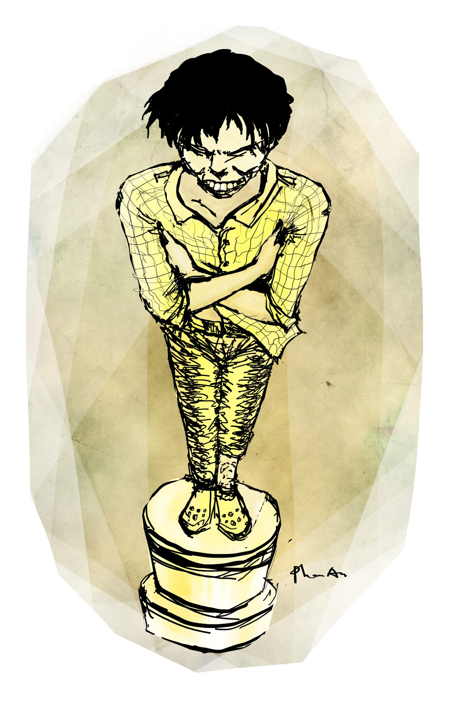

# 21

Bài tôi được bốn điểm. 

Nếu trí nhớ các bạn tốt, thì khi ngồi uống cà phê tống tiễn ông thầy Mẫn, tôi đã quét qua bốn cái tên trong đầu. Trừ cô Kim và chú Thảo là hai nhân vật chỉ có trong trí tưởng tượng phong phú của loài người những lúc đứng dưới vòi sen nước nóng, thầy Tư và thầy Bành là những người hoàn toàn có thật. Nếu trí nhớ các bạn tốt hơn nữa, thì khi kể chuyện ông thầy Tứ ăn cú đập rớt chức, tôi đã hứa sẽ kể cho các bạn nghe về ông thầy Tư. Nay thời cơ đã đến, tôi sẽ thực hiện lời hứa của mình tại đây. 

Đây, ông thầy Tư thân mến của chúng tôi trạc chừng ba mươi lăm tuổi, đầu tóc bù xù, da dẻ mốc thếch, mũi tẹt, môi trề, răng cải mả. Để cho cái vẻ ngoài xinh xắn ấy được hoàn toàn, ổng mắc thêm chứng hôi nách rất nặng. Đến mức bọn con Cẩm thằng Huy, những đứa thuộc thành phần con ngoan trò giỏi của lớp, sáng nào cũng cơm đùm cơm nắm đi học từ lúc bốn giờ và chen nhau ngồi bàn đầu để nghe thầy giảng rõ hơn, mỗi khi đến tiết của ổng cũng đành phải mang khẩu trang than hoạt tính vào và dạt xuống cuối lớp, đánh nhau để giành chỗ ngồi gần cửa sổ, mở lòng ra mà đón hướng gió. Nhưng vì một lí do bí hiểm nào đó mà ổng không chịu hiểu cho chúng nó, ổng cứ khoanh tay trước ngực, nách trái kẹp tay phải, nách phải kẹp tay trái, nhìn na ná cái tượng Oscar mà người ta vẫn thường hay đem tặng cho mấy người diễn tuồng hay nhứt bọn, và thỉnh thoảng ổng lại len lén đưa hai ngón tay lên mũi ngửi như mấy bà già hít dầu cù là trên xe đò. Những lúc ấy, đôi mắt ổng lim dim đầy khoái cảm, mặt ổng hơi ngửa ngửa mặt lên trời như đang cảm tạ Thượng đế ban cơn mưa lành; đứng ngoài nhìn vào bảo đảm người ta không biết đó là ông thầy Tư đang thưởng thức mùi hôi nách dách lầu của mình và thầm nguyện cầu Đức Chúa Lời cho mọc thêm hai cái mũi nữa ở hai bên xương quai xanh, mà có khi lại tưởng đâu là một tiên nữ vai đeo đàn hạc đang ngửi đóa păng-xê mới hái ngoài nội, hay là một nhân viên kiểm thử nước hoa đang chuyên cần làm việc trong xưởng, hay là một thằng nghiện đang ngồi xổm bên vệ đường hít lấy hít để keo con chó từ một cái bọc ni lông trong một buổi chiều quá vã. 

Nói cho đúng ra, chúng tôi tôn trọng tuyệt đối sở thích của ông thầy Tư. Vì rằng, con người là một loại động vật có vú rất phức tạp. Ý tôi là con người rất phức tạp. Không ai giống ai. Và bởi vì không ai giống ai nên bạn đừng có cố công ép uổng sở thích của người khác làm gì. Tôi nói ví dụ, cái xóm quê tôi ngày xưa có ông Luận lãng mạn kia là tổ trưởng tổ dân phố. Tất nhiên ban đầu ông không phải là Luận lãng mạn, ổng chỉ là Luận như tất cả các Luận khác. Nhà ổng mở quán cơm chay, quán bán đậu hủ chiên xù và hay phát bài Woman in Love của nhà nghệ sĩ Barbra Streisand. Những lúc không chạy bàn cơm chay giúp vợ thì ổng ngồi đánh cờ tướng ngoài quán cà phê cóc với ông Tây thiến lợn, ổng đi mã, kéo pháo, tấn xe, chống sĩ mạnh mẽ dứt khoát thôi rồi, ổng đẩy con tốt qua sông “roẹt” một phát, đập con tượng một cái “cốp” vỡ cả bàn cờ, và ổng cười rất sang rằng “Ha! Ha! Ha! Con bồ của anh rứa là ăn cứt đó hỉ!” và ông Tây thiến lợn nhăn mặt cự nự “Ông nói chi thì nói đừng nói đụng tới con bồ tui, hắn đang nằm ở nhà hắn đợi tui can chi tới anh mô na” rồi hai ông khởi sự tát nhau khí thế. Chà, cái ông Luận, làm quán chay nên ổng sống tốt đời đẹp đạo lắm. Chính ổng đã khởi xướng ra vụ “xóm văn hóa quyết tâm không có giết người để cướp của” rồi đi đến từng nhà để tuyên truyền cái quyết tâm ấy, thành thử sau đó tất cả những thằng lỡ tay giết người để cướp của trong xóm đều phải khai man một cách trơ trẽn ra rằng “bị cáo giết ảnh vì ảnh đẹp trai hơn bị cáo mà lại nhìn bị cáo với ánh mắt sỗ sàng,” “bị cáo giết ảnh vì trời hôm nay có gió Tây Tây Nam làm bị cáo trúng gió mê sảng,” “bị cáo giết ảnh là vì bị cáo có thói quen sưu tập tiền mới, mà khi ảnh rút tiền trả công bơm xe thì bị cáo thấy ảnh có tiền mới đầy một bóp,” hay “bị cáo chỉ giết người vu vơ mừng giao thừa mà thôi” vân vân, và nhờ thế mà né được án dựa cột. Nói chung là cái quyết tâm của xóm nói chung và của ổng nói riêng thành công rất là vang dội, thế là ổng được thành phố gọi lên tuyên dương, tặng bằng khen có con dấu đỏ hẳn hoi, rồi mua vé tàu tăng cường cho ổng ngồi ghế xúp đi chơi thủ đô một chuyến. Tôi sẽ không kể cho bạn nghe chuyện ổng bị bọn xe ôm mang giày tây bóng và thắt cà-ra-vát ở ngoài đó chém cho hở be như thế nào, chỉ kể rằng trong cái tuần rong chơi cuối trời quên lãng ấy ổng đã có dịp ở một cái khách sạn ba sao, như ổng nói, tên là 3★ Hotel. Chuyện sẽ chẳng có gì to tát, nếu cái khách sạn ấy không nằm trên một con đường mà đầu đường có trồng một cây hoa sữa. Cứ đúng nửa đêm, như con ma le, hương hoa sữa lại bò bò vào phòng ổng theo lối cửa sổ, chui vào mũi ổng và bắt ổng ngửi. Cái mùi thoang thoảng thơm thơm của nó làm ổng đâm ghiền, tới mức khi trở về ổng đã mở một cuộc tọa đàm về hoa sữa, ổng bắt loa kêu gọi tất cả các hộ dân trong tổ bốn tham dự cuộc tọa đàm ấy, và ổng phát bánh đậu xanh Rồng Vàng mua từ Hà Nội ngàn năm văn vật về cho người ta ăn, mỗi người như vậy là được bốn thỏi bánh đậu xanh, cùng với một tách chè tàu. Đợi mọi người ăn uống xong xuôi rồi, ổng mới cầm cái tô đi quanh biểu mọi người góp tiền vào để mua cây hoa sữa về trồng trong hẻm, cứ một hộ là hai cây, ai không chịu đóng thì ổng đòi “Trả bánh đậu xanh lại đây.” Sau đó ít lâu thì cả xóm tôi đầy cây hoa sữa như ý nguyện của ổng, và đến mùa thì cành lá rợp rợp, hoa nở khắp khắp, mùi thơm bay tứ tung, và ổng cứ chiều đến lại ra đứng trước hiên hít hà, rất là một sự mãn nguyện. Người ta bắt đầu gọi ổng là ông Luận lãng mạn, tuy rằng cũng có những người làm biếng chỉ gọi tắt là Luận lãng. Nhưng ổng lãng không được mấy lâu. Sau một tuần bán bún mắm dưới tán của bốn cây hoa sữa một lúc và phải ngửi mùi hương nồng nặc của chúng nó, bà Bảy đâm mất ngủ, nhức đầu quáng mắt và bắt đầu gắp ruồi bỏ vào tô thay cho hành phi. Sau đó đến lượt thằng Phi đi học đến mười giờ tối không thấy về, và khi đi tìm thì ông Tây thiến lợn té ngửa thấy thằng con học sinh xuất sắc toàn quận đang đeo khăn quàng đỏ mà ôm một gốc cây ngoài đầu đường cười hi hi, rồi nó lại múa điệu con công, nó ưỡn cổ ra phía trước rồi lắc mông cho bố xem, rất khí thế. Ông Tây thiến lợn bèn vội vã lái xe với vận tốc bảy mươi cây số một giờ chở thằng Phi lên bệnh viện tâm thần tuốt trên Hòa Khánh khám, bác sĩ bảo nó ngửi nhiều hoa quá nên đâm ra ngớ ngẩn, thế là ổng phóng xe tốc độ tám mươi lăm cây số một giờ chạy về nhà, lôi con dao thiến lợn ra, lao qua nhà ông Luận lãng mạn. Tối ấy người ta thấy ông Luận lãng mạn lao vọt ra từ quán cơm chay, hai tay đùm lấy bộ hạ, chạy quanh mấy gốc hoa sữa, vừa chạy ổng vừa kêu làng, trong khi ông Tây đuổi theo sau, mắt long sòng sọc, tay huơ con dao sáng quắc, cũng kêu “Thằng Luận lãng mi đứng lại! Mi vác dái mi chạy đi đâu? Mi đứng lại tau thiến!”, và sau rốt là bà Luận lãng mạn chạy lặc lè, cặp vú thây lẩy nảy tưng tưng ra hai bên, bả gào lên “Tôi lạy anh Tây, anh đừng thiến chồng tôi! Chưa thiến đã ù ù cạc cạc rồi, thiến xong thì còn làm ăn cái chi được nữa anh Tây ôi!” Tấn tuồng ấy diễn ra đến khuya lắc khuya lơ mới hạ màn, và tất nhiên sau này mỗi khi có hội thao sồn sồn cấp quận thì xóm lại cử ba người đi thi đấu marathon để lãnh cúp vàng, nhưng cái chính là sáng hôm sau đó chính ông Luận lãng mạn đã phải bỏ tiền ra thuê người chặt sạch đám cây hoa sữa, ổng đứng nhìn mấy cái cưa máy quay ò ò mà nước mắt nước mũi giàn giụa, ổng buồn vô hạn, ổng tiếc bánh đậu xanh thì ít mà tiếc hoa sữa thì nhiều. 

Đó, để cho các bạn thấy rằng phàm ở đời thì chúng ta không nên ép uổng về sở thích cá nhân của nhau, ông thầy Tư ổng mê mùi hôi nách kệ ổng, ổng muốn ngửi sao đó thì ngửi, miễn sao đừng dí hai ngón tay vào mũi sinh viên bắt ngửi theo là được. Ngay cả cái việc ổng nghiện coi phim con heo và có lần đã cùng ngồi coi suốt bốn tiếng đồng hồ ròng với thằng Minh cụt khi nó mang ổ cứng di động tới nhà ổng xin chép tài liệu Cơ học công trình[^1] – và khi về nhà thì cái máy tính của nó mọc thêm một cái thư mục tên là “Phim cua thay Tu vao xem di hay lam” nặng tám mươi gigabyte, có đủ da đen, da trắng, da vàng, chó, ngựa, quái vật xúc tua vân vân – thì cũng vậy thôi, không ảnh hưởng gì đến chúng tôi. Thậm chí tôi còn hưởng sái được thằng Minh cụt một ít, vì sau chừng một tháng ngồi nhà luyện phim chán chê thì nó nảy ra một ý tưởng kinh doanh sáng tạo vãi mọi linh hồn: nó lên góc Tôn Thất Tùng – Bùi Thị Xuân mua một thùng đĩa DVD trắng về, sử phần mềm Nero Burning Rom chép phim ra, in nhãn True Color và hì hụi dùng hai cánh tay cụt khiêng lên trước cổng trường đứng bán với giá năm ngàn đồng một bản, nó lại quảng cáo rằng “Phim hay lắm, các bạn cùng coi với mình cho vui, chứ tay mình cụt vầy có coi nhiều cũng chẳng làm ăn được gì các bạn ạ.” Thế là tụi sinh viên ra vào đầy cổng trường, mà bác bảo vệ thì đứng vờ dim hai mắt ngủ, để lắng nghe Minh cụt nói bô bô. Đợt ấy Minh cụt lời được tận hai trăm ngàn, mà tôi cũng ăn hôi được hai bữa cà phê liền. Cho nên, tôi không có gì để trách ông thầy Tư, nhất là khi vào cuối học kì tôi cũng nhờ ông thầy Trạch moi được của ổng tờ đề rồi cùng với thằng Hải Lẹo thức đến ba giờ sáng để vẽ trước ra giấy cái biểu đồ mô-men uốn trong thanh thẳng, rồi bữa thi đó tụi tôi làm bài nhanh hơn thiên hạ cả chừng ba chục phút. 

Nhưng ông thầy Bành thì khác hẳn. Ổng bắt người ta phải tuân theo sở thích của ổng. Mà cái sở thích của ổng lại là cái sở thích giết người. Ở đời, cái ấy mới là ngặt. 

So về tuổi thì ông thầy Bành già hơn ông thầy Tư một chút, cỡ chừng bốn mươi. So về dung mạo thì người ta đoán ổng cỡ sáu mươi. Thế còn so về tính tình thì ổng phải là trường sinh bất lão. Nên chi sinh viên gọi ổng là ông Bành Tổ. Ông Bành Tổ cổ hủ một cách rất quái gở. Ổng không thích hình tròn. Ổng không thích hình e-líp. Ổng cũng không thích hình hi-pẹc-bôn hay pa-ra-bôn chi chi cả. Ổng chỉ thích hình chữ nhật và dạng đặc biệt hoàn hảo của hình chữ nhật là hình vuông mà thôi. Mọi thứ trước mắt ổng phải thẳng thớm, vuông vức. Ổng ghét những thứ không vuông vức. Đến cái hình tam giác với hình bình hành ổng không cũng không ưa. Ngay lúc này thì ổng đang ngồi đối diện với tôi, mặt mày quạu quọ, hai cái lông mày của ổng châu lại với nhau như hai con sâu róm, có lẽ vì thứ nhất là cái bàn hình trứng, thứ hai là tôi không giống bố, mặt tôi không phải mặt chữ điền. Ổng nhịp nhịp chân, khạc một cái rõ to, rồi nhổ phẹt. Ổng nhìn bãi nước bọt bay ra theo một đường cong với ánh mắt thất vọng, và cất giọng đều đều:

“Các anh các chị không ngay thẳng. Cong quẹo. Tôi không chấp nhận được những con người như vậy. Cong quẹo. Không ngay thẳng. Những con người như vậy tôi không chấp nhận được.” Rồi ổng nhổ thêm một cái nữa, lần này mạnh hơn, bãi nước bọt bay thẳng ra phía trước, lông mày ổng giãn ra, và ổng cười mãn nguyện.

Lạy trời, nhưng ổng không cần nói, không cần khạc, không cần nhổ thì chúng tôi cũng đều biết ổng không thích những thứ cong quẹo. Tất nhiên người ổng gù gù, nhưng cong quẹo thì ổng không thích. Hải Lẹo chẳng hạn, là một trong những đứa biết rõ nhất. Vốn là một thằng pê-đê bay bổng sáng nhặt lá trưa đá ống bơ, năm ngoái khi thiết kế bài trường mẫu giáo nó đã toan vẽ một đống phòng ốc hình bầu dục chụm vào cái sân chơi chính giữa hình tròn, xong nó lại giật các khối lan can gác lửng cho lồi lõm, lại trang trí bằng cách lợp mái bằng các loại gạch màu đỏ vàng da cam các kiểu, từ trên nhìn xuống giống y như bông hoa. Nó lấy làm khoái chí với ý tưởng ấy lắm, nó đã đặt tên sẵn là Trường mẫu giáo Hoa Lài (còn gọi là trường Trăm Hoa Đua Nở), nó còn mua đất sét màu ở mấy cái cửa hàng bán đồ chơi con nít về định làm cái mô hình đặt bên cạnh để minh họa[^2]. Nhưng lúc nó mới lên nét chì thì ông thầy Bành đã mặc áo ca rô quần tây là thẳng li đi ngang qua với tướng điệu như Michael Jackson đang nhảy điệu rô bốt búng chim. Ổng dừng lại nhìn một hồi lâu, nhân trung của ổng dài ra chừng tám tấc, rồi ổng hỏi: 

“Bong bóng lợn à?”

Hải Lẹo lật đật trả lời rằng thưa thầy đây không phải là bong bóng lợn mà đây là trường mẫu giáo Hoa Lài, còn gọi là trường Trăm Hoa Đua Nở, đây là cánh hoa, đây là nhị hoa, đây là lá, đây là cỏ, đây là trời xanh, đây là mây trắng, đây là ong, đây là bướm, đây lại là chim. Ổng liền nhìn dọc nhìn ngang, rồi nói tiếp:

“Chim với bướm gì. Tôi hỏi anh một câu thôi: anh có xây được cái nhà này không?” 

Khi Hải Lẹo trả lời rằng không, vì nó không phải là thầu xây dựng, nhưng nó có đọc một số tài liệu nước ngoài, trong đó nó thấy người ta dựng mấy cái nhà còn kì hình dị tướng hơn nhiều mà còn đạt giải thiết kế của các thể loại ban bệ quốc tế, thì ổng khạc một cái, bắt đầu nhịp nhịp bàn chân mang giày đế vuông mà rằng:

“Tôi nói với anh một câu thôi: anh đừng có nói với tôi chuyện nước ngoài. Chuyện nước ngoài là cái chuyện nước ngoài. Còn chuyện nước mình là cái chuyện nước mình. Cái chuyện nước mình thì anh không nói lẫn qua cái chuyện nước ngoài được. Cũng như cái chuyện nước ngoài thì anh không nói lẫn qua chuyện nước mình được. Không ai lẫn nước mình với nước ngoài được cả. Tôi làm cái nghề này bao nhiêu năm. Bao nhiêu năm tôi làm cái nghề này (Hải Lẹo há mồm định nói “Thưa thầy em không biết hi hi” nhưng ổng đã giơ tay làm hiệu chặn nó lại). Bao nhiêu năm tôi làm cái nghề này. Mà tôi chưa thấy thằng nhà thầu nào làm được cái nhà nào tròn như cái nhà này. Một cái nhà tròn như cái nhà này thì không thằng nhà thầu nào làm được. Nhà gì mà tròn như cái nhà này? Đây không phải là cái nhà (Hải Lẹo lại hả họng toan phân bua rằng “Dạ đúng rồi thưa thầy, đây không phải là cái nhà mà là cái trường hi hi” nhưng ổng đã lại giơ tay lên chặn họng nó). Không cái nhà nào tròn như cái nhà này. Không thằng nhà thầu nào của nước mình xây được cái nhà nào tròn như cái nhà này. Anh muốn xây cái nhà tròn này thì đi ra nước ngoài kiếm thằng nhà thầu nước ngoài. Nhưng tôi nói với anh, tôi không nói với anh chuyện nước ngoài. Tôi nói với anh rồi, tôi đang nói với anh chuyện nước mình. Vì anh với tôi không sống ở nước ngoài. Anh với tôi đang sống ở nước mình. Mà cái chuyện nước ngoài không lẫn vào chuyện nước mình được. Không ai lại đi lẫn chuyện nước mình với chuyện nước ngoài được. Tôi thậm ghét những đứa đem chuyện nước ngoài lẫn vô chuyện nước mình. Nước mình là nước mình mà nước ngoài là nước ngoài. Đây tôi chỉ nói ngắn gọn vậy thôi. Nước mình là nước ngoài mà nước ngoài là nước mình. Anh dẹp cái nhà tròn này ngay cho tôi.”

Thế là Hải Lẹo tiu nghỉu như con chó bị nhúng nước, mắt nó long lanh ngấn lệ cũng như con chó bị nhúng nước, và nó nhìn xuống đất, dí dí hết chân nọ lại chuyển sang chân kia, như em bé vừa bị mẹ đánh vì tội đem con chó đi nhúng nước và được quay phim lên chương trình Em yêu động vật trên VTV3. Đợi ổng đi khuất dạng rồi, nó mới nghiến răng quăng mấy cục đất sét vào tường kêu đánh “bẹp” một phát, tòe ra kết hợp thành hình bông hoa. Rồi nó bặm môi lại, cắm đầu gôm cho kì sạch sẽ mấy đường chì, xong nó vung cây ê-ke lên và bắt đầu vẽ cái trường mẫu giáo hình vuông, trong đó mọi thứ đều có hình vuông: phòng ốc hình vuông, lồng cầu thang hình vuông, giếng trời hình vuông, bàn ghế hình vuông, la-va-bô hình vuông, bồn cầu hình vuông, lỗ hút nước hình vuông, thậm chí những hình cây cối, em bé và cô giáo đặt trên mặt bằng với mục đích minh họa đơn thuần cũng hình vuông nốt. Nó đặt tên cho cái trường mẫu giáo của nó là TRƯỜNG MẪU GIÁO LEGO, xong rồi nghĩ đi nghĩ lại, nó chua thêm một dòng phía dưới: CÒN GỌI LÀ TRƯỜNG MẪU GIÁO TETRIS. Bài đó nó được ông thầy Bành cho tám điểm, con số tám đỏ chót nhìn y chang chữ H được bịt kín hai đầu. Tám điểm cho một bài đồ án không phải là chuyện hôm nào cũng thấy. Nhưng cái thằng ki bo bần tiện Hải Lẹo, nó không đãi anh em được bữa bia bọt nào cả. Nó bảo “Nhục nhã lắm chúng mày ơi” xong cuộn bài lại nhét xuống gầm giường, nó lại bảo “Mẹ mày, cuối cùng thì mày cũng tròn nhé.” Rồi nó nằm xuống bên cạnh giường, cuộn người nó lại luôn, như con chó cái canh đàn con mới đẻ, hễ ai lọ mọ đến gần đòi xem quả bài tám điểm là nó táp đứt gân chân. 

Đến lúc này thì các bạn đã biết chuyện gì đã xảy ra cho cái bài đồ án của tôi rồi. Đúng thế, ông thầy Mẫn ung dung khen bài tôi rằng “Được!” rồi xuất kì bất ý bỏ ra nghĩa trang nằm, để lại cái bài đồ án hoành tráng của tôi cho ông thầy Bành Tổ chấm. Vốn dĩ ông thầy Bành đã không ưa đường cong, ổng lại còn chẳng khoái gì ông thầy Mẫn, nhất là từ cái đợt ổng bị ông thầy Mẫn gạt cho té chúi nhủi. Cho nên, nghe Quang Tèo kể lại, ông Bành Tổ đứng trước cái mặt bằng hình cây đàn Stradivarius dách lầu của tôi một hồi, nhân trung của ổng dài ra chừng tám tấc. Ổng hết nhìn tới lại nhìn lui, mặt mày có vẻ đăm chiêu suy nghĩ lắm. Xong rồi ổng rút trong túi ra cây thước, đo từ đầu đàn đến đuôi đàn, ổng đo ngang, đo dọc, đo cái eo đàn, đo sợi dây lông ngựa, mọi thứ. Cuối cùng ổng mới quay sang nhìn mấy ông thầy khác với một vẻ ngơ ngác đầy chân thành, giống như thằng cha trong phim quảng cáo thuốc diệt giun đũa giun tóc giun móc giun kim. Nhưng ổng không hỏi “Em thưa thầy thuốc Fugacar diệt trừ giun như thế nào?” Mà ổng hỏi:

“Sao lại có cái chày ở đây?”

  

[^1]: Là một môn học chỉ cho bạn cách thiết kế các loại dầm xà chịu lực để sao cho, nói ví dụ, một cái cao ốc hai mươi lăm tầng bị ăn bớt một nửa khối lượng thép vẫn có thể đứng vững trong vòng hai năm.
[^2]: Mô hình minh họa cho bài đồ án là một trò khá hay. Có những đứa vẽ bài như hạch, chỉ đáng bốn điểm, nhưng nhờ dụng công thức khuya chổng mông làm cái mô hình bằng xốp mà được các thầy thương tình cho 5v, tức là 5 Vớt, mà chúng nó hay gọi là 5 Vui.
