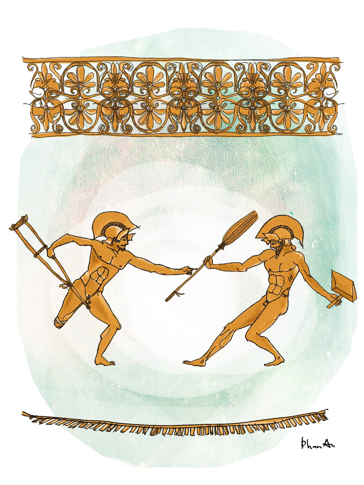

# 233

Và mãi cho đến bữa nay tôi vẫn chưa được chơi gái. 

Mặc dù, nói cho cùng thì chơi gái không phải là chuyện gì lớn lao, cũng như cái thằng Tú sau khi vô tình sờ được tay con bạn đã về thức khuya viết nhật kí rằng “Hạnh phúc đâu phải gì lớn lao lắm, nó nằm ngay trên bàn tay trên từng ngón tay.” Hằng ngày đọc báo tôi vẫn hay thấy chuyện ông thầy này ông thầy nọ chơi gái, rồi ông thầy này ông thầy nọ xông vào nhà trọ cưỡng hiếp học sinh – tôi nói học sinh chứ không phải nữ sinh, tức là unisex, để có thể thỏa mãn được mọi trường hợp. Mới hồi nãy đây, trước khi vào phòng họp, ngồi vệ đường uống cà phê tôi cũng đọc được tin một con bé lớp chín trên tờ báo sáng sớm, báo nói nó đúng là tương lai của đất nước mai sau, còn nhỏ mà giỏi công nghệ lắm, nó dùng điện thoại di động màn hình rộng 4,5 in-sơ không cần phím bấm, không cần nhìn, nhắm mắt nhắn tin cho ông thầy dạy Văn của nó rằng “Thầy ơi nhớ mang bao cao su nha thầy,” chính là thần đồng thời nay. Tất nhiên báo không nói rõ nội tình sự vụ sau đó, rằng điện thoại của ông thầy có ngoài vùng phủ sóng không, rằng sự tréo ngoe ông thầy có mang thì nó không có mang và ông thầy không mang thì nó có mang là thế nào, và liệu sự nhớ quên nhỏ nhặt của ông thầy đó có ảnh hưởng đến hạnh phúc lứa đôi hay chăng, nhưng chừng ấy cũng đủ để chúng ta kết luận rằng giữa giáo dục và gái gú, ít nhất trong trường hợp này, là có mối quan hệ vô cùng mật thiết. 

Còn nếu các bạn không tin ở báo chí, thì ít nhất cũng phải tin ở tôi. Năm lớp mười, tôi học giáo dục công dân với thầy Sừu. Đinh Sừu. Các bạn có thể cãi rằng đinh rất là cứng nhọn, đinh không bao giờ sừu, đã sừu thì gọi là bún chứ còn gì là đinh nữa, nhưng tôi biết làm thế nào, vì kinh nghiệm bản thân cho thấy thầy ấy quả tên Đinh Sừu thật. Nhà thầy Sừu với nhà tôi ở cùng chung khu phố, nhưng rất ít khi tôi thấy thầy ngoài đường. Nghe nói vợ thầy mất sớm vì suy nhược, thầy không có con cũng không có họ hàng gì, chỉ sống thui thủi một mình trong ngôi nhà nho nhỏ trong khoảng sân be bé có cây xoài lá rụng, ngoài có cái cổng sắt lúc nào cũng khóa im ỉm. Chỉ có con Loan là thỉnh thoảng gặp thầy, nhờ những lần đi thu tiền rác giùm ba nó là ông Hai Cụt. Ông Hai Cụt người gốc Bắc, là thương binh cụt chính cống nên được phong vị trí thu tiền rác và các loại tiền khác; bình thường thì ổng chống nạng lọc cọc đi thu tiền rác của cả phố, nhưng những khi trái gió trở trời thì cái chân không cụt của ổng sinh ra đau nhức, và ổng phải sai con Loan đi thay thế. Con Loan năm ấy mười lăm tuổi, tóc dài, da hồng, miệng hơi hô nhưng được cái hay cười nên thành ra cũng khá có duyên. Nó chơi khá thân với tôi và thằng Phan, chính là cái con mà thằng Phan hay mượn cây thước kẻ để đo chim, nhưng tôi nhớ là đã kể với các bạn nghe về việc này rồi, nên bây giờ tôi sẽ tập trung kể về thầy Sừu và chỉ một thầy Sừu mà thôi. Tóm lại mãi đến khi vào cấp ba, tiết giáo dục công dân đầu tiên thấy thầy Sừu đĩnh đạc bước vào lớp, tôi mới biết thầy là giáo viên. Thầy đã già rồi, năm ấy thầy đã hơn năm mươi tuổi, đầu thầy lơ thơ hơi mốc, nhưng dáng điệu thầy rất điềm đạm, thầy thắt cà vạt xám mịn, thầy mặc áo sơ mi trắng quần tây ủi thẳng nếp, giày tây đen bóng chỉn chu, thầy đeo kính trắng, mồm thầy chúm chím, và thầy dạy hay lắm, nghe thầy giảng về tồn tại của xã hội và vai trò của thực tiễn đối với nhận thức lịch sử duy vật duy tâm thần chủ thể tồn tại khách quan vận động kinh phương pháp luận biện chứng khuynh hướng mục tiêu khoa học viễn tưởng bở rệp thì không chê vào đâu được. Cái đặc biệt hơn cả là thầy mê đọc Truyện Kiều và biết làm thơ, những lúc rảnh rỗi thầy lại đọc thơ cho chúng tôi nghe. Thầy sẽ lặng lẽ nhìn ra sân trường vào một buổi chiều mưa phùn nhè nhẹ có những chiếc lá rơi chao nghiêng, mấy cánh hoa phớt hồng lả tả và bóng chú bảo vệ cầm dùi cui ngồi trong lô cốt mờ mờ ảo ảo như một bức tranh sơn thủy, một hồi bỗng nhiên thầy cất giọng ngâm nga:

_Duy tâm chui dưới gầm bàn  
Siêu hình giáo dục tuôn tràn công dân  
Cộng đồng xã hội xoay vần  
Trăng soi đáy nước hồng quần tụt ngay_

hoặc là:

_Duy vật Lê Nin thế giới quan  
Thật chân biện chứng đứng hai hàng  
Cu con khóc ngất ngoài cửa ải  
Các Mác siêu quần rộng thênh thang_

Tất nhiên lúc ấy chúng tôi còn nhỏ dại không hiểu hết sự thông tuệ trong thơ thầy, nhưng chúng tôi cũng mang máng thấy rằng thơ ấy thật hay, thật nhiều hình ảnh, thật có âm hưởng vi vu, khổ đầu theo phong cách lục bát mà khổ sau lại nghiêng về hướng tứ tuyệt, theo thằng Á đù nói thì thầy đã đạt đến đẳng cấp Đằng Vương Các của Đinh Bột. Và cái dáng gầy gầy nghiêng nghiêng của thầy, cái điệu bộ thầy hơi ngửa mặt lên trời, cái giọng trầm hùng của thầy cất lên, cổ họng thầy rung rung, cặp mắt thầy nghiêm nghị mà ấm áp đằng sau cặp kính, cặp môi thầy chúm chím khi ngâm thơ, sao mà đẹp lạ. Chúng tôi mê tít thầy. Thằng Mai Văn Phép được huy chương vàng bơi ốc trong hội khỏe Phù Đổng thành phố đã lên ti vi nói rằng tuy giỏi tất cả các món thể thao nhưng em yêu nhất, quý nhất là môn giáo dục công dân, và ghét nhất, giận nhất là những bạn không nhận thức được rõ ràng chủ nghĩa duy vật biện chứng. Còn con Loan thì từ đó chính thức trở thành tay thu tiền rác của cả khu phố thay cho ông Hai Cụt, nó thu tiền năng nổ lắm, không quản đêm hôm mưa gió, đâu có tiền là Loan cứ thu, nhưng Loan về nói với bố là thầy Sừu nghèo lắm, nhà thầy chỉ có một phòng ngủ, một cái giường, một phòng khách và một bộ xa-lông thôi, êm lắm, rất tội bố ạ, nên Loan sẽ thu tiền thầy thành nhiều lần.

Thế rồi một buổi trưa đi học về tôi thấy ông Hai Cụt đang đứng vung cây nạng bên hàng rào nhà thầy Sừu mà chửi bới loạn cả lên rằng làm thằng thầy giáo nhân dân mà như thế à, bố mày ôm súng AK xung phong đến cụt cả chân không phải để cho những thằng thầy lợn như mày đi ngủ với con gái nhà người ta đến có chửa nhé, mày khốn nạn vậy nên con vợ mày nó trốn xuống suối vàng là đúng lắm, đuỵt con mẹ mày chứ lị. Tất nhiên thầy Sừu của chúng tôi lúc đó chưa phải là thầy giáo nhân dân, thầy chỉ mới được đề cử danh hiệu nhà giáo ưu tú thôi, nhưng ông Hai Cụt không màng sự thật ấy. Ổng chửi rất kinh, có lẽ còn kinh hơn cả cái lần vạch quần quay chim trước nhà ông Luận lãng mạn mà đòi lương thu tiền rác. Ổng vừa chửi vừa nhảy loi choi, ổng huơ cây nạng mãnh liệt, và ổng kêu “Thằng Sừu dâm tiện bước ra đây!” Nhưng thầy Sừu không ra. Thầy đứng bên kia hàng rào, đằng sau cánh cổng đã được khóa cẩn thận, trong bộ quần tây áo sơ-mi thẳng nếp, mặt thầy hơi ngửa lên trời, thầy nhìn ông Hai Cụt nhảy bằng ánh mắt ấm áp mà nghiêm nghị đằng sau cặp kính, rồi một hồi thầy cất giọng trầm hùng, thanh quản thầy rung lên, môi thầy chúm chím, thầy nói:

“Mi có ngon vô đây!”

“Mày ra đây!”

“Mi vô đây!”

“Mày ra đâyyyy!”

“Mi vô đâyyyy!”

Rầm một cái, ông Hai Cụt lấy hết sức bình sinh táng cây nạng i-nốc vào cánh cổng, làm nó đổ sập xuống, một đám bụi mù bốc lên, thấy mờ mờ bóng ổng lao tót vào như chiếc xe tăng tiến vào cổng dinh Độc Lập. Thầy Sừu có lẽ hơi bất ngờ trước chất lượng cổng nhà mình, nên tôi thấy mặt thầy hơi biến sắc, thầy không ngẩng mặt lên trời nữa, thầy hạ mặt xuống, thấy giơ chân trái mang chiếc giày tây bóng lộn lên trước, thầy lại đánh hai tay sang trái, và thầy bắt đầu chạy quanh sân. Nhìn thầy lúc này rất giống thằng Kều Ghẻ, nếu các bạn còn nhớ, chỉ khác là trong khoảng sân be bé của thầy không có cái cầu cống nào cả, nên chi thầy không liều thân nhảy xuống cống như Kều Ghẻ được. Thầy cũng không chạy ra ngoài đường được, vì người ta đã kéo đến đứng chắn tầng tầng lớp lớp ở cổng, không cho thầy đi. Thật là một sự éo le hiểm trở. Thầy cắm mặt mải mốt chạy quanh sân một vòng, rồi hai vòng, rồi ba vòng, rồi như cảm thấy không có kết quả gì khả dĩ, thầy bèn đứng lại, tay phải thầy vớ lấy cái chổi dựng ở bờ rào, tay trái thầy cầm cái ki xúc rác hộ thân, dạng chân ra thủ thế. Thấy vậy, ông Hai Cụt cũng dừng lại, và nhún hai phát, nghiến răng phóng cây nạng về phía thầy. Thầy né qua một bên kịp thời, cây nạng xé gió bay đánh soạt ra ngoài đường, làm chiếc cà vạt xám trên ngực thầy bay phần phật, nhưng trước khi thầy kịp mừng thì bà Hai Cụt, cũng cụt như ông chồng, đã chạy đến liệng cây nạng của mình vào tiếp tế. Đến lượt thầy, thầy cũng bặm môi ném cái chổi vào đầu ông Hai Cụt, nhưng ổng nghiêng đầu tránh được, vì rằng ổng có không ít kinh nghiệm bắn nhau thu lụm được từ những cuộc chiến cả oai hùng lẫn không mấy oai hùng trong quá khứ. Mất món võ khí, thầy tuyệt vọng vung ki xúc rác lao vào quyết một phen sống mái thư hùng, miệng thầy chúm chím kêu “Hây dô” để bổ sung nhuệ khí. Ông Hai Cụt cũng không hề thua kém, ổng lẳng lặng mà hăm hở xông lên. Sau một hồi vờn nhau thì ông Hai Cụt lựa thế chọc cây nạng của bà vợ vào cổ thầy Sừu một phát, làm thầy té lăn quay ra đất. Bà Hai Cụt liền chống tay xuống đất, nhảy phốc vào. Đám đông bên ngoài hò reo vang dội. Tôi ngơ ngác hết nhìn người thầy đáng kính của mình nằm chàng hảng trên nền sân nhớp nhúa, cặp kính văng đâu mất, miệng chúm chím kêu “Cứu tôi với, cứu tôi với, chỉ tại hai hòn duy vật chúng nó mâu thuẫn biện chứng thôi mà, cứu tôi với các ông các bà ơi,” lại nhìn hai ông bà cụt đang cưỡi trên bụng thầy, nhún nhảy lên xuống, nhổ nước bọt vào mặt thầy và tát thầy túi bụi, không hiểu ra làm sao cả. Khó hiểu hơn nữa là tôi không thấy bóng dáng con Loan đâu, trong khi nó là đứa yêu quý thầy nhất, và những lúc dầu sôi lửa bỏng này đáng lẽ nó phải có mặt để can gián cho cả hai phe. Phải đến gần nửa năm sau tôi mới gặp lại nó, nói đúng hơn là nhìn thấy lại nó. Lúc ấy bụng nó đã lùm lùm một đống, nó nằm ngửa một cách bình thản dưới gốc cây sao bên bờ sông, một chân co, một chân duỗi như đang mỏi, quần áo ướt sũng dính bết vào làn da tai tái, đôi mắt nó khép hờ, miệng còn ri rỉ vài dòng cát, trong khi ông bố cụt chân của nó quỳ ngả ngả nghiêng nghiêng bên cạnh, ngơ ngác bảo “Con ngồi dậy đi, bố mua bộ xa-lông cho con rồi, êm lắm con, ngồi dậy rồi bố con mình về nhà đi con” còn mẹ nó thì từ xa đã quăng cả nạng, té sấp, và kêu gào ba hồn chín vía “Loan ơi, về ăn cơm trứng với mẹ Loan ơi,” náo động cả một khu chợ. 

Việc ấy đối với tuổi thơ của chúng tôi là một kỉ niệm buồn. Con Loan chết đuối – hoặc đơn giản chỉ là nhảy sông tự tử giống như hàng chục hàng trăm những đứa con gái chửa hoang khác, như người ta đồn – không còn ai cho mượn thước nữa, thằng Phan đành buồn bã bỏ tật đo chim. Tôi cũng buồn, tôi nghĩ về thầy Sừu mà liên tưởng đến thằng Thu Đạm và cái số phận hẩm hiu của nó, tôi nghĩ giá khi hiếp dâm con bé thiểu năng đó nó vừa tiến hành hành động vừa ngâm một số câu thơ nhất định thì đâu đến nỗi phải vào trại cải tạo thiếu niên hư hỏng, tôi lại nghĩ giá con Loan nó cũng ngớ ngẩn, gù, lác hay mắc chứng tụt lưỡi nói cà lăm như con bé đó thì chắc giờ này còn sống. Bọn lớp tôi cũng buồn thiu, vì sau sự kiện đó thì thầy Sừu không bao giờ còn đọc thơ cho chúng tôi nghe nữa. Thầy vẫn còn nhìn ra sân trường những lúc trời mưa nhưng mặt thầy lúc nào cũng đọng một vẻ u tịch thảm sầu, giờ học giáo dục công dân vì thế mà cũng trở nên tẻ nhạt, chúng tôi một lũ học trò ngồi cô quạnh nhìn nhau. 
