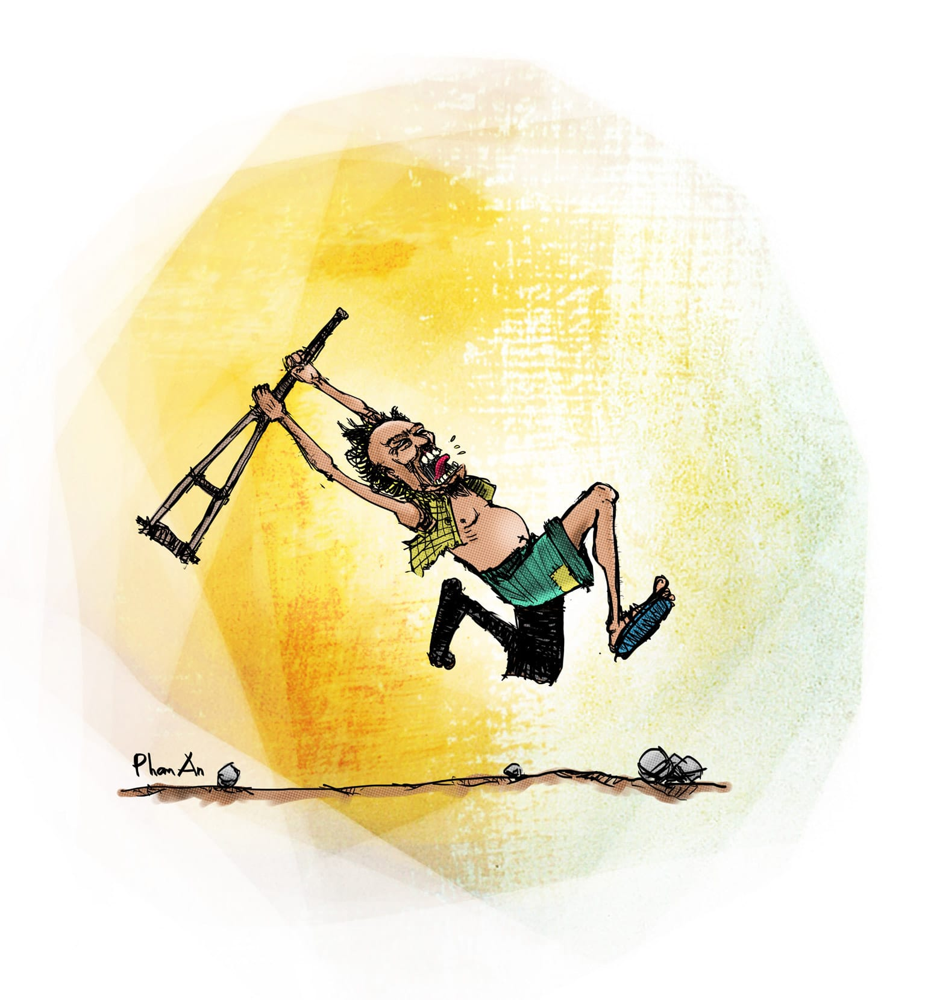

# 3

Lão thầy Hợi đập bàn xong, tới lượt ông thầy Tôn. Ổng đưa tay vuốt mớ tóc trắng như cước được chải rất cẩn thận, chỉnh lại cặp kính đang chực trượt té gãy gọng trên cái mũi đỏ bầm như một trái cà chua nghiện rượu, cầm lấy tờ giấy trước mặt, rồi cất giọng ề à:

“Thầy rất... buồn. Các em làm thầy rất... buồn. Mà không riêng gì thầy, tất cả các thầy cô ngồi đây đều buồn phiền... vì các em. Vô... cùng buồn phiền. Các em là những người đầu... tiên vi phạm kỉ luật như thế này. Vô... cùng đau lòng các em ạ. Vô... cùng đau lòng.” Ổng nói xong thì bên ngoài hành lang vang lên tiếng chuông reng reng vô cùng vui tai. 

Không, không phải là tôi đang nhại ổng đâu. Bạn hiểu cho, tôi có thể hỗn láo thật nhưng tôi không bao giờ nhại người già. Mà nói chung tôi không bao giờ nhại ai cả. Tôi biết hơn bất cứ ai trên quả đất này rằng nhại người lớn là một sự tuyệt đối không nên. Hồi học lớp sáu, tôi có một thằng bạn hỗn danh là Kều Ghẻ. Kều Ghẻ là thằng con nít quậy phá nhất xóm, buổi sáng nó cúp học ở nhà buộc đuôi chó đuôi mèo lại với nhau, buổi chiều nó rình đổ muối ớt vào chó dính lẹo, buổi tối nó lại theo anh Thu Đạm đi đục lỗ phòng tắm nhà người ta. Nói chung nhân cách nó đồi bại bẩn thỉu không ra gì, nhưng người lớn xem nó còn nhỏ nên không ai nghiêm trị, hoặc cũng có thể người ta sợ động vào nó thì lây ghẻ ngứa chăng, tôi không được rõ. Chỉ biết Kều Ghẻ được thể càng tăng cường phá phách, nó gạt cẳng con nít đang tập đi trước sân, nó bắt cóc bỏ vào cặp tụi bạn cùng lớp, nó liệng đá vào đám cưới làm toét đầu phù dâu, thôi thì đủ cả. Cho đến một bữa, trên đường đi học hè về nó gặp một ông già ăn xin vừa mù, vừa câm, lưng còng đến đất đang chống nạng đi cà lơ phất phơ ngoài đường. Thấy người ta lê lết khổ sở trong một xã hội đầy bất công giai cấp vậy mà nó cũng không để yên. Nó bắt đầu nhảy nhót quanh ông già tội nghiệp, tay nó banh mồm thè lè ra, mắt nó làm bộ lác, và nó kêu “ê, ê.” Được chừng mười phút liên tục như thế mà ông già không có phản ứng gì, Kều Ghẻ phát chán định thôi không nhảy không ê nữa, thì tự nhiên ông già đứng thẳng lên, gồng một phát, lông tóc dựng ngược như siêu Xayda cấp bốn, và trở nạng quật nó một cú thật lực. Kều Ghẻ nhanh mắt né được cú quật trí mạng, kinh hoảng vác giò lên cổ mà chạy. Ông già cũng quay chân như cối xay gió, vác nạng đuổi theo nó sát đít, vừa đuổi ổng vừa chửi “Đù mẹ thằng chó, đù mẹ thằng chó, mi đứng lại tau đánh chết mi đứng lại hem đù mẹ thằng chó?” Từ thuở cha sanh mẹ đẻ chưa bao giờ Kều Ghẻ thấy ông già mù câm què nào lại năng động được đến như thế vậy, nên nó vừa chạy vừa làm cú bĩnh ra quần, như con chồn hôi. Thế mà nó cũng không thoát. Sau khi ăn liên tiếp năm sáu phát nạng bể người, Kều Ghẻ quáng cả mắt, cuống quýt ôm nguyên cú bĩnh trong quần lao xuống cây cầu ở đoạn cống cái gần ngã Bảy, nơi có cái quán cà phê ôm mà mấy bà trong đó vẫn hay cho con nít sờ bụ, mỗi lần hai ngàn đồng. Xui cho nó là nó quá bận phá làng phá xóm với sờ bụ mà quên đi học môn thể dục “Nhảy cầu thẩm mĩ và cách tiếp đất hợp lí,” vả lúc ấy mùa hè, cống hơi cạn nước, nên sau cú nhảy đó thì nó gãy ống quyển chân trái, vẹo ba ngón bàn chân phải, lại may mắn được trời ban thêm cái sọ dập vì đập vào đống đá dưới chân cầu. Từ đó nó đâm ra nghễnh ngãng, hay bắt cái ghế rỉ sét ra ngoài cửa nhìn thiên hạ đi qua đi lại mà cười vu vơ, và tích được một loại phản ứng có điều kiện kì quặc là ỉa đùn ngay mỗi khi thấy có người đi cà nhắc. 

Cho nên, tôi không dại mà đi giễu nhại ông thầy Tôn. Tôi không muốn vừa ỉa đùn vừa cười. Cái cách của ổng trước giờ vẫn thế. Nói cho đúng, hồi ổng còn rất trẻ thì ổng không thế. Hồi ổng còn rất trẻ, ổng đi lính, cũng dõng dạc và quyết đoán như ai. Nhưng rồi nổ ra một thời kì tối tăm trong lịch sử dân tộc gọi là thời kì bao cấp, và trong thời kì ấy, để có thể sống lay lắt được thì từ đi lính ổng linh động chuyển sang đi lượm đồng nát. Qua năm tháng, cái giọng dõng dạc và quyết đoán những khi hô khẩu hiệu trước tiểu đoàn của ổng trở thành “Ơ… ai đồng nhôm… dép rách… vỏ chai… lông gà lông vịt khơơơng… nào…” và nó ám luôn vào ổng luôn từ bấy đến nay, kể cả khi ổng đã đi học đến bậc phó tiến sĩ và trở thành giảng viên. Xưa ổng lượm xô bể, nay giống như số mệnh đẩy đưa, là giảng viên, ổng dạy môn Âm học công trình[^1]. Tất nhiên “âm” ở đây là âm thanh, âm vang, âm xô bể, chứ không phải âm dương. Nhưng sinh viên cứ vin vào âm dương mà tôn sống ổng lên làm thần. Hỏi: cái gì thần? Đáp: an thần. Luôn luôn, ổng giảng bài lôi cuốn tới mức chí ít cũng phải một nửa lớp lăn quay ra ngủ. Chúng nó cứ hè nhau dồn cả xuống cuối lớp, nằm trên băng ghế khuất sau bàn, úp cuốn _Âm học trong công trình căn bản và vô cùng nâng cao_ – do chính Giáo Sư Phó Tiến Sĩ Nguyễn Tường Tôn sưu tầm, biên soạn và phát hành nội bộ với giá bốn chục ngàn mỗi cuốn – lên mặt và đánh một giấc phủ phê. Thật ra, Quang Tèo bảo với tôi, cẩn thận như thế là thừa. Cái thằng Quang Tèo, nó cứ đường hoàng ngồi ngay bàn đầu, gục mặt xuống mà ngủ, nước dãi chảy rớt chảy rệu ra mà ông thầy Tôn chẳng hề hay biết. Ấy là vì ổng cứ cắm đầu vào cuốn Âm học trong công trình cơ bản và vô cùng nâng cao mà lè nhè đọc, sinh viên có chép bài hay không mặc xác sinh viên. Mỗi lần lên lớp ổng đọc một chương, và cái cách ổng canh đo thời gian sao cho tiếng chuông luôn luôn réo lên đúng lúc ổng hạ chữ cuối cùng xuống, đối với chúng tôi mãi mãi là một sự huyền bí. Với kĩ thuật huyền bí và độ chính xác tót vời ấy, có lẽ ổng phù hợp với nghề lái tàu cao tốc ở Nhật Bản[^2] hơn là làm giảng viên âm học ở Việt Nam. Nhưng bởi vì số mệnh không phải là chuyện mà những loại người phàm mắt thịt chúng ta có thể chọn lựa được, cho nên xem ra ổng sẽ còn làm giảng viên âm học đến mãn đời. Chuyện đó ổng coi là ổn định, là đất lành chim đậu, còn sinh viên tụi tôi coi là đại họa, là đất nhậu mất chim. Là vì vào cuối buổi học cuối cùng của học kì, năm nào cũng như năm nấy, ổng sẽ gấp cuốn Âm học trong công trình cơ bản và vô cùng nâng cao lại nhét vào cặp, tháo kính ra, vuốt mái tóc bạc trắng, và đứng lên chậm rãi thuyết rằng:

“Như vậy… là thầy đã đọc xong... à, chúng ta đã học xong… môn âm học của học kì này. Thầy mong rằng… các em đã lĩnh hội được thật đầy đủ, thật sâu sắc những điều thầy đọc... à, những điều tâm huyết thầy giảng. Và… khi đi thi thì nhớ là phải thật thà. Phải tuyệt đối thật thà. Vì thầy không tuyệt đối... à, tuyệt đối không chấp nhận gian dối trong thi cử. Em nào gian lận là thầy bắt… buộc phải hủy kết quả thi. Thầy đang nói một cách rất là vô... cùng nghiêm túc. Các em cứ đi hỏi các anh chị năm trên để biết là thầy rất là vô... cùng nghiêm túc.” Tiếng chuông vang lên, ổng lừ đà lừ đừ đeo kính vào, rồi cứ thế lừ đà lừ đừ cắp cặp đi ra. 

Và ổng thực hiện rất là vô cùng nghiêm túc cái lời ổng nói là ổng rất là vô cùng nghiêm túc. Đề thi của ổng thường ra theo kiểu “Đố các em thiết kế âm được cho một cái nhà hát cao ba mươi mét, rộng mười hai mét, dài năm mươi mét, khoảng cách từ hàng ghế đầu tiên đến sân khấu là ba mét lẻ bảy.” Sinh viên cắm đầu vào tính toán hộc máu mồm, vẽ ra một cái sơ đồ dày tám trang giấy thi, khi ra khỏi phòng thi túm tụm lại so nhau thì thấy hoàn toàn na ná, rất hí hửng. Đến khi nhận kết quả thì mỗi đứa một con dê-rô. Khi chúng nó phẫn uất cắp cuốn Âm học trong công trình cơ bản và vô cùng nâng cao vào nách làm tang chứng rồi kéo nhau đi hỏi ông thầy Tôn cho ra nhẽ thì ổng nhấp một ngụm trà rồi thủng thẳng trả lời: “Thầy rất là vô... cùng thất vọng về các em. Trên đời... làm gì có cái nhà hát nào... cao ba mươi mét...” Cả bọn đực mặt ra, ú ú ớ ớ vài phát cho đủ lệ bộ, rồi lục tục bỏ về, vừa đi đường vừa lầm bầm tự chửi thề mình vì đã quá ngây thơ sơ suất trước bao cạm bẫy dối gian của đời. Tóm lại ổng nguy hiểm như thế, nên từ tụi năm nhất trở đi ai cũng biết tiếng Giáo Sư Phó Tiến Sĩ Nguyễn Trường Tôn, giáo sư gây mê kiêm máy chém hàng loạt, giống như tên bác sĩ Josef Mengele[^3] của Đức Quốc Xã. Năm kia, khi nghe tin thầy Nguyễn Trường Tôn sẽ dạy môn Âm học, tôi lo ngay ngáy trong bụng. Chuyện ổng rất là vô cùng nghiêm túc trong thi cử càng làm tôi lo thêm. Nhưng hai bữa trước ngày thi, ông thầy Trạch vỗ vai tôi đánh “bẹp” một cái mà bảo: 

“Anh chẳng việc gì phải lo. Anh chẳng phải lo cái đếch gì sất. Anh lo là anh đánh giá thấp tôi đấy. Thế anh tưởng tôi chớp chớp lòa lòa mà vào được cái trường này làm chân thu bài đấy à? Này! Anh đã bao giờ thấy một cái nhà chỉ có cửa chính thôi chưa? Chưa, đúng không? Lấy đếch đâu ra! Một cái nhà muốn cho ra cái nhà, thì phải có cửa hậu, cửa hông, cửa sổ mái, ống khói, ống nước các loại. Có như vậy mọi thứ mới điều hòa. Phong thủy[^4] đấy, chứ còn gì nữa!”

Nói rồi ổng chở tôi đến nhà ông thầy Tôn. Nhà ổng nằm trong một con hẻm trên đường Nguyễn Văn Thủ, trước nhà có giàn hoa giấy phủ trên cái cổng gạch đỏ theo phong cách làng quê Bắc Bộ. Ông thầy Trạch cầm cái phong bì nhét ba trăm năm chục ngàn của tôi, biến mất đằng sau cánh cổng. Có tiếng chó sủa nhặng xị, tiếng ông thầy Trạch “Mẹ mấy con chó này! Em chào thầy ạ!” rồi mười phút sau ổng lại xuất hiện, cũng với cái phong bì ấy, nhưng nội dung được thay thế bằng tờ đề thi ấn loát cẩn thận, cùng lời giải chép tay ở mặt sau. Nhờ đó tôi mới biết chữ của ông thầy Tôn rất là chân phương, rõ ràng, với cái móc đằng sau những chữ a và chữ e ngoắc lên nhọn hoắt. Ông thầy Trạch bảo đó là dấu hiệu của những người sống nguyên tắc, chính trực, nhưng nói thật là cho đến bây giờ tôi vẫn bán tín bán nghi về khả năng bói chữ của ổng. Tôi không tin bói toán. Quang Tèo là một thằng hay đọc những loại sách bói toán bán thành từng đống từng ụ trước cổng chùa Vĩnh Nghiêm trong khói nhang sặc sụa, nó từng bảo tôi những đứa viết chữ nhọn là những đứa thâm hiểm, những đứa viết chữ tròn là những đồ ba phải, những đứa viết chữ thưa là những phường dối trá, và những đứa viết chữ xoắn xuýt lấy nhau là những quân hèn mọn. Cứ chiếu theo đó mà suy thì chỉ có những đứa mù lòa đọc chữ nổi bẩm sinh mới được sống cuộc đời thanh thản hạnh phúc. Nên chi tôi không tin nó. Hải Lẹo lại càng không. Hải Lẹo từng kể với tôi, năm nó lên mười tuổi có một lão thầy bói mò vào tận nhà nó ở ngoài quê, bày trò bói củi. Trước tiên lão cầm lấy cái đòn gánh đang dựng ở góc nhà, sờ ngang sờ dọc rồi phán rằng “Đòn gánh mòn nhẵn, lên nước bóng loang loáng thế này, chính là dấu hiệu bà đã có tuổi.” Sau đó, thấy trước nhà nó có một hàng rào dâm bụt, lão thầy bói bèn nói mẹ nó ra bẻ một nhánh đem vào cho lão xem. Lật qua lật lại nhánh cây, lão phán “Nhánh này bị gãy, chứng tỏ số bà sau này bị tông xe què liệt, đái ỉa một chỗ, mụt mủ đầy người, báo hại chồng con cơm bưng nước rót đến mãn đời.” Mẹ nó nghe đến đây thì nước mũi sụt sùi khóc rằng ai nuôi con tôi, còn Hải Lẹo thì nhẹ nhàng thinh lặng bước đến góc nhà, vớ lấy cái đòn gánh, từ đằng sau phang thẳng cánh vào cái đầu búi củ hành của lão bói củi kêu “Beng,” rồi trở đầu đòn gánh lại dộng vào xương cụt của lão kêu “Cụp.” Lão thầy bói bị hai phát trí mạng, xây xẩm mặt mày, đầu đít cùng thốn, quăng cả bị cả nải, lao ra cửa ngạch chạy một hơi trối chết không nhìn lại. Không biết sau lão có gieo quẻ bói được cái cây nện vào đầu đâm vào đít lão là cây gì không, chỉ biết từ độ ấy nghe nói để đảm bảo vệ sinh an toàn lao động, đi dân nhớ ở dân thương, lão đã chuyển qua bói bài Tây, theo kiểu “Bài này có năm mươi hai lá, tức là số ông được năm mươi hai tuổi, thật là trường sanh bất tử xin chúc mừng quý khách.” Chính vì tuổi thơ Hải Lẹo dữ dội như thế, nên mỗi lần Quang Tèo mang những sách âm dương cốc tử ra đọc cho đỡ buồn ngủ giữa giờ Âm học là một lần nó lườm nguýt, moi xa móc gần không ra gì. Nhưng cho dù tôn giáo có khác biệt ra sao mặc dầu, đến kì thi đợt ấy thì cả lớp ngoài tôi ra chỉ có hai thằng Quang Tèo và Hải Lẹo thi đậu. Chúng nó bèn dồn lại khao tôi một chầu tổng tiền là hai trăm ngàn, vẫn còn lời chán so với số tiền tôi đã bỏ ra. Đó là một bữa nhậu vui vẻ hạnh phúc, Quang Tèo tay trái gãi mông tay phải quàng vai Hải Lẹo rất là vô cùng thân thiết mà rằng “Có thể mày không tin vào tài bói chữ của tao, nhưng mày phải công nhận là chữ lão Tôn nhà mình đẹp đấy chứ” và Hải Lẹo trả lời rằng “Đẹp thì vẫn đếch đẹp, nhưng tao thấy chữ lão nhìn đứng đắn, thể hiện con người đôn hậu, mày cũng có năng khiếu bói toán đấy, thế mà tao tưởng mày chỉ giỏi tài gãi mông thôi chớ.”

Bây giờ ngồi đây, càng nghĩ lại tất cả những chuyện này, tôi càng tiếc hùi hụi vì đã không vào nhà ông thầy Tôn đợt ấy. Nếu lúc ấy tôi lẽo đẽo theo ông thầy Trạch, xông pha giữa đàn chó mà vào gặp ổng thì biết đâu lúc này ổng lại chẳng nhớ cái tình ba trăm năm chục ngàn mà nói đỡ cho tôi vài câu rồi không. Tôi dại. Mà ông thầy Trạch đã nói rồi, dại thì chết. Nên tôi chết. 

  

[^1]: Âm học, tương tự như Nhiệt công trình, là một môn học chỉ các cách thức thiết kế sao cho nhà cửa văn phòng khách sạn không ồn ào, tránh dội âm, cộng hưởng âm gây điếc đặc hoặc lãng tai các thứ.
[^2]: Nói thì nói vậy chứ thật ra tàu cao tốc ở Nhật Bản chạy mỗi năm trễ đến một phút. Đây là một trong những nỗi sỉ nhục lớn nhất của Nhật Bản, bên cạnh việc bại trận trong chiến tranh thế giới thứ hai. Tụi học sinh sinh viên Nhật Bản đang phải ngày ngày è cổ ra học để rửa hai nỗi nhục này.
[^3]: Josef Mengele, một thiên tử thần, cũng là tiến sĩ. Tất nhiên ngoài gây mê ra, công trình nghiên cứu của hắn còn có những vụ không gây mê.
[^4]: Tiếng Anh là feng shui, tiếng Tàu là 風水, là một thuật nghiên cứu hướng gió, hướng nước, hướng khí các loại để xem chúng nó ảnh hưởng gì đến phước họa của gia chủ. Một số ví dụ cơ bản nhất về phong thủy: cửa chính đâm thẳng vào bếp gây mạt vận, nằm sấp dưới quạt trần khó có con, lát gạch nhà cầu màu đỏ dễ gây táo bón mà có rêu thì hay trượt té vân vân.
