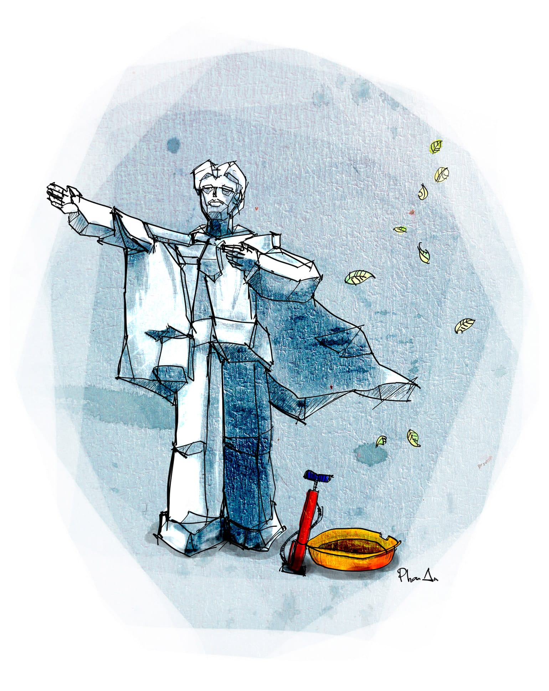
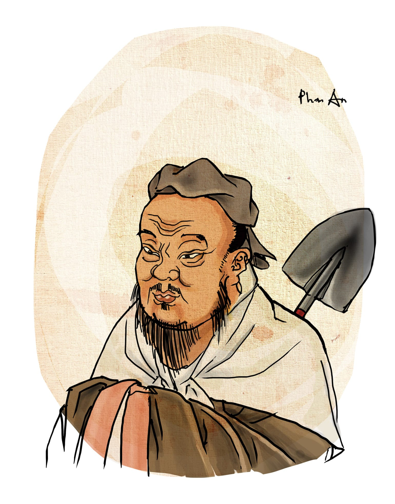

# 34

Con nhện lại nhúc nhích. Đang ở góc tường, tự nhiên nó chạy xuống bám vào đầu rèm cửa sổ. Chỗ đó, một tia sáng mặt trời buổi chiều chênh chếch rọi vào đúng cái lưng của nó, làm hình chữ thập đỏ sáng rực lên, óng ánh như bụng một con đom đóm. Hồi còn nhỏ, ở quê, có một dạo cứ tối tối ăn cơm xong tôi lại chạy ra đường bắt đom đóm bỏ vô vỏ trứng, chúng tôi thi nhau xem thằng nào bắt nhiều đom đóm hơn và vỏ trứng của thằng nào sáng nhất. Những con đom đóm ban đầu còn sáng nhấp nháy rất mĩ miều, bay qua bay lại trong cái vỏ trứng một hồi thảy đều tắt ngóm, lăn quay ra chết cả lũ, xác dồn lại dưới đáy vỏ trứng thành một đống đen đen mà lại có mùi hôi hôi.

Quang Tèo xúi tôi mang bài đi khiếu nại. Nó nói bài tôi đẹp ngất trời ai ai cũng thấy, nó nói trước khi bài tôi được chấm thì tụi năm dưới lấy máy ảnh ra chụp đến cháy đèn flash, nó lại nói chính thầy Mẫn khi còn sống cũng khen, mà thầy Mẫn đã khen thì là thiên hạ vô địch, lời thầy đối với sinh viên cũng như sấm truyền, không có lí do gì mà đang từ cây đàn vi ô lông mướt như sợi cước lại trơ trẽn trở thành cái chày như ông thầy Bành nói. Nhưng tôi không nghe nó. Tôi không phải là thằng có đủ dũng khí để đứng lên cãi lại thầy cô. Tôi không được sân si như người ta. Thầy cô đối với tôi cũng là cha mẹ. Ví dầu con lợn bay qua, thầy cô nói con gà tôi cũng nói theo. Thầy cô đặt đâu tôi ngồi đấy. Từ nhỏ tới lớn tính tôi đã vậy rồi. Thêm nữa, tất cả những vụ chống đối thầy cô trước giờ tôi được biết đều có một kết cục chẳng ra cái ôn vật gì sất.

Tội nghiệp, thằng Phan bạn tôi hồi học lớp mười một lại không có được cái đức tính quý báu đó. Bản chất nó là một thằng vui vẻ hòa đồng, những buổi sinh hoạt lớp cuối tuần vẫn thường xung phong lên bảng hát bài hát trộm gà “cái cánh nó xé ra chiên bơ cái chân nó cắt đem phơi khô,” vừa hát nó vừa rút dép lê ra đập bàn giáo viên phèng phẹt để lấy nhịp và ngoáy phao câu tít mù. Nó lại được cái tốt mồm, mỗi lần đi học quân sự hay hội diễn thể thao thể dục gì đó lại được cử làm đội trưởng; nó vươn cổ ra, ngửa mặt lên trời, hô “Bước đều! Bước! Một hai một hai một hai!!!” văng nước bọt, giọng nó to tới mức những lớp khác ở góc bên kia của trường cũng nghe thấy và bắt đầu chân trái đá chân phải, đi loạn cả lên, mất sạch điểm thi đua, rồi thằng lớp trưởng phải chạy đi méc “Thưa thầy bạn chó Phan lùn ở lớp 11/22 hô to quá nên lớp em không giẫm đều được” và ông thầy Trí quát “Em nói ai lùn? Em nói đểu tôi đó hả?” rồi đuổi nó đi chỗ khác. Tất nhiên tụi lớp khác căm thằng Phan lắm, nhưng ở lớp tôi thì nó là người hùng, được anh em nhất tề bầu làm lớp phó lao động, mặc dù thỉnh thoảng nó cũng đem truyện sex lên trường dấm dúi đọc và mượn cây thước kẻ của con Loan bàn trên để đo chim. Thế mà đến cuối kì nó lại được hạnh kiểm trung bình. Là tại cái mồm xơm xơm vô kiểm soát của nó mà ra cả. 

Tại vì lớp tôi năm ấy có bà cô dạy Địa rất ngầu. Tôi nói thiệt, trong suốt mười mấy năm đi học tôi chưa thấy bà cô dạy Địa nào ngầu hơn bả. Mặt bả đanh lại, xám xịt, lưỡng quyền bả nhô một cách dị thường, lại có một cái nốt ruồi to chà bá ở bên mép mà thỉnh thoảng bả lại thè lưỡi liếm một phát cho nó bóng nhờn lên. Bả mang đôi guốc cao dễ đến hai tấc, gót nhọn hoắt như cây đinh, và mặc áo dài gấm đen đính hột cườm thêu hình con công, hoặc con rồng, hoặc con phượng, hoặc một giống vật quái đản nào đó mà hồi nhỏ mẹ bạn vẫn thường đem ra dọa để bạn ăn cơm được ba bát – cùng với ông kẹ nấp trong góc nhà, con ma le nấp dưới giường và chú công an nấp sau gốc cây ngoài phố. Nghe đồn nhà bả có mấy trăm cái áo dài, không biết có phải vậy không, nhưng đúng là suốt một học kì chưa bao giờ tụi tôi thấy bả mặc trùng cái nào. Bả lại xức nước hoa, cái loại nghe mùi như mùi thuốc lá hạng nặng – cho dù tụi con gái lớp tôi trầm trồ bảo nhau rằng bảo loại ấy là đắt tiền lắm, chỉ thua mỗi loại mùi ruồi giấm và loại mùi nước đái bò – và mỗi khi kiểm tra thì bả đi lên đi xuống, tay cầm chai dầu gió xanh Singapore xịt không ngừng vào mũi. Thế còn cái giọng bả thì, Phạm Duy nói giọng danh ca Duy Khánh như tiếng chuông đồng, như thông reo trên đồi Vọng Cảnh, nhưng tôi đồ rằng ổng chưa gặp bà cô của tôi nên mới dám nói nhăng như thế, phỏng ổng gặp rồi thì cỡ Duy Khánh chắc ổng cũng chỉ coi như vại cà nằm chái bếp mà thôi. Giọng bả lanh lảnh, xuyên vào tai người ta như cái dùi, bả giơ tay phải ra phía trước, xéo lên phía trên khoảng mười lăm độ, mắt bả nhìn thẳng, hai chân bả đứng nghiêm, và bả hô như người ta duyệt binh, rằng “Các em rất là may mắn vì Việt Nam ta được thiên nhiên vô cùng hậu đãi đó hỉ, tài nguyên khoáng sản của chúng ta là mênh mông hỉ, phía Bắc chúng ta gánh khoáng sản phía Nam chúng ta gánh thóc gạo rứa còn miền Trung chúng ta thì gánh cái đòn gánh đó hỉ” “Việt Nam ta rừng vàng biển bạc, mưa thuận gió hòa, giàu có muôn đời đó hỉ” “Các em phải tự hào vì sinh ra là người Việt Nam vinh quang, con Lạc cháu Hồng, da vàng máu đỏ đó hỉ” “Tôi đã đi Pháp đi Mỹ đi Nhật, người Pháp người Mỹ người Nhật đều ngưỡng mộ Việt Nam ta vì chúng ta đánh họ chạy té re[^1] đó hỉ” “Tôi tiết lộ cho các em một bí mật quốc gia ni đây hỉ, chính là do bạn thân của tôi làm phát ngôn viên bộ ngoại giao nói cho tôi biết, là chúng ta đang gấp rút chuẩn bị quy trình xây nhà máy điện nguyên tử đó hỉ, tới chừ là vẽ gần xong cái móng rồi đó hỉ. Xây xong nhà máy điện nguyên tử nớ rồi thì nền kinh tế của nước ta sẽ tăng trưởng phi mã, trong vòng một kế hoạch năm năm là lên tốp đầu thế giới liền hỉ, tụi tư bản chỉ còn nước hít khói đó hỉ.” Tới đây thì hốt nhiên thằng Phan cười khơ khơ, nó nói:

“Răng nghèo mà dóc kinh rứa hỉ.”

Cái câu thất ngôn đó phát ra khỏi miệng nó khơi khơi mà lại có sức mạnh như một quả bom đế quốc. Tụi khốn nạn lớp tôi bắt đầu lăn ra bàn cười hô hố và vỗ tay. Thằng Kỳ lại còn đập tay _high five_ với thằng Phan đánh “bộp,” và chúng nó cùng kêu “Ồ Dê!” Nhưng bà cô Địa bả không cười cũng không vỗ tay. Thay vào hai hành động thân thiện đó, bả làm một hành động khác, công bằng và run rẩy mà nói thì có hơi kém phần thân thiện. Bả xồng xộc bước xuống chỗ thằng Phan đang ngồi, tà áo dài thêu con công của bả bay phấp phới như hoa hậu quý bà nào đó đang trình diễn trên sàn thời trang Paris, và bả _high five_ một quả trực tiếp lún mặt thằng Phan, làm nó văng thẳng vào gầm bàn. Khi nó ôm má xuýt xoa chui từ gầm bàn ra và ngửa cái mặt lún lên nhìn bả với ánh mắt ngơ ngác như muốn hỏi “cô hai phai em chi mà mạnh rứa” thì bả quát ra một câu thất ngôn ứng đối như Mạc Đĩnh Chi qua cửa ải, rằng: 

“Răng mà cậu mất dạy rứa hỉ!!!”

Cuối học kì đó, thằng Phan bị xếp loại hạnh kiểm yếu. Lo lắng cho tương lai tối tăm của thằng con đốn mạt, mẹ nó liền đập heo đất lần giải rút, tất tả đi mua một can dầu mè hai chục lít vác tới nhà bà cô Địa. Trong ánh đèn nê ông sáng choang ở phòng khách nhà bả, bà mẹ thằng Phan tấm tắc khen rằng “Nhà cô đẹp thiệt, chu choa con chó ni hai mươi triệu à, đắt hơn thằng Phan con em rồi, rứa hắn có ăn cứt không cô, hi hi, dạ em giỡn chơi rứa thôi, dạ thưa cô dầu ni thơm lắm nề” rồi mở nắp can dầu ra nâng lên đến mũi bà cô cho bả ngửi tại chỗ. Xong bả lại nói “Xin kỉnh cô can dầu mè ni nề, cái ni chính là tấm lòng yêu thầy cô, yêu đất nước, yêu dòng giống Bò Lạc máu vàng da đỏ chi chi nớ, mà nhứt là yêu nhà máy điện tự tử chi chi nớ của em với thằng Phan con em nề.” Bà cô Địa nhoẻn miệng cười, hai tay bả xoắn vào nhau, bả nói “Chu choa chị bày vẽ chi cho mệt rứa hỉ, em Phan nhà mình tui lạ chi nữa, em nớ là hiếu động lắm, có tương lai sáng chói lắm đó hỉ, đất nước mình giàu mạnh như bây chừ chính là công lớn ở lứa học sinh như em Phan nhà mình đó hỉ, thôi chừ ri, chị để can dầu lại đây, chị đi dề từ từ thôi, coi chừng con chó hắn tưởng cứt hắn cắn đó hỉ.” Nhờ can dầu mè ấy mà hạnh kiểm của thằng Phan được vớt lên thành loại trung bình, tuy rằng trong học bạ của nó cuối cùng người ta vẫn ghi “Báng bổ tổ quốc, thiếu lòng tin vào nguồn năng lượng hạt nhân.” Với cái học bạ như thế, thằng Phan nghiễm nhiên có một chỗ đứng trong đội ngũ đi nghĩa vụ quân sự năm sau, cho dù nó cao chỉ một mét rưỡi và cận đến bảy độ rưỡi. Buổi tập trung lên đường, nó đứng phía trước hàng, oai vệ như một chú lùn trong bộ quân phục thùng thình, cặp mắt nó nghiêm nghị nhìn thẳng về phía trước sau cặp kính, thỉnh thoảng liếc nhìn bà mẹ nó như nàng Bạch Tuyết đang hớn hở khoe với hàng xóm “Coi tề, coi thằng Phan con tui hắn mới ngầu kinh chưa tề.” Sau hai năm trong quân đội, lúc trở về thằng Phan trở thành một người có kỉ luật khác hẳn. Sáng nào cũng vậy, đúng năm giờ rưỡi là nó bật dậy rửa mặt đánh răng rồi tập thể dục dụng cụ, nó hít xà đơn xà đôi nhuần nhuyễn, xong đến sáu giờ nó ăn sáng, sáu rưỡi nó uống cà phê, bảy giờ nó vác đồ nghề ra ngã tư và bắt đầu chổng mông bơm xe đạp đến tám giờ tối, nắng cũng như mưa không bao giờ ngơi nghỉ. Thậm chí cái năm quê tôi bị bão, thằng Phan vẫn kiên cường bám trụ cái ngã tư ấy, tuyệt đối tuân theo cái kỉ luật sắt ấy. Nghe người ta kể rằng, trong khi bà mẹ với con em gái nó cuống cuồng chạy tới chạy lui trong nhà, lấy dây chuối buộc lại cửa mành mái tôn và chêm giấy báo vào cửa sổ, thì nó vẫn đứng uy nghiêm trong cái áo trấn thủ màu xanh lá, trước những cơn gió thổi phần phật, bên tấm biển “Bơm Xe Độp Ko Đâu Rẻ = Đây!??”, mặc cho mưa quất rát mặt và cột điện đổ lỏng chỏng chung quanh, nhìn nó hiên ngang như một tượng đài mẹ Nhu. Khi báo Tuổi Trẻ cử phóng viên đến tận ngã tư phỏng vấn nó rằng chân lí nào, niềm tin nào đang tung bay đằng sau thế đứng ngầu cồi đã bao nhiêu năm ấy, nó bảo nó đang đợi cho đến ngày Việt Nam ta xây dựng nhà máy điện nguyên tử và trở thành đất nước phát triển nhất thế giới, nó tháo kính ra lau, nó trở tay quẹt mồ hôi chảy ròng ròng trên trán và than rằng biển bạc đã cạn queo rồi, rừng vàng đã trọc lóc rồi, chớ răng mà cái nhà máy nớ hắn lâu tới rứa hỉ.

Nhưng vụ thằng Phan như thế là vẫn còn nhẹ, vì dù sao nó cũng vẫn có được một công việc ổn định, còn hơn khối thằng tốn biết bao nhiêu tiền học thêm năm lớp mười hai chỉ để thi tốt nghiệp sáu môn được ba điểm rưỡi mặc cho các cô thầy giám thị đã cong đít giải bài giùm, và cuối cùng phải đi làm những nghề nghiệp kì quặc như lau nước đá, bơm bánh xe lửa, quay cánh trực thăng, hoặc đường cùng hơn nữa thì đóng một khoản phí nhỏ hàng tháng để có chân trong đội hình kéo thang máy cho mấy cái chung cư cao cấp mới xây mỗi khi cúp điện. Thằng Hùng thầy đề lại không được may mắn như thế. 

Hùng thầy đề hơn tôi hai tuổi nhưng thi rớt đại học một năm, khi tôi mới vào trường thì nó mới học tới năm hai, vả cái mặt nó lại non choẹt, nên sau hai tuần ở chung phòng trọ thì tôi với nó mày tao chi tớ loạn cả lên, không còn ra cái phép tắc lễ độ gì nữa cả. Nó là một thằng gốc Hà Nội, bố làm gì đó ở Bộ, nhà rất giàu. Tướng nó dong dỏng cao, gầy gầy, da dẻ trắng trẻo, nó để tóc dài gần nửa lưng trông rất thư sinh, nhưng lại chửi thề luôn mồm và sở hữu một bộ óc kì quặc. Tôi chưa thấy ai dốt về số má như nó. Nó vẽ rất đẹp, nhưng trong cái đầu nó hình như không có con số cũng không có bất kì một thứ logic nào, chỉ có màu sắc hoa lá và chim chóc các loại. Cho nên khi đi thi đại học lần thứ nhất, tuy rằng bài vẽ lão già theo góc ba phần tư của nó được chín điểm rưỡi, nó vẫn rớt thẳng cẳng vì môn toán chỉ được không điểm hai lăm. Nó bảo được không điểm hai lăm thật ra cũng là nhờ trước khi nộp bài nó đã kịp viết “Kính thưa thầy em không biết làm bài nào cả, chỉ xin thầy cho em nửa điểm để em đỡ mang nhục với gia đình và xã hội” rồi mang lên nộp. Đến lần thi sau thì nó đậu, nhờ ông bố nó bằng một cách nào đó đã đút trót lọt bốn mươi triệu sáu trăm năm mươi bảy nghìn đồng, cho dù đến tận bây giờ nó vẫn chưa biết bố mình đút tiền cho ai và phần lẻ của món tiền ấy rơi vào đâu. Tóm lại là Hùng thầy đề đường hoàng bước vào cổng trường đại học, và thậm chí còn nhanh chóng nổi tiếng toàn trường nhờ tài vẽ vời hoa lá chim muông của mình. Bài vẽ mĩ thuật của nó, bét nhất cũng được tám điểm, cá biệt có lần nó vẽ tượng David nhìn từ sau mông được cho mười điểm trừ, và cái lần nó vẽ Athena từ chân vẽ lên được mười điểm cộng. Có điều, nó tự hào về môn vẽ của mình bao nhiêu thì lại khổ sở nhục nhã về những món tính toán bấy nhiêu. Những giờ Cơ học, Nhiệt học, Âm học, Điện học[^2], nó ngồi nghe giảng bài như vịt nghe sấm, mồm nó há ra, chảy dãi, mắt nó lờ đờ như mắc dại, nó ngáp liên tục không ngừng nghỉ. Đến lúc thi thì càng tệ hại hơn, nó đến trường sớm phải chừng hai tiếng, cứ thấy đứa nào học hành khá khẩm tí ló mặt tới là nó ba chân bốn cẳng chạy đến nở nụ cười xun xoe, nó nắm tay người ta lắc lắc như bạn thân lâu ngày, và nó nói “Chút nữa vô phòng thi mày ngồi gần tao tí nhé hi hi, thi xong ra chỗ bà Nhã uống cà phê tao trả tiền, hút nữa không tao còn cả bao đây, thôi xú-vơ-nia mày luôn, báu gì cái hộp quẹt.” Trong phòng thi nó loe ngoe như con trùn, hết nhìn tới nhìn lui lại nhìn qua nhìn lại, nó thì thà thì thào “Ê Bảy, suỵt, thằng chó, ê cu đĩ, ê thằng mặt phò, bài này làm sao mày? Diễm ơi Diễm câu này sao nữa hả bạn?” xem tướng bộ rất hèn hạ. Đến cuối giờ được thằng Bảy vứt cho cục giấy, nó mừng còn hơn cha chết sống lại, vội vội vàng vàng mở ra chép lấy chép để theo kiểu dấu vô cực thành số tám, dấu căn bậc hai thành chữ V, dấu pi thành số mười một. Chuông reng hết giờ, khi tụi tôi đã ra hành lang đứng bàn tán xôn xao thì nó vẫn còn cặm cụi ngồi viết mót trong phòng, giám thị quát dữ quá thì nó vội vội vàng vàng ghi vào cuối bài thi dòng chữ rằng “Xin thầy cho em qua môn này em lạy thầy” rồi mới chịu nộp. Cái khổ nhục kế ấy, tuy rằng khá bần tiện, nói một cách công bằng đã giúp nó chật vật qua được năm nhất. Nhưng sang đến năm hai, tức là khi tôi vào trường, thì các thầy đã nhẵn mặt thằng Hùng thầy đề. Hùng thầy đề không còn được du di nữa, mặc dù nó đã tìm cách linh động hóa cái câu kết bài trứ danh của mình thành các phiên bản uyển chuyển mềm dẻo như “Em lạy thầy vạn lạy mớ lạy,” “Em nghiến răng cắn cỏ ngậm vành,” rồi những lúc cùng cực quá nó lại ghi “Hu hu thầy ơi” các thứ. Kết thúc đợt thi lần một của học kì hai, sau khi nhận con dê-rô thứ tư ở môn Quang học[^3], đem cân đối bù trừ với loạt điểm vẽ mĩ thuật với đồ án thì nó được có bốn phẩy ba, và cầm chắc trong tay một vé đình chỉ. 

Ngay giữa giờ tuyệt vọng ấy, Hùng thầy đề được Trầm Tử Thiêng từ trong trại cải tạo báo về cho một tin vui. Nó nghe giang hồ đồn về cái bảng băm lộng kiếng treo trong phòng khách của ông thầy Tượng. Nó lại nghe rằng bắt đầu từ năm ấy trường tôi thực hiện cuộc cách mạng văn phòng điện tử gì gì đó để ăn theo cái đề án gì gì đó của chính phủ, rằng cho dù trong cái đề án đó người ta tham nhũng đến cả trăm tỉ, thì điểm số của bọn sinh viên chúng tôi vẫn đã được chuyển hết từ mấy cái tủ hồ sơ vẫn bám đầy mạng nhện ở phòng đào tạo sang một cái máy tính đặt trong phòng thực hành tin học, cái máy mới mua bự chà bá, đặt trên cái bàn có xích sắt ở chân, và rằng ông thầy Tượng nắm mật khẩu cái máy tính ấy trong tay – chính thế, ổng xăm cái mật khẩu vào cánh tay, gồm tám dấu hoa thị liền liền. Thế là bỗng nhiên Hùng thầy đề với ông thầy Tượng thành bạn nhậu chí thân, Tượng đi chơi Hùng đi học, Tượng ngang dọc Hùng vọc tới nơi, một tuần liên tục hôm nào người ta cũng thấy Tượng với Hùng dắt nhau đi ăn thịt chó trong hẻm Võ Văn Tần. Đến tuần thứ hai thì Hùng thầy đề từ đâu lao xe về, xông vào phòng, vừa búng tay tróc tróc vừa nhún nhảy bảo tôi: 

“Anh mày thoát rồi nhé thằng em mặt phò. Tốn mười chai chẵn. Lão già giảm giá cho tao đấy, nhờ một số lượng đùi chó, chứ bình thường phải là mười hai chai kia. Hớ hớ quả này anh vững như cái bửng nhé.”

Xong nó huýt sáo bài “Giàu chưa chắc sướng mà nghèo thì chắc chắn khổ” của Michael Lang và trong một tâm trạng hứng khởi đã mặc độc cái quần tà lỏn mà đi ngược kiểu moonwalk quanh phòng. Nhưng nó chỉ làm trò bước giăng được có ba ngày vỏn vẹn. Ngày thứ tư, Quang Tèo chạy đến hớt hơ hớt hải gọi “Anh Hùng thầy đề ơi anh bị đình chỉ rồi chết mẹ!” và thằng Hùng thầy đề đang nằm vắt chân chữ ngũ trên cái giường tầng rơi đánh uỵch ngay xuống đất, cái quần tà lỏn móc vào cây đinh mắc mùng rách toạc lòi mông đít, nó vừa ôm mông xuýt xoa vừa quát tướng lên “Cái đuỵt ai bảo mày thế thằng mặt phò này?” Sau khi nghe Quang Tèo vừa gãi mông vừa thề sống thề chết trên có Thiên Văn dưới có Địa Lí, đất có Thổ Công sông lại có Hà Bá rằng chính mắt nó thấy tên dzé của sinh viên ít học Nguyễn Tấn Hùng lớp 01A1 trong danh sách đình chỉ dán trước cửa phòng đào tạo, thì Hùng thầy đề cuống quýt rút ngay điện thoại ra, mở danh mục Favorites gọi cho Thịt Chó (Thầy). Quang Tèo và tôi, chúng tôi lúc ấy tâm trí hoang mang nên không theo dõi được đầu đuôi câu chuyện, nhưng nghe lõm bõm thì cuộc nói chuyện của nó với ông thầy thịt chó nặc danh ấy diễn ra một cách vô cùng tuyệt vọng như sau: 

“Vâng thưa thầy em là Hùng 01A1 đây, thầy quên em rồi à, vâng đúng là Thịt Chó (SV) đây mà. Dạ vâng, thịt chó ạ, chính thế, một số lượng lớn các đùi, với vốt-ka Hà Nội một dung tích nhiều, sao em vẫn bị đình chỉ là sao thưa thầy, vâng thầy kiểm tra lại giúp em với ạ. Sao cơ? Thầy bảo thầy nhầm á? Á? Thầy nhầm qua thằng Nguyễn Tấn Hưng á? Á? Dạ không em có dám nhại gì thầy đâu ạ, tôn sư trọng đạo, tiên học lễ hậu học văn mà thầy, quẻ đầu tiên của tất cả các loại quẻ... Sao cơ? Thầy bảo tại vì không có dấu á? Á? Không có dấu là thế nào, máy móc thế đếch nào mà lại không có dấu? Sờ ốc dấu sắc, sờ bướm dấu huyền, bộ gõ Việt Khây đấy, cứ thế mà gõ vào thôi! Không sửa lại được à? Cái gì mà bút sa gà chết, bút sa gà chết là cái chó gì, thầy đừng có chơi trò Trúc Xanh với tôi, này là cái máy tính chứ có phải bút tích gì đâu, gà với lại chả vịt, máy tính thì phải có phím Clear chứ, tôi còn lạ gì cái đống máy móc xích vào chân bàn của thầy, thế còn gà thì không chết mà là tôi rách quần lòi cả trôn đây này! Sao cơ? Thầy đùa với tôi đấy à, bảo cho thầy biết thằng này không dễ chơi đâu nhé, Tấn Hùng chứ đếch phải Tuấn Hưng đâu, tôi không phải ca sĩ đâu mà nghe thầy gảy đàn. A! Cái đuỵt mẹ lại còn dọa tao à, thằng láo, thằng mặt phò chó chết, đợi bố mày đấy!” 

Xong rồi mặc cho tôi với Quang Tèo ra sức cản, nó cứ mặc nguyên cái quần rách đít, phăm phăm lao lên xe phóng đến nhà ông thầy Tượng. Nhưng ổng đã khóa cổng sắt cắt dây chuông mà cố thủ trong nhà không chịu ra. Hùng thầy đề đứng bên ngoài tung quần trong gió, hò hét chửi bới chán chê xong lại chuyển sang hát vọng cổ Lan và Điệp “Tượng ơi mở cửa anh vào, để anh leo rào là chết mẹ Tượng nha” đến tối mịt mà không thu hoạch được thành quả gì rõ rệt, đành hậm hực về nhà. Tối hôm ấy nó vẽ liền một tờ truyền đơn trang trí rất đẹp, tuyền những là hoa cỏ và đường diềm, nó lại vẽ thêm cái lỗ chó chui, trên có tấm biển “Khoa Tin Học.” Nguyên văn tờ truyền đơn của nó ghi như sau:

_“Thầy Tượng nhận tiền hối lộ của sinh viên!!!  
Mười triệu đồng nhưng mắt lé!!!  
Sinh viên mất tiền mà vẫn rớt? Tại sao sự ~~bất công~~ vô lí dưới mái trường xã hội chủ nghĩa???  
Những thằng thầy lé không nên đi dạy Pascal!  
Những thằng mặt phò không được ăn thịt chó!!!”_

Sáng hôm sau nó đem tờ ấy đi photocopy màu, rồi đeo khẩu trang vào và đi vòng vòng rải truyền đơn khắp trong trường. Nó lại đứng trước cổng trường, thấy đứa nào đi ra đi vào cũng chặn lại nhét truyền đơn, nó lại dặn “Đọc đi nhé bạn, cái này bí mật lắm đấy, một mình bạn được biết thôi.” Đến trưa thì nó thanh toán xong xấp truyền đơn năm trăm bản, hoan hỉ trở về phòng trọ ngủ. Tuần sau thì bố nó nhận được tờ quyết định thôi học của thằng con do nhà trường gửi về tận nhà. Ổng hộc tốc ra sân bay mua vé máy bay hạng thương gia, xong na cái thân béo phệ vào Sài Gòn, tìm gặp thầy hiệu trưởng, nhưng đã khí muộn, vì thầy đã bảo ổng rằng “Xin lỗi anh nhưng tôi cũng không phân biệt được Nguyễn Tấn Hưng với Nguyễn Tấn Hùng bởi vì đối với những giảng viên đầy tình yêu thương chúng tôi thì tất cả các em sinh viên yêu mến đều như là những búp trên cành biết ăn ngủ biết học hành là ngoan, thế nên cái truyền đơn của em Hưng con anh là một sự báng bổ thánh hiền, anh có biết Khổng Tử không, chính là đốt sách chôn thầy, thế còn thầy Tượng thì là một giảng viên gương mẫu đến giá trị vô cùng, chúng tôi chưa hề nhận được văn bản có con dấu nào từ bên trên gửi xuống phàn nàn về thầy, không một con nào cả! Thế và ai bảo lần này anh gặp tôi trễ thế, anh đừng hỏi tôi về bảy ngàn lẻ nữa có được không?” rồi tiễn ổng ra khỏi phòng, và ổng cáu tiết lôi luôn thằng con về lại thủ đô. Từ cái buổi nó với hai cánh tay Grudge cào cấu vô vọng trên mặt đường nhựa trong khi hai cẳng chân bị ông bố kéo lê xềnh xệch từ cổng nhà trọ ra đến tận sân bay ấy, thằng Hùng thầy đề đẹp trai tài hoa bạn tôi trở thành một thằng du đãng vừa thất học vừa thất nghiệp, tuổi thanh xuân của nó đang từ mơn mởn như cô thiếu nữ tuổi mười ba cởi truồng lội khe dưới ánh trăng rằm lại thành ra rất vô nghĩa và buồn tủi, ban ngày nó gác tay lên trán làm trò ngã tư thế sự ngủ khò cho thật đẫy, ban đêm nó lái xe hơi đầu nhọn thân vát cạnh bánh vuông bật đèn gầm mở nhạc xập xình chạy quanh quanh hết vũ trường này đến quán bar nọ để kiếm gái, mặc cho bố nó vẫn ngày ngày đập bàn đòi đưa tình hình đĩ điếm của cả dân tộc ra luận bàn tại kì họp quốc hội, rằng với tình hình thanh thiếu niên hư hỏng đi chơi đĩ ngày càng nhiều như hiện nay thì liệu chúng ta có nên xem làm đĩ là một nghề hợp pháp hay không, và những đứa đi chơi đĩ có cần xuất trình sổ hộ khẩu hay không, thế còn những dân nhập cư chưa có hộ khẩu chỉ có giấy báo đóng tiền điện muốn chơi đĩ thì phải làm thế nào. Thỉnh thoảng nhớ bạn, tôi cũng gọi nó hỏi thăm tin tức đời sống thân thế và sự nghiệp, lúc nào thì vào quốc hội thay cho ông bố sắp về vườn, nhưng lần nào nó cũng trả lời rất vắn tắt “Đang đá phò, sẽ gọi lại cho thằng cu đĩ sau.” 

  

[^1]: Trước đó tôi chỉ nghe người ta dùng từ “té re” để miêu tả ỉa chảy. Chính là nhờ bà cô dạy Địa mà tôi biết từ này cũng có thể dùng trong quân sự và chính trị.
[^2]: Điện học, tương tự như Âm học, là một môn học dạy cách thiết kế mạng lưới điện trong các công trình, ví dụ điện cầu thang ra sao mà điện sân thượng lại như thế nào. Ngoài ra nếu bạn may mắn thì ông thầy dạy môn này cũng sẽ chỉ bạn cách quay máy phát điện để phòng khi cần kíp.
[^3]: Quang học, tương tự như Điện học, là một môn học dạy cách thiết kế công trình sao cho ánh sáng chiếu vào đúng nẻo, buổi sáng tránh hướng Đông mà buổi chiều lại né được hướng Tây vân vân, nhằm giữ cho con người ta đỡ bị quáng gà mà không cần phải uống vitamin A hằng ngày. 
