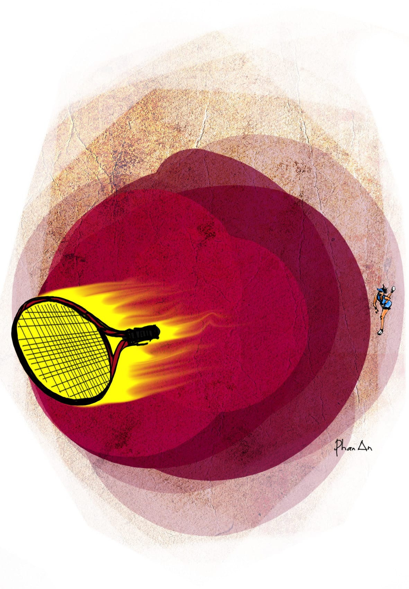

# 377

Có những con nhện lành, và cũng có những con nhện độc đến mức một phát cắn có thể làm chết lật ngửa nguyên một con bò. Miễn cưỡng mà nói thì có thể phân biệt được nhện và bò, nhưng loài người chúng ta, bất chấp nền khoa học kĩ thuật đã phát triển tột bậc, vẫn chưa tìm ra được cách nào hữu hiệu để phân biệt nhện lành nhện độc với nhau. Có người bảo nhện lành nhìn xấu, nhện độc nhìn đẹp đẽ nhiều màu sắc, nhưng điều đó là sai, là nói càn, đó không phải là nhện, đó là nấm hai mươi lăm ngàn một kí hoặc gái đĩ vận váy ngắn lòi xi-líp giá hai ngàn rưỡi đô một shot. Ví dụ con nhện mà tôi quan sát nãy giờ đây, da nó đen bóng, lưng nó có dấu chữ thập đỏ, nhưng không có nghĩa nó là nhện độc. Tôi không nghĩ trong trường tôi lại có nhện độc. Những nỗi đau khổ hiện tại đè lên chúng tôi đã là vượt quá sức chịu đựng rồi, chẳng cần thêm một con nhện độc nữa. 

“Các thầy không thể chèn ép bọn em quá đáng như vậy được.” Thằng Kiên mũi gãy lại nói. Cái mũi gãy của nó đỏ ửng lên, nhìn lại càng rõ là lệch hẳn qua một bên. 

“Cậu ăn n-n-nói cho cẩn thận! Cậu nói ai ch-ch-chèn ép các cậu?” Lão thầy Hợi lại đập bàn “Rầm” một cái nữa. Nhưng lần này thì con nhện thản nhiên không động, dường như nó đã quen với những chấn động bất thường trong cái phòng họp này, cũng như dân miền Trung quen với cái đập thủy điện sông Tranh suốt ngày lủng lỗ với lung lay. 

 “Thầy… rất thất vọng… Sao em lại có… có gì nhỉ… ờ ờ, có thể… suy nghĩ… Các thầy không thể… ờ ờ… không thể nghĩ suy…” Ông thầy Tôn ề à.

“Em lầm rồi, các thầy luôn coi các em như những búp trên cành, biết ăn ngủ biết học hành là ngoan. Các thầy đã tạo điều kiện cho các em bao nhiêu, nào là chơi bóng ném, nào là đánh ten-nít. Em nói thế chính là báng bổ thánh hiền đấy, chẳng khác nào đốt sách chôn thầy, mà em có biết Khổng Tử là ai không cái đã?” Thầy hiệu trưởng nói.

“Đó... là chưa kể... các em đốt sách phô tô chứ không phải sách gốc... thà như là mua sách gốc...” Ông thầy Tôn lại tiếp tục quá trình ề à của mình. 

“Tôi đã nói với các anh rồi, tôi không có chèn ép các anh.” Tới lượt ông thầy Bành tham gia, vừa nói ổng vừa chấm tay vào li trà đá, vẽ lên mặt bàn những hình vuông chẳng biết hữu ý hay vô tình mà vô cùng đồng dạng. “Tôi nhắc lại, không có người thầy nào lại đi chèn ép người trò của mình. Đã đi chèn ép người trò của mình thì không phải là người thầy. Tôi là người thầy. Các anh là người trò. Mà người thầy thì không chèn ép người trò. Nên tôi không chèn ép các anh. Chèn ép các anh thì còn gì là người thầy nữa? Không người thầy nào lại đi chèn ép người trò của mình cả. Nhưng đã là thầy thì phải ra thầy. Đã là trò thì phải ra trò. Thầy cho ra thầy mà trò thì cho ra trò. Đấy, rất đơn giản. Thầy phải cho ra trò mà thò phải cho ra chày. Tôi chỉ nói ngắn gọn đơn giản vậy thôi, các anh hiểu chứ?” 

“Dạ em hiểu.” Thằng Kiên trả lời. “Ủa mà quên, á lộn, xí mê, thưa thầy em chưa hiểu. Thật ra em hiểu, nhưng chính vì em hiểu nên em chưa hiểu.” Nói xong câu nói có tính chất bác học ấy, nó lảo đảo ngồi xuống, mắt trợn ngược lên, đồng tử giãn ra, và Quang Tèo bắt đầu vỗ vào lưng nó thật lực.

Tôi đồng ý với nó. Tôi cũng hiểu mà như chưa hiểu. 

Phong trào làm trong sạch nền giáo dục đổ bộ vào trường tôi như một cơn bão. Người ta nói cùng với áp thấp nhiệt đới gây gió giật bay mái tôn tùm lum trên diện rộng, có một ông bộ trưởng bộ giáo dục mới mới lên thay cho ông bộ trưởng bộ giáo dục cũ hồi tháng tư vừa rồi. Nghe bảo ông bộ trưởng bộ giáo dục mới, trong buổi nhậm chức đã ngửa mặt lên trời hít hít mấy cái rồi nhíu mày tuyên bố “Chà cái nền giáo dục thúi nát quá, thúi chi mà thúi lạ, chúng ta hãy nói không với sự thúi nát của nền giáo dục cũng như chúng ta nói không với bao ni lông nào các bạn.” Thế là tuân theo lời bộ trưởng, phong trào tìm diệt bao ni lông nổi lên khắp mọi nơi, đâu đâu cũng thấy người ta cầm que đi trên đường để xiên bao ni lông, cứ mỗi kí bao ni lông đổi được hai nghìn đồng. Sau khi bao ni lông đã bước đầu được bình định, đường sá đã bắt đầu được sạch đẹp, người ta mới sực nhớ lại và ngồi xuống xòe bàn tay ra đếm ngón, rồi phát hiện ra câu nói của ông bộ trưởng có đến hai vế chứ không ít, mà chiến dịch tìm diệt bao ni lông chỉ mới đánh vào vế thứ hai mà thôi. 

Tai họa của chúng tôi bắt đầu từ đó. Mọi thứ đều thay đổi. 

Đơn cử như chuyện cái sân tennis. Ông thầy Trạch nói tôi không biết có một loại phí là Đoàn phí, kể cũng đúng. Nhưng bảo tôi không biết gì về phí thì có hơi oan uổng. Ngay từ đầu năm nhất, khi mới chân ướt chân ráo vào trường, tâm hồn còn thơ dại, mặc quần xanh áo trắng cắm thùng, ngồi sè sẹ trên ghế và lấm lét nhìn xuống xem có quên kéo phẹc-mơ-tuya hay không, thì chúng tôi đã được phổ cập về một loại phí tên là thể dục phí. Ấy là khi thằng Kiệt mặt mụn nhờ câu nói trơ trẽn “Các bạn bầu tôi đi” mà được bầu lên làm lớp trưởng, nó bèn mặc quần tây thắt cà vạt đi dự đại hội các lớp trưởng của trường, có hoa và nước khoáng đóng chai La Vie miễn phí, được vỗ tay đồng ca bài “Đi lên thanh niên,” rồi về đứng trước lớp tuyên bố:

“Các bạn thân mến, các bạn hãy cùng tôi đóng thể dục phí nào.”

Khi chúng tôi ồ lên hỏi quát đờ phắc là cái thể dục phí thì nó bảo rằng thể dục phí là một khoản phí để có cơ thể cường tráng, cũng như muốn đi tập tạ phải đóng tiền cho thằng cha pê-đê râu xồm vậy, đã có học phí, có tình phí, có công tác phí thì cũng phải có thể dục phí, đó là cái lẽ dĩ nhiên mà thôi. Nó bảo ngôi trường này có truyền thống học tập căng thẳng từ lâu đời các bạn không biết ư, điểm đầu vào đã là hai mươi bốn, nhiều người tay to còn gọi nó là Harvard của Việt Nam, nếu các bạn muốn trụ được cho đến ngày đội mũ bê rê có tua vàng thì liệu hồn mà tập thể thao thể dục, phải có sức khỏe thể chất các bạn mới có sức khỏe tinh thần, đó chính là tinh thần thể dục của nhà văn Nguyễn Công Hoan. Nó lại bảo không nói gì xa xôi, ngay năm ngoái đã có bốn đứa ngu bị lên tăng xông, đột tử cùng một lúc vì không tập thể dục mà lại cả gan thức khuya vẽ bài ba đêm liên tục. Cái ghế chúng tôi ngồi bỗng dưng ướt nhem một cách rất mất kiểm soát, và chúng tôi đồng loạt gởi thư về quê xin tiền bố mẹ để đóng thể dục phí, mỗi đứa như thế là một trăm ngàn. Đợt ấy bao nhiêu là bò và lợn bị bán đi trên khắp các làng quê Việt Nam, và vài tháng sau thì trong khuôn viên trường mọc lên một cái sân quần vợt. Nó là một cái sân đẹp mĩ miều, nền xanh đất đỏ, dài rộng cao và sâu theo đúng chuẩn quốc tế, lại có giàn đèn cao áp hẳn hoi. Những lúc đợi chúng tôi viết chương trình phân biệt chẵn lẻ, ông thầy Tượng vẫn thường đứng bên cửa sổ nhìn xuống sân, người ổng hơi cúi, chân ổng khuỳnh khuỳnh, tay ổng vợt qua vợt lại một cái vợt tưởng tượng giữa hai đùi, miệng ổng kêu nho nhỏ “Bình! Bốc! Đốp! Mười lăm! Ba mươi! Bốn mươi! Đếu! Đếu rồi thưa các bạn!” Ấy là vì ổng mê quần vợt, cũng như tất cả những ông thầy khác. Buổi trưa sau những giờ giảng bài căng thẳng, ổng thường cùng các thầy cô khác túa xuống sân, bận quần bó thể thao, chia phe uýnh quần vợt với nhau. Các thầy lên lưới, các cô rờ-ve, các thầy vô-lê, các cô bỏ nhỏ, các thầy xoáy trên, các cô xoáy dưới, các thầy thở hồng hộc, các cô lại má đỏ hồng hồng, rất nhiều điều lả lướt. Bên ngoài, ông thầy Mẫn đi ngang qua, tay đút túi quần tay để sau đít, mắt liếc nhìn khinh bỉ, còn sinh viên chúng tôi thì níu hàng rào sắt, những thằng tục tĩu thì bình phẩm giò đùi, nhưng đa số thì vô tư cổ vũ tinh thần cho cả hai đội. Tuy nhiên, có một số đứa may mắn hơn cả, được các thầy cô cho vào sân. Dưới cái nắng như đổ lửa, những thằng sinh viên tổ đãi ấy sung sướng chạy tới chạy lui trong sân banh đến tụt cả quần lòi khe mông sâu sắc, mồ hôi chảy thành dòng trên khuôn mặt xanh lè như đít nhái, giành nhau trái banh tennis do các thầy cô đánh văng ra. Cứ mỗi buổi nhặt banh như thế, mỗi thằng được trả công năm mươi ngàn đồng. Cuối buổi, thằng nào may mắn hơn nữa thì được giao cho cây chổi, liền chổng mông lên quét sân, lượm bịch nước ngọt, cạo bã kẹo cao su, và lãnh thêm được hai chục ngàn nữa. Đối với bọn sinh viên chúng tôi thì tất nhiên đây là một số tiền khổng lồ, nên chúng tôi chẳng nề hà gì gian khổ, mặc dù những rủi ro mang đặc thù nghề nghiệp thì không thể nói là không có. Thằng Kiên chẳng hạn, chính là trong một phút bất cẩn thiếu tập trung mà nó bị trái banh tennis giáng cho lệch sống mũi, máu chảy tùm lum. Nhưng nó vẫn còn may mắn hơn ba thằng: một thằng bên A1 ăn nguyên cây vợt nặng nửa kí bay với vận tốc tuột tay là trăm hai cây số một giờ vào mặt, ngã lăn ra đất bất tỉnh nhân sự, phải khênh đi chụp X-quang kết quả rạn sọ, và tất nhiên là hôm ấy không nhận được món tiền năm mươi ngàn đồng, một thằng mặt rỗ chuyển thành mặt ca rô vì mải ngửa lên trời nhìn đường banh mà té úp mặt vào hàng rào lưới sắt, với một thằng ở lớp dưới có hỗn danh là Dũng chim gãy, trước đó vẫn được gọi một cách hiền lành và sặc sỡ hơn là Dũng Chim Xanh. 

Thế rồi phong trào làm trong sạch nền giáo dục tự nhiên nổ ra. Cách đây mấy tuần, sau gần hai năm câm miệng hến không phát biểu gì, thằng Kiệt mụn lại lên đứng trước lớp nói:

 “Mấy thằng chó chuẩn bị chơi ten-nít nhé.”

Chúng tôi còn chưa kịp bất ngờ về sự thay đổi nhỏ trong cách xưng hô của lớp trưởng Kiệt mụn thì nó đã phát cho chúng tôi mấy trái banh tennis rồi bảo lũ chó chơi đi còn chờ gì nữa, cơ hội thể dục thể thao ngàn năm có một đây rồi. Khi chúng tôi ngơ ngác cầm banh xuống sân thì thấy một cảnh tượng vô cùng nhộn nhịp. Cái sân đã mở cửa tự do, giàn đèn cao áp được bật sáng trưng giữa buổi trưa đứng bóng, bên trong sân là một đống lau nhau những đứa năm nhất và năm hai đang vừa chạy như chó dái vừa hò hét điên loạn. Chẳng biết làm gì với mấy trái banh không có vợt, chúng nó liền chia phe chơi banh ném, và bởi vì không biết một chữ luật banh ném nào, chúng nó chỉ biết ra sức ném banh vào nhau túi bụi như những đứa con nít bên Tây Âu trên ti vi ném tuyết. Bên ngoài sân, các thầy cô đứng nhìn bọn sinh viên chơi đùa và nở nụ cười mãn nguyện. Ngay cả ông thầy Tượng bình thường quạu quọ, lúc ấy cũng đứng trên tầng hai, chỗ khoa Tin Học Cơ Bản mà nhìn xuống, mặt mày tươi tỉnh, và ổng quàng vai lão thầy Hợi đang có vẻ vừa sung sướng vừa có nét ngượng ngùng khó tả. Nhưng chuyện ấy diễn ra không được bao lâu. Tụi sinh viên thụ động ấy, vốn chỉ quen lượm banh chứ không quen ném banh, đã mau chóng chán ngấy cái trò chạy qua chạy lại trong khoảng sân có rào sắt cho các thầy cô đứng nhìn mà không liệng chuối, nên lần lượt bỏ ra vỉa hè uống cà phê bà Nhã hết cả. Chẳng còn gì để nhìn, các thầy cô cũng đành bỏ đi, ông thầy Tượng không quàng vai lão thầy Hợi nữa, mặc cho lão tiu nghỉu như chó bị cắt tai. Kể từ hôm ấy, cái sân banh một thời náo nhiệt huy hoàng đã trở nên vắng tanh vắng ngắt, mặc dù Hải Lẹo nói rằng chẳng qua các thầy đã chuyển sang chế độ đánh ban đêm, và rằng các thầy đã thuê mấy đứa cháu của lão Lồng lượm banh trả tiền theo giờ, cứ một giờ là mười lăm ngàn đồng mỗi đứa.

Nhân tiện kể luôn, lão Lồng là chủ của cửa hàng bán dụng cụ học tập ngay bên cạnh trường tôi. Lão mới xuất hiện gần đây, cho dù cái cửa hàng này đã tồn tại dễ phải được chục năm rồi. Trước đây cửa hàng này có tên là Năm Cư, do một lão tên là Năm Cư mở ra, nghe nói sau khi thắng một cuộc đấu thầu căng thẳng đến mức độ nhũn não. Nằm ở vị trí quá sức đắc địa, cửa hàng Năm Cư quanh năm suốt tháng đông nghẹt khách ra vào, đại đa số là sinh viên, đứa mua chì, đứa mua gôm, đứa mua giấy, đứa mua đất sét tạo hình, đứa mua màu Leningrad, đứa lại đi phô-tô cả cuốn _Âm học trong công trình cơ bản và vô cùng nâng cao_, vô cùng tấp nập. Tất nhiên cái đứa phô-tô cuốn _Âm học trong công trình cơ bản và vô cùng nâng cao_ cũng như tất cả các cuốn khác của Phó Giáo Sư Tiến Sĩ Nguyễn Trường Tôn sẽ bị đánh rớt hai năm liền vì tội vi phạm bản quyền giảng viên, và ông thầy Tôn sẽ lên trước lớp nói rằng “Thầy rất... thất vọng vì có một... à, có một vài em... đã lấy cớ nhà nghèo mà… mà không tôn trọng công chép... à, công sức của... của thầy...” nhưng đó lại là chuyện khác. Chuyện tôi đang nói ở đây là cái cửa hàng Năm Cư ấy, nó đông khách từ lúc mở hàng cho đến lúc đóng cửa, chỉ trong vòng vài năm tôi đã tận mắt chứng kiến nó nuốt luôn hai căn nhà hai bên, phát triển thành hệ thống văn phòng phẩm Năm Cư, gồm Năm Cư 1, Năm Cư 2 và Năm Cư 3, ba Năm Cư cùng vươn lên vô cùng hùng mạnh. Sau đó chúng tôi lại thấy cả ba Năm Cư đập tường để kết nối lại với nhau thành Năm Cư như cũ, chỉ khác là tấm biển Năm Cư phình ra to gấp ba, treo trước cả ba cái mặt tiền, như thế này: “Năm Cư Năm Cư Năm Cư,” lại có hàng chữ gắn đèn nê-ông phía dưới nhấp nháy rằng “Năm Cư không có chi nhánh.” Từ cây thước chữ T đầu năm nhất cho đến mười sáu tờ giấy A0 cuối năm năm, bọn sinh viên trường tôi bất kể giàu nghèo đã đổ không biết bao nhiêu tiền vào cái cửa hàng Năm Cư này mà kể. Thế nhưng chẳng đứa nào biết mồm ngang mũi dọc của lão Năm Cư cả, và hình dung của lão là một trong những đề tài hay được sinh viên bàn tán nhất những lúc cà phê; chúng nó đồn rằng cái xe mui trần mới vừa tông chết bà già rồi chúi nhủi vào gốc cây trên đường Lê Văn Sĩ là của lão, và rằng lão thích nhạc giao hưởng các thứ. Lâu lâu vào mua con dao rọc giấy chúng tôi cũng thấy một lão già mặt mày đen thùi lùi như củ khoai lang nướng đang ngồi lụm cụm trong xó gạch gạch xóa xóa gì đó trên một cuốn sổ cũ rích nhàu nát, nhưng Quang Tèo nói như đinh đóng cột rằng đó không phải là Năm Cư; nó bảo lão Năm Cư còn trẻ trung và trắng trẻo hơn nhiều, chúng mày không có gì phải thắc mắc, cứ tin ở bố. Khi chúng tôi gặng hỏi “Tại sao mày biết?” thì nó trả lời “Chuyện đâu còn có đó, từ từ rồi chúng mày cũng hiểu biết như tao.” 

Nhưng chưa kịp diện kiến dung nhan của Năm Cư thì một bữa chúng tôi đã thấy người ta dỡ tấm biển Năm Cư xuống, thay bằng tấm biển “Bốn Lồng Bốn Lồng Bốn Lồng.” Ban đầu thì bọn sinh viên còn bỡ ngỡ với sự thay đổi đột ngột từ Cư sang Lồng này, nhưng chỉ sau một buổi thì lòng trung thành khách hàng của chúng nó cạn sạch, cái bản chất vô ơn bạc nghĩa thiếu thủy chung của chúng nó quay trở lại, chúng nó quên phắt Năm Cư, và hò nhau vào mua hàng của lão Lồng như chẳng có gì xảy ra. Tất nhiên lưng lão Lồng còng queo, răng lão lởm chởm, lão lại hay rít ống điếu nhả khói hôi rình, nhìn lão giống lơ xe đò về hưu hơn là ông chủ văn phòng phẩm, nhưng tất cả những điều đó không ngăn cản được lão trở thành một doanh nhân thành đạt, có lẽ cũng chẳng kém gì Năm Cư lúc trước. Lão lại tuyển thêm được mấy đứa cháu ở quê ra, chính là cái bọn mà Hải Lẹo nói là từ sáng đến chiều bán giấy bút, buổi tối đi lượm banh tennis mỗi tiếng mười lăm ngàn. 

Nói gì thì nói, mặt mũi lão Năm Cư đối với chúng tôi vẫn còn là một bí ẩn.
