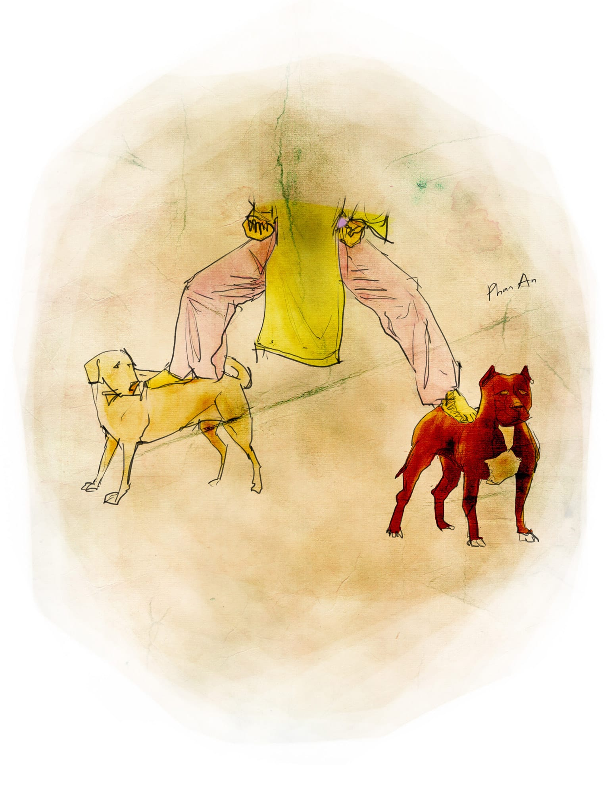

# 5

Nhưng trước khi chết, hẵng để tôi giãy một cái. Ai trước khi chết cũng giãy một cái, coi như là ngáp vớt. Sống bao nhiêu năm trên đời, chịu bao nhiêu là bất công xã hội, đóng bao nhiêu là loại thuế, mà không làm một cú giãy ngáp vớt thì cũng khí ngu. Tôi giãy một cái đã. 

Đó là, nghĩ đi nghĩ lại thì tôi không đồng ý với ông thầy Tôn. Tôi không phải là người đầu tiên trong lịch sử giáo dục nước nhà bị đình chỉ. Tôi cũng không phải là người thứ hai hay người thứ ba. Từ giữa những năm hai mươi của thế kỉ trước, khi trường mới được bọn thực dân man rợ thành lập ra cho đến nay, số sinh viên bị đình chỉ hoặc bị đuổi dễ phải lên đến con số ngàn. Nếu tính rộng ra, từ khi người ta ôm cái ống tre mà tuyên truyền sự học vấn trên toàn cõi Việt Nam này, số người bị đuổi học dễ phải được tính bằng ức vạn. Nếu bạn may mắn không phải là một trong số ấy, thì để tôi giải thích thêm cho chắc ăn: “ức,” ngoài cái nghĩa là vùng ngực của các loại gia cầm và là nơi nhiều thịt nhất, được KFC tức Kentucky Fried Chicken hâm mộ nhất, còn là một từ cổ dùng để đếm mà ngày xưa những người hủ lậu người ta xài, giờ người ta không xài nữa nếu không thuộc dạng hủ lậu triệt để. Gần đây thì một ức là một trăm triệu, nhưng hồi xưa hơn một chút thì một ức là mười vạn, một vạn là mười ngàn. Thế còn tiếp theo đó thì mười ngàn là một ổ bánh mì thịt, một tờ vé số Đồng Tháp chiều xổ, hoặc một lần vá xe theo thời giá do doanh nghiệp của thằng Phan cung cấp – tôi sẽ kể về thằng này cho các bạn sau. Một điều chắc chắn: tôi không biết hết tên của toàn bộ ức vạn bị đuổi ấy. Nhưng tôi biết một số điều còn chắc chắn hơn: mỗi một đơn vị trong số ức vạn bị đuổi ấy lại bị đuổi trong một hoàn cảnh khác nhau, chẳng đơn vị nào giống đơn vị nào, và sau khi bị đuổi thì chúng nó gần như ngay lập tức trở nên quen thuộc với bánh mì, săm xe và vé số.

Ví dụ, năm lớp ba tôi học chung lớp với thằng Câu. Thật ra tên thật của nó không phải là Câu. Bố nó cũng không phải tên Câu, bố nó tên Bồ hay tên Phao gì đó. Mẹ nó thì tên là Bích. Vì sao người ta gọi nó là Câu tôi không nhớ, hoặc đơn giản là tôi không biết. Tôi chỉ nhớ năm đó cô giáo cho bài tập làm văn như sau “Chó là người bạn lâu đời nhất của con người, cho nên em hãy tả con chó nhà em đi còn chờ gì nữa.” Đó là một đề tập làm văn rất kinh điển, rất cổ kính, có thể nói là kinh điển và cổ kính như cột cờ Hà Nội vậy. Ai trong đời cũng phải tả chó một vài lần, cùng với chú lợn, cô gà trống, bé Hoa mới sinh, cái trống trường em, ông nội vân vân. Có lẽ bạn cũng còn nhớ, trên đời này lợn nào lợn nấy tuyền đều to bằng cái phích nước, gà trống nào gà trống nấy đều vỗ cánh phành phạch gáy gọi bạn dậy học bài mỗi sáng tinh mơ, mẹ bạn bà nào bà nấy lúc nào cũng vừa mới sinh em bé hôm qua, em bé nhà bạn đứa nào đứa nấy đều có cặp má lúm đồng tiền xinh xắn và cổ tay tròn từng ngấn như tôm hùm, ông nội bạn ông nào ông nấy râu tóc bạc phơ như một ông tiên hay ngồi đánh cờ tướng với ông Tám nhà bên cạnh cũng râu tóc bạc phơ như một ông tiên khác, bà ngoại bạn bà nào bà nấy đều thường vừa bỏm bẻm nhai trầu vừa kể truyện Tấm Cám Thạch Sanh cho bạn nghe, còn cái trống trường bạn thì cái nào cái nấy cũng đều kêu tùng tùng như thúc giục bạn hãy đến trường chăm chỉ chuyên cần cho dù đài đang báo bão số bốn gió giật cấp mười một và trụ điện bị thổi ngã bổ chỏng khắp khắp. Một đôi khi bạn cũng muốn tả con lợn nhà bạn to bằng bà Tư đầu xóm, con gà trống của bạn đang gân cổ gáy thì bị bà chị dâu trùm bao bố cắt cổ lấy bộ tinh hoàn cho ông bố chồng ăn lại sức sau những đêm nhún mông khó nhọc, mẹ bạn suốt ngày ăn mắm cáy sau khi bạn có đứa em gái thứ ba, bố bạn tát mẹ bạn mà bảo là bà mẹ mày cái loại đàn bà không biết đẻ đái đếu gì cả, ông nội bạn trọc đầu vì xạ trị ung thư hay nằm vắt chân chữ ngũ trên bộ ván ngựa mà phê bình chế độ độc tài toàn trị của Saddam Hussein[^1], trong khi bà ngoại bạn ngồi bệt ngoài hiên vừa lần chun quần đếm mấy tờ tiền bán ve chai lúc sáng vừa chửi thằng ăn cắp đểu giả, và cái trống trường bạn nó kêu reng reng như tiếng chuông điện, nhưng vì nhiều lí do chủ quan cũng như khách quan mà người ta không cho bạn được như nguyện. Dù sao thì ở đây tôi cũng không bàn đến những chuyện ngoài lề vô nghĩa ấy. Tôi chỉ bàn đến chuyện con chó. 

Nay chúng ta quay lại chuyện con chó. 

Đúng vậy, năm lớp ba chúng tôi được ra đề tập làm văn về nhà “Tả con chó nhà em.” Cô giáo của chúng tôi dặn đi dặn lại rằng “Mấy em phải tả thiệt, không có được cọp dê sách văn mẫu, vì đứng trên sách văn mẫu mà nói thì cô có cả chồng sách văn mẫu đây, em mô làm giống sách văn mẫu là cô trừ điểm liền.” Cái giết người là ba phần tư lớp tôi ở khu tập thể, và trong khu tập thể thì người ta không cho nuôi chó. Tất nhiên người lớn có những lí do rất búa bổ mà tụi con nít chúng tôi lúc ấy chưa hiểu được vì hạn chế của tuổi tác. Người ta bảo rằng “cứt chó hôi như chó” và “chó sủa điếc tai, không cần chó cái khu tập thể chó chết ni đã ồn thí mẹ rồi” và “nuôi chó rồi mấy thằng dân phòng với bảo vệ làm cái đếu chi cho hết ngày” và “chó cái chi chi nữa, bộ mi tưởng đời ni chưa đủ chó hay là như răng?” Tóm lại là ba phần tư trong số chúng tôi không có chó mẫu để tả thực. Cho nên chúng tôi, đứa nào gia đình khá giả tí thì bật ti vi lên đợi chương trình thời sự và thấp thỏm hi vọng hôm nay có tin gì liên quan đến chó, ví dụ như “bàng hoàng chó dại tung cánh bơi chó qua sông và cắn chết người ở Liên Trì Bắc” hoặc “kinh hoàng chàng trai Bắc Kinh đến nhà bạn chơi và quan hệ tình dục với chó.” Những đứa nghèo hơn như tôi thì phải chạy ra mấy bãi rác cạnh khu chợ cũ để tìm tả chó hoang, cái lũ chó ghẻ lở gầy giơ sườn vẫn hay sủa ủng oẳng và cắn nhau toạc da rách thịt để giành nhau cục xương, nào có ngờ đâu một lão ăn mày đê tiện đã dùng kế sách “tọa sơn quan hổ đấu” của Tôn Tử mà nhanh tay thó mất. Còn thằng Câu thì may mắn hơn, bố nó là đại tá lái xe giuýp cho quân khu Bảy, nhà nó có một con chó quả thật chính hiệu chó, có thể hãnh diện trong mọi chó: lông trắng, mũi đỏ, chân sau có khoeo kiềng, lại biết đi ỉa đều đặn ngày hai lần vào trong một cái hộp giấy; chính là con chó do bác Tư Bề – lúc ấy còn là dân phòng trơn – kính biếu nhân dịp Trung Thu. Thế là thằng Câu phen ấy trúng tủ. Cho nên, vừa nhận được đề là nó hí hửng nhảy chân sáo về nhà, búng lên cầu thang từng ba bậc một bất kể cái cặp táp đeo trên lưng nặng đúng mười hai kí lô, xong nó tung đòn giu-đô vật ngay con chó ra giữa phòng khách, văng rận chó ra bốn phía, và khởi sự làm bài như sau “Nhà em có nuôi một con chó tên nó là Tô Tô, nhìn từ xa Tô Tô lấp ló đằng sau hàng cây đa cổ thụ, nhìn gần thì mái Tô Tô đỏ, trước phấp phới cột cờ, nhà em rất yêu Tô Tô cũng như nhớ ơn bác Tư Bề đội trưởng đội dân phòng vì đó chính là một con chó rất khả kính.” Bài nó dài ba đôi giấy, nó viết cả ra lề. Nó tả con Tô Tô và bác Tư Bề kĩ lưỡng từ từng cái nốt ruồi nó tả đi. Bữa nộp bài, trong khi chúng tôi mặt mày méo mó thì nó vô cùng hí hửng, nó bảo lần này nó được mười điểm chắc cú, Tô Tô muôn năm, bác Tư Bề vạn tuế! Nhưng đến khi cô phát bài ra thì lạ thay, nó chỉ được sáu điểm rất bèo bọt. Lời phê của cô là “Văn em viết dài dòng quá sao lại có thể như thế được nhỉ, ôi rất ngô nghê.” Cô lại gạch tên con chó Tô Tô và sửa lại thành “Nhà em có nuôi một con chó tên là Mi Lu.” Cô bảo chó phải tên là Mi Lu chứ lị, cô đọc sách “Những bài văn mẫu hay lắm” và truyện tranh “Tanh-tanh ở xứ Công-gô” đều thấy người ta biên như thế, thế còn trên đời không thể có con chó nào lấp ló sau hàng cây đa cổ thụ được vì cây đa cổ thụ không bao giờ mọc thành hàng. Mắt cô đẫm lệ, cô nói cây đa cổ thụ là một loại cây cô đơn và đau khổ, cũng như nước Đại Việt ta, cô đơn và đau khổ đến mức nó thường mọc lên từ một cái hột do con chim bay ngang qua đầu làng mà ỉa ra. Bình thường thì lời cô nói chúng tôi nhất nhất đều coi như sấm truyền, vả thằng Câu cũng không biết nhà nó đặt tên cho chó như vậy là đúng hay sai, nhưng lần này bị cú sáu điểm, tức là điểm tổng kết của nó sẽ bị kéo xuống còn có chín phẩy sáu, tức là bố mẹ nó sẽ lấy mười trừ cho  chín phẩy sáu thành không phẩy bốn mà uýnh nó bốn mươi roi, nên nó uất quá, bèn đứng lên cãi cô rằng chó nhà nó tên Tô Tô thật và rằng đứng trên chó mà nói thì cô chẳng biết gì về chó, cũng như đứng trên cây đa mà nói thì cô chẳng biết gì về cây đa nên cô đừng có mà bô bô, rằng nó sẽ về méc bố nó là đại tá lái xe giuýp cho quân khu bảy, cứ mỗi chiều chủ nhật lại lái xe giuýp đi ăn thịt chó bờ sông Hàn. Chẳng biết nó méc như thế nào mà ông bố nó lái xe giuýp đến gặp cô ở trường thật, và khi cuộc tranh cãi nảy lửa đến đỉnh điểm thì người ta nghe ổng hái bài “khi đến trường cô giáo như mẹ hiền” có chút cải biên rằng “Tôi nói cho cô biết, ở trong trường cô vẫn là cô giáo nhưng mà ở ngoài trường cô chỉ là con chó mà thôi.” Thế là để cho thỏa chí nguyện của ổng, nhà trường đã mời ổng ra ngoài trường, rồi một tuần sau thì thằng Câu cũng cơm nắm cơm đùm mà ra theo. Ấy là chuyện thằng Câu con nhà bà Bích bị đuổi học mà chúng tôi thời đó đứa nào cũng biết. Chúng tôi chỉ không biết tháng sau cô giáo đi đâu mà chúng tôi không bao giờ được gặp lại cô nữa. 

Tới năm lớp bảy, tôi lại gặp một vụ đuổi học khác. Lần này là thằng Lâm gấu, nhưng đầu têu sự vụ là thằng Khiêm mặt chuột. Thằng Khiêm mặt chuột, khi nó mới sinh ra thì ba mẹ nó định đặt tên nó là Nguyễn Bỉnh Khiêm, nhưng sau khi đi dọ hỏi quanh quanh trong xóm thì ổng bả mới tá hỏa mà nhận ra rằng hóa ra cái tên này trùng với tên với một ông chí sĩ nào đó đã ôm bom ba càng từ thời kháng chiến chống thực dân Pháp đô hộ nước ta, nên cuối cùng ổng bả quyết định đổi dấu mà đặt là Nguyễn Bĩnh Khiêm. Thằng Nguyễn Bĩnh Khiêm là một thằng không có gì đặc biệt hơn thiên hạ, chỉ trừ ba việc sau đây. Việc thứ nhất là nó học dốt vào loại siêu cấp vô địch, chủ trương không có đối thủ, không bị lung lạc, không hề nhân nhượng. Nó nói nó xưng đệ nhị thì không thằng nào dám xưng đệ nhất, mà khi nó xưng đệ nhất thì cũng không con nào dám giành vị trí đệ nhị vì khoảng cách quá xa. Không ai biết được nhờ vào phép màu nào mà nó lên được lớp bảy, vì ngay cả cái bảng cửu chương khi đọc nhanh nó vẫn thường bắt chước ông Lại Văn Sâm trên ti vi mà cho tám nhân tám bằng bốn mươi tám phẩy năm. Khi người ta nhã nhặn sửa bốn mươi tám thành sáu mươi tư thì nó đại diện luôn cho ông Lại Văn Sâm mà gân cổ lên cãi, và sử ra ngay cái việc thứ hai là ỉa đùn. Nó rất hay ỉa đùn mỗi khi xúc động, cũng như người khác khi hồi hộp thì chảy mồ hôi tay. Nhưng nó không lấy cái việc sỉ nhục ấy làm điều. Nó cứ ỉa đùn đều đều, rất thản nhiên và vô cùng ngang nhiên. Lúc nào ỉa xong, cái mặt nhỏ như mặt chuột của nó cũng vênh lên, và nó bắt đầu nương theo làn hương mà đi tướng khuỳnh khuỳnh từ trong lớp ra đến chỗ cái vòi nước máy ở góc sân, đi tới đâu mọi người dạt ra tới đó, làm như nó không phải là thằng Khiêm mặt chuột vừa bĩnh xong đang đi rửa đít mà là Hít Le đang đi duyệt binh đâu tận bên Đại Đức. Ai cũng ghét nó, nhưng không ai dám làm gì nó. Vì có cái việc thứ ba rất quan hệ là, mẹ nó chính là bà cô Trân chủ nhiệm dạy môn sinh vật. Nó là con của bả. Con ruột hẳn hoi. Nó với bả từng chung nhau một dây rún – bả truyền chất dinh dưỡng và trí tuệ và các loại bệnh di truyền cho nó qua cái dây rún ấy. Có đứa cả quyết rằng ỉa đùn cũng là một loại bệnh di truyền, nhưng tôi không tin mấy. Dù sao cũng chưa ai thấy bà cô Trân ỉa đùn bao giờ cả. Chúng tôi chỉ thấy đầu mỗi tiết sinh vật bả lại lù lù bước vào lớp như hung thần genie mới lặc lè chui ra khỏi cái chai bottle. Tướng tá bả mập ú na ú nụ, cản hết cả ánh mặt trời, làm cái bóng của bả đổ về phía trước che tối nguyên một nửa lớp kiểu mấy phim kinh dị, cái loại phim mà mấy đứa nhân vật chính bị dồn vào góc tường, ôm nhau gào cha khóc mẹ thay vì bỏ chút công trèo qua cái tường cao nửa mét mà chạy trốn. Bả tiến về phía ghế giáo viên với dáng điệu nghênh ngang không thua gì thằng con đi rửa đít. Rồi bả ngồi xuống đánh “phẹp,” như người ta nện một cái bong bóng lợn xuống thớt, tiếng vọng qua ba dãy lớp, và tụi lớp ở hành lang đối diện nói với nhau “Tới giờ cô Trân rồi đó bay.” Bả từ từ đeo đôi kính to tổ chảng vào, liếc quanh lớp một cái từ trái qua phải rồi một cái nữa từ phải qua trái, xong bả nói rành rọt từng tiếng một:

“Chỗ ni! Giờ chừ! Kiểm choa!”

Ấy là bả nói “hiện nay và đúng ở tọa độ này, tôi đang kiểm tra đầu tiết ơi hỡi các em.” Nhưng cái kiểu của bả nó là như thế. Thế là cả lũ chúng tôi vội vội vàng vàng gấp hết sách vở lại, nhét vào cặp hoặc thảy vào hộc bàn. Đứa nào còn để một tờ giấy mở trên bàn, bả cho một điểm ngay lập tức. Chúng tôi ai cũng sợ bả như sợ cọp. Chỉ trừ thằng Khiêm ra, vì càng khắt khe với chúng tôi bao nhiêu bả càng tỏ ra hiền lương với thằng con bả bấy nhiêu. Đây chính là định luật bảo toàn hiền lương, chiếu theo định luật này thì hiền lương không tự nhiên sinh ra mà cũng không tự nhiên mất đi, nó chỉ chuyển từ người này qua người khác, qua đường rún. Bả hầu như chẳng bao giờ màng hỏi bài nó, mà có hỏi bả cũng chỉ hỏi những câu như đít con khỉ màu gì, con giun đất sống ở đâu, khủng long tuyệt chủng hay chưa, rồi khen ôi trò giỏi quá, đúng là con lăng quăng biến thành con muỗi rồi, sao một em bé xinh xắn dễ thương như trò lại biết được những điều tiến hóa cao siêu đến vậy, và cho nó mười điểm. Cho nên cái thằng Khiêm, nó ị đùn một cách đầy xúc động vào tất cả các tiết học, trừ tiết sinh vật. Đến giờ sinh vật, nó tạm gác công việc ị đùn thật hệ trọng kia lại để làm vua một cõi. Nó giật tóc con này, nó châm kim vào mông thằng kia, người nó nhoi nhoi như giòi. Nhưng không ai dám làm gì nó, vì cho dù nó giống giòi đến mấy thì nó vẫn là con ruột của cô chủ nhiệm, nó với cô chủ nhiệm từng chung nhau sợi dây rún, và đứa nào gây rối trật tự trong lớp sẽ bị cô chủ nhiệm mời phụ huynh đến trường để công bố quyết định hạ hạnh kiểm cháu nhà một lần hai bậc. 

Có điều, con giun xéo lắm cũng quằn. Sau lần bị một điểm vì mải mê ôn bài quên cả cất sách vào cặp, rồi lại kim châm xuyên mông phải ngồi nhón cả tuần, thằng Lâm gấu mới dồn thằng Khiêm mặt chuột vào một góc lớp, lặng lẽ tung hết các ngón nghề võ thuật. Phải nói thêm rằng nhà Lâm gấu đã bốn đời chuyên nghề trật đả chân tay và cứ đến mỗi mùa Trung thu với Giáng sinh lại đi múa lân kiếm thêm thu nhập ở đền chùa miếu mạo đạo Cao Đài và nhà thờ Cơ đốc giáo, rằng nó mới mười hai tuổi đã cao một mét bảy mươi nặng sáu mươi kí lô, tướng nó rất be, rằng nó là đứa học trò yêu dấu nhất của tất cả các giáo viên thể dục, và rằng mỗi khi đá banh, thay vì sút vào giữa hai cột quần áo thì nó lại toàn sút qua khu doanh trại bộ đội cách sân banh hai cái chung cư. Nói thì nói vậy, nhưng thật ra Lâm gấu rất hiền. Ngay cả khi nó đánh thằng Khiêm, nhìn nó cũng vô vàn hiền hậu. Mặc cho thằng Khiêm kêu gào như cha chết, nó không nói không rằng, cứ bình tĩnh hết đấm vào be sườn bên phải lại đạp qua cẳng chân bên trái, nó lên đầu gối nó lại xuống cùi chỏ, rất từ tốn ôn hòa, tới mức nếu không thấy thằng Khiêm lăn qua lăn lại ắt người ta tưởng Lâm gấu đang tập dưỡng sinh cho đầu óc đỡ căng thẳng giữa hai tiết học. Khi bà cô Trân vừa lao vào lớp, vấp chân bàn ngã cái “bạch”, vừa kêu “Quớ làng nước ơ! Quớ làng nước ơ!” thì mặt thằng Khiêm đã sưng húp, tròn quay như cái mặt heo, và nó bĩnh một quả phải nói là thúi trần gian có một. Bà cô Trân nhảy vào giữa hai đứa, ra sức can, nhưng Lâm gấu đang hăng máu cứ đánh nhầu thêm hai hiệp nữa. Nó chỉ dừng lại sau khi tiện tay quại luôn vào bả một cú đấm làm bả ngã ra, tứ chi huơ huơ trong không khí, như con rùa lật ngửa, làm cả lớp tôi cùng hiệp lực toát mồ hôi mới kéo được bả dậy. Hai hôm sau thì Lâm gấu bị đuổi học, cho dù cả nhà nó đã đội lân mang trống đến trước nhà bà cô chủ nhiệm để vừa uýnh trống vừa múa lân nguyên một buổi sáng, xong lại nhất loạt quỳ lạy van xin bà cô chủ nhiệm cùng thằng con mặt tròn của bả. Rồi nhà Lâm gấu lẳng lặng dọn ra Hà Nội. Bẵng đi cả chục năm biệt vô âm tín, tự nhiên một bữa tôi thấy nó trên ti vi. Thì ra thằng Lâm gấu của lớp tôi ngày xưa bây giờ đã đường đường là tuyển thủ quốc gia môn Ủ Su, nhà nước cử nó đi thi đấu SEAGames. Trên ti vi nó đấm đá thôi rồi, tay nó chém gió nghe phần phật, mắt nó sáng quắc tựa sao sa, nó kêu “ối a” và lĩnh huy chương vàng. Còn thằng Khiêm thì sau khi tốt nghiệp trung cấp nó được tuyển vào làm gì đó bên sở điện lực thành phố, hình như là mỗi khi cúp điện thì người ta lại phân công nó cứ mười phút một lần, trèo cột điện cầm bút thử châm xem đã có điện lại chưa. Có lần về quê chơi tôi thấy nó mặc bộ vét-tông mới cáu, diện đôi giày da bóng lộn như đánh mỡ gà, ngồi chồm hổm vỉa hè góc Lê Lợi và Lê Đình Dương uống cà phê cóc, cái mặt bây giờ, cũng như cái bụng, đã tròn tự nhiên. Lúc đó tôi định đến vỗ vai chào hỏi rằng mẹ mày giờ thế nào, nhưng lại sợ làm nó giật mình. Vì rằng miệng quan trôn trẻ, cái thằng lúc nhỏ mỗi lần giật mình lại tung một cú ị đùn thì lớn lên cho dù có nói điện nói nước gì gì bạn cũng chớ hề tin tưởng được. 

Lớn thêm một chút nữa, năm lớp mười hai, tôi ngồi chung bàn với thằng Á, tên thường gọi là Á đù. Công bằng mà nói thì thằng này đầu óc cũng không đến nỗi đù, chỉ phải cái mặt mày nó trông lúc nào cũng lờ đờ vì ngủ nhiều quá. Tôi có nghe một số giai thoại về nó, ví dụ như nó có khả năng vừa đạp xe vừa ngủ, hoặc như hồi cấp hai nó từng ngủ gật ngay khi đang đứng trên bảng giải bài hình học, thế mà giống như nó có thêm con mắt sau mông, khi ông thầy toan phét vào đít nó thì nó bừng tỉnh và né qua một bên kịp thời, làm tay thầy đập đánh “bép” vào bảng, sưng vù lên. Thằng Á đù chưa bao giờ nói những chuyện đó là thật hay giả, vì cứ đến lớp là nó lăn ra ngủ ngay khi vừa đặt đít xuống ghế, đố ai hỏi được nó một câu. Thật ra bảo nó chỉ toàn ngủ thì cũng không đúng, vì cũng có những lúc điều kiện ngoại cảnh khiến cho nó không ngủ được, như giờ thể dục chẳng hạn. Và những lúc ngủ không được như thế, thì nó noi theo đường lối của Bác Hồ. Nó làm thơ. Một thằng ngủ gật lại đi làm thơ, ấy mới thật là kinh dị. 

Chuyện là, năm lớp mười hai lớp tôi bị thay giáo viên thể dục. Thầy Đức đô chuyển sang dạy khối sáng, người ta điều ông thầy Trí về phụ trách lớp chúng tôi. Chúng tôi thích thầy Đức đô và không ưa ông thầy mới. Người ta bảo khi đỡ đẻ cho bà mẹ của ổng, mụ y tá chẳng biết bồng ẵm ổng thế nào lại làm rơi đánh phẹt, mà nền bệnh viện lại lót cái thể loại gạch bông bền chắc nhất trong các chương trình quảng cáo trên ti vi là Dongtam, làm ổng bị các loại ngoại lực tác dụng từ bốn phương tám hướng mà lớn lên trở thành con người hình vuông, cao một thước lẻ ngang một thước chẵn, cành cạch lăn tới lăn lui trong một cái xã hội cao ráo, thật rất đau xót. Nhưng sự ấy thật ra xét cho cùng thì cũng không phải là điều hệ trọng, vì bạn phải đồng ý với tôi rằng bề ngoài không quyết định tính cách với số phận người ta, đến như cái anh lực sĩ to lùn kia tưởng suốt ngày chỉ biết gồng và nghiến hai hàm răng lại nhìn giám khảo cười một cách đầy đau khổ mà nay cũng trở thành ngôi sao ca nhạc nhẹ hay biểu diễn ở sân Trống Đồng và thỏ thẻ rằng “Xin cảm ơn quý khán thính giả đã yêu em hí hí.” Không, chúng tôi không ưa ông thầy Trí vì những chuyện khác: ổng dẹp môn bóng rổ là cái môn chúng tôi ưa thích mà thay bằng môn đá banh trong nhà, ổng lại bắt riêng lớp tôi đổi đồng phục thể dục với cổ áo lá trầu, ổng đeo lủng lẳng trên cổ một cái còi, và ổng hay bắt tụi con gái hít đất. Ổng ngồi chễm chệ trên cái ghế gỗ ba chân, tay ổng vân vê sợi râu duy nhất mọc ra từ cái nốt ruồi đen thui to bằng ngón chân cái đính dưới cằm, cặp mắt ổng hau háu nhìn bộ mông tụi nó nhấp nhổm và bộ ngực tụi nó núng nính thập thò bên trong cái cổ áo thun thể dục rộng thùng thình trễ xuống. Mỗi khi tụi nó chống lên thì cục yết hầu của ổng chạy lên, mỗi khi tụi nó nằm bẹp xuống thì cục yết hầu của ổng lại chạy xuống, đều đặn như cái pít tông xe hai thì. Không, chúng tôi không ưa gì ổng, và cả cái điệu há mồm ra quên cả thổi còi lấy nhịp của ổng. Mà ổng cũng chẳng cần chúng tôi phải ưa. Có lần thằng Huỳnh Đức Chu Kỳ đôi co với ổng cả tiếng đồng hồ về luật nhảy ba bước, cuối cùng khi nó lễ phép bảo ổng rằng thằng anh nó có chân trong đội điền kinh thành phố và tính cho đến giờ thằng chả nhảy không phải là ba bước mà phải đến cỡ ba ngàn bước rồi, thì ổng phân định thắng thua một cách rất quyết đoán bằng cách tát cho nó ba tát, cái này tiếp sau cái kia một cách đều đặn theo luật cộng hưởng, làm nó ngã dúi dụi, bập đầu vào tường, và ổng biểu nó có ngon thì kêu thằng anh nhảy bao bố của nó nhảy lên đây cho ổng tát luôn một thể. Không, chúng tôi không ưa ổng. Thế mà thằng Á đù lại làm một bài thơ rất hay về ổng. Bài thơ như sau: 

_Xin tự giới thiệu, mỗ là Mô Văn T  
Vừa đi học nâng cao trở v`  
Bằng đỏ bổ túc trung cấp dân lập thể dục  
Bằng xanh cấp bổ sung môn d  
Mỗ được phân công dạy lớp mười hai hăm hai  
Sĩ số băm gái hăm trai  
Tức nhiên là mỗ cực khoái  
Đương nhiên mỗ phải ra oai  
Dưới quyền của mỗ chúng hắn đừng mong điểm cao  
Nhất là những kẻ dám dài hơn mỗ  
Chúng hắn làm mỗ cứ ngước lên mỏi gần gãy cổ  
Mỗ tất phải đè cho biết tay  
Đặc biệt có thằng Huỳnh Đức Trâu Cày  
Cái thằng cả gan xúc phạm tới mỗ  
Mỗ cho hắn đội sổ  
Coi thử hắn ngóc cách chi?  
Thân mỗ thời vuông  
Mỗ lăn nhanh hơn đi  
Tướng mỗ thời tốt  
Lý Đức cũng đếch hơn gì!  
Mỗ kịch liệt bài trừ bóng rổ  
Vì hắn không có ăn ý với chiều cao của mỗ  
Mỗ chỉ thích đá banh  
Làm thủ môn mỗ chắn hết khung thành  
Đường đi trước mặt mỗ còn dài  
Dài như khoảng cách từ đầu mỗ đến trời  
Mỗ còn phải nỗ lực hết sức  
Học trò mỗ phải hít đất cật lực  
Một hai một hai  
Một hai một hai… bái bai!_

Bạn thấy đó, có đọc ngược hay đọc xuôi gì thì cũng phải công nhận đây là một tuyệt tác. Tôi không biết hồi nhà thơ Xuân Diệu còn sống ổng có bị thầy thể dục bắt hít đất lần nào không, và ông thầy thể dục có dòm ngực Xuân Quỳnh không, nhưng bảo đảm Xuân Hồng không làm được bài thơ hay đến như thế vậy. Chúng tôi chuyền tay nhau cuốn sổ của thằng Á đù và khen Á đù có chí khí, rằng đây là thể loại thơ tự do thể hiện tinh thần yêu tự do của những con người chưa được mấy tự do đang đi hàng hai cả lề trái lẫn lề phải như một con cừu tật nguyền. Tiếng lành đồn xa, ban đầu chỉ có những tụi lớp bên cạnh biết tiếng nó mà qua mượn bài thơ để đọc cho làu thông, sau đến tụi lớp buổi sáng, sau nữa là tụi bên trường Trần Phú, tụi Lê Quý Đôn, tụi Nguyễn Hiền, cuối cùng bằng một cách rất mầu nào đó mà mắt thường chúng tôi không nhìn thấy được, cuốn sổ của nó lọt vào tay ban giám hiệu. Mà trong sổ, ngoài bài thơ về ông thầy Trí dạy thể dục, nó lại có thêm một bài văn tế sống bà cô Hòe dạy môn vật lí bị té lọi tay trên đường chạy từ lớp ra bãi giữ xe ô tô “để lại một mình thầy – và con cầy,” một bài tứ tuyệt về chuyện ông thầy dạy toán dùng chổi đuổi một đứa ra khỏi lớp học thêm vì chưa kịp nộp tiền “em đang hả họng chửa kêu la – thầy đã vung ngay chổi lông gà,” rồi lại một bài ngũ ngôn về thằng con của ông thầy dạy hóa được đặc cách học vượt từ lớp hai lên lớp bốn “thầy ngồi kèm con học – hai cộng hai bằng ba.” Chưa hết, giữa các bài thơ thỉnh thoảng nó lại chêm những câu ca dao cải biên theo phong cách hậu hiện đại rất sáng tạo, ví như: 

_Trời mưa thì mặc trời mưa  
cô tôi đi bừa đã có xú chiêng_

hoặc 

_Mưa phùn tí tách  
rơi trên cặp sách,  
thầy đi ì ạch  
bỗng té cái “bạch.”_

Đối với ban giám hiệu trường tôi thì đây thật là một tiếng sét giữa bầu trời quang đãng. Chắc các thầy cô trong ban không ngờ là giữa thời đại khô cằn sỏi đá toàn bể hụi giữa chợ, giết mẹ nhét dưới hòn non bộ trước cửa nhà và hiếp dâm người già ngoài đồng mà mình lại đào tạo được một đứa học sinh có tâm hồn thi sĩ mông mợ cành cây đến thế, nên hình như định trao nó học bổng hay sao đó, rồi định mời báo chí tới phỏng vấn gia cảnh nhà nó sao đó, rồi lại định kiến nghị lên bộ giáo dục và đào tạo để đặc cách cho nó vào thẳng đại học không thông qua mấy vòng thi cử ngu si sao sao đó, tóm lại tôi nghe đồn là có đủ các kế hoạch để phát triển tài năng cho nó. Chỉ tiếc là nó không đợi được vì đã bị đuổi học ngay đầu tuần sau, sau khi được thầy hiệu trưởng xướng nguyên cả họ tên là Lưu Đông Nam Á đù một cách long trọng trong lễ chào cờ. Thật đáng tiếc, nếu kiên nhẫn hơn thì thằng Á đù bạn tôi đâu có phải đạp xe đi xin từng húp nước lèo về cho heo ăn mỗi sáng, mà biết đâu giờ nó đã thành một nhà thơ nổi tiếng như tất cả các nhà thơ nổi tiếng khác trên đất nước này. Nó sẽ dùng dao cạo tới cạo lui cho rách cả quai hàm để nuôi râu quai nón, nó sẽ đeo kính cận để ra cái điều mắt lòi mặc dù đêm tối bỏ kính ra nó vẫn nhìn thấy cái nhũ hoa dài thoòng loòng đến háng của một mụ già khú đế đang đứng thay đồ cách đó ba tòa nhà, tay nó sẽ dắt một con nái xề mặt mày phì nộn với cái nọng dày bốn tấc mà nó gọi là nàng thơ, tối tối nó sẽ len lén nấp đằng sau cánh cửa, xuất kì bất ý gạt cẳng cho nàng thơ té oạch xuống giường và lột quần mụ tô hô ra để làm bài thơ theo thể loại tự do, đại để như sau:

_ôi ánh sáng  
ói phẹt  
tôi vật vã sợi lông nách  
khải huyền trân quý phúc chuyên âm trạch  
hỡi loài người mông  
lung  
ôi sợi lôn  
g nách  
tôi móc cục cứt mũi một cá thể  
mặt trời huyền thoại  
tôi ăn! ô hô thiên! tôi ăn  
(cục cứt mũi, không phải mặt trời)  
(á lộn, mặt trời, không phải cứt mũi)  
mà sao cũng được cái đuỵt sao phải phức tạp  
với thật ra nhân sinh bản lai ăn tạp  
nên chi cứ có là tôi ăn_

và sáng sáng nó sẽ ra đầu đường Nguyễn Trung Trực uống bia hơi bàn chuyện bô-xít bị voi xéo đâu trên Tây Nguyên, và nó sẽ dằn li bia xuống bàn để đòi tự do sáng tạo, cũng giống như tất cả những trí thức râu dài đeo kiếng viễn ngồi sa-lông ăn chôm chôm chấm mắm tôm khác mà tôi được biết.

Như vậy, những đứa bạn tôi, đứa thì bị đuổi vì một con chó, đứa thì vì một thằng ị trong quần, lại một đứa vì mấy bài thơ niêm luật tề chỉnh. Rất thông cảm cho chúng nó, nhưng nói thật là chưa bao giờ tôi nghĩ sẽ đến ngày cái vận ấy ám vào mình – con chó trong bài tập làm văn của tôi tên Mi Lu đàng hoàng, tôi không đánh bạn, cũng không biết làm thơ. Vậy mà cuối cùng tôi cũng nhập hội với chúng nó, vì một bài đồ án cuối kì. Mà tôi đã rất cố gắng. 

Thế mới đau.

  

[^1]: Saddam Hussein là một tên tổng thống I-rắc, hắn độc tài vô kể. Cuối cùng thì vì độc tài quá mà hắn bị treo cổ, làm ông nội bạn rất cụt hứng. Mấy năm sau thì ông chuyển sang công kích Gaddafi, rồi sau khi Gaddafi chết thì đến lượt Kim Jong-un.
