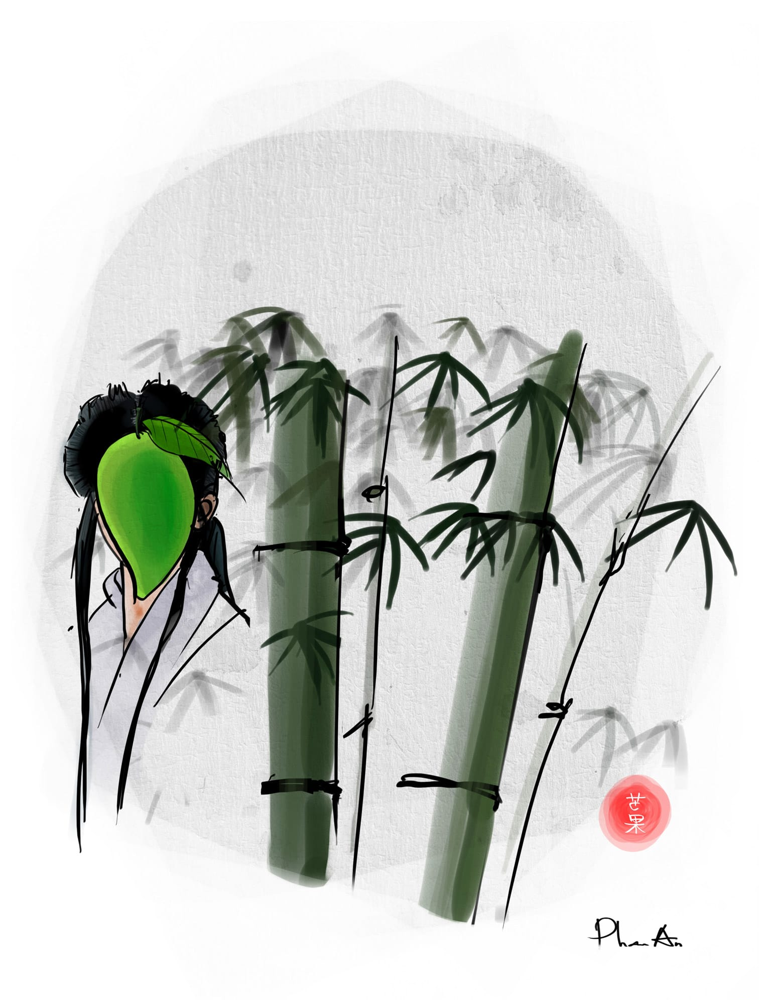

# 610

Ông thầy Trạch chửi tôi không ra gì. Qua đường điện thoại, ổng quăng vào mặt tôi một lô một lốc những dấu chấm hỏi và dấu chấm cảm, lẫn giữa những tiếng chửi thề _bíp bíp_, như sau:

“Rút đếch thế nào cho kịp? Bài vở mà anh làm như bao cao su, muốn rút là rút sao! Chịu! Tôi nói gì anh còn nhớ không? _Bíp_! Tôi đã bảo là kì này đang có động! Làm cái gì cũng phải cẩn thận củi lửa! Trời hanh vật khô! Có cạo cũng phải cạo cho kĩ lưỡng! Cạo kĩ thì các thầy còn tha cho! Cạo như cạo _bíp_ lợn thế à? Chết là phải! Ngu thì chết! Giờ anh khóc lóc cái _bíp_ gì với tôi? Tôi ở đâu à? Vũng Tàu! Đua ngửa, bơi chó! Tức là đua chó, bơi ngửa! Chịu! _Bíp_ còn cách nào đâu! Cái số phần cùi hủi của anh nó đã định như thế rồi!”

Ấy là lúc tôi gọi cho ổng và mếu máo hỏi “Chết em rồi thầy ơi, có cách nào rút bài ra không hả thầy?” Trong lúc chúng tôi còn đang hí hửng đợi điểm vẽ lại của bài đồ án nhà hát thì trường cho dán một tờ giấy trước cửa phòng đào tạo, trên in danh sách hai mươi lăm sinh viên vi phạm quy chế học tập, gian lận trong bài đồ án, đang đợi nhận hình thức kỉ luật thích đáng từ hội đồng giáo viên. Những đứa cũng cạo bài như chúng tôi nhưng không có tên trên cái bảng phong thần này thì hú vía, mừng như cha chết sống lại, thắp hương cúng bái khắp nơi, mặc dù chính chúng nó cũng không biết nhờ đâu mà thoát, chúng nó chỉ cúng phong long thế thôi, thằng thì cúng thổ công, thằng thì cúng Hà Bá, thằng Nguyên lại còn cầu hồn một bà nào đó trong phòng trọ của nó lên để đa tạ, thôi thì nhặng xị cả.

“Vì sao à? Hên xui chứ sao!” Ông thầy Trạch lại quát tướng lên. “Các anh ngu như lợn! Có nghe đến phong trào tìm diệt bao ni lông bao giờ chưa? Rồi à? Ghê nhỉ? Bữa nay có tấn bộ! Thế có biết tên phong trào tiếp theo không? Không chứ gì? Dốt như _bíp_! _Bíp_ bao giờ khá nổi! Nó gọi là phong trào làm trong sạch nền giáo dục! Đấy!” 

A, phong trào làm trong sạch nền giáo dục. Đó là lần đầu tiên tôi nghe thấy tên cái phong trào này. Từ thuở cha sinh mẹ đẻ, do thiếu va chạm xã hội, tôi vốn không có kiến thức gì nhiều về các thể loại phong trào. Cả quãng đời đi học, tôi chỉ tham gia có hai phong trào vỏn vẹn. Đầu tiên là hồi đầu năm lớp bốn, cô giáo bắt chúng tôi “trồng một cây, nuôi một con.” Sau khi hỏi đi hỏi lại cô giáo cho thật chắc về việc người nông dân nên trồng cây gì, nuôi con gì, và được cô trả lời rằng đây là một vấn đề có tầm quan trọng quốc gia, cụ thể là thuộc thẩm quyền của bộ Nông Nghiệp Và Phát Triển Nông Thôn hoặc bộ Lao Động Thương Binh Và Xã Hội, không thể nói vắn tắt trong một sớm một chiều được, thì tôi quyết định trồng rong và nuôi cá bảy màu. Trong bản thu hoạch, tôi ghi rõ “Kính thưa cô! Về cái mặt cá mà nói thì em nuôi một hồ kiếng, đủ cả cá kim, cá beo, cá hổ, cá phướn, cá mắt lồi và các loại cá khác. Còn về cái mặt rong mà nói thì em thả từng chùm, có rong gai, rong xoăn, rong tua, dương xỉ, cỏ dùi, cỏ nghệ và các loại rong khác. Thế và thỉnh thoảng em cũng vớt cá lên đi đấu với mấy thằng trong khu phố và đều giành thắng lợi vẻ vang, chúng nó bảo em là vô đuỵt và nhất nhất phong em làm Hà Lan King tức là vua đá cá” và cô cho tôi hai điểm. Đến học kì hai năm ấy, cô lại bảo chúng tôi nhặt giấy vụn để tham gia phong trào kế hoạch nhỏ, đâu như là “Thiếu nhi lụm giấy xây dựng đất nước.” Lần này đối với tôi không có ấn tượng gì đặc biệt, nhưng đối với thằng Đức bạn tôi thì lại có nhiều kỉ niệm khó quên. Nó là một thằng rất chuyên cần tham gia các phong trào đoàn đội, đến mức chúng tôi gọi nó là thằng Đức yêu đội; nó có chân trong cả ban văn thể mĩ và ban đánh trống ếch của trường. Cái lần nhặt giấy vụn ấy, chẳng những lượm sạch giấy rác quanh nhà mà nó còn lượm cả đống báo sáng của ông nội, lượm chồng hồ sơ của bố vẫn để trên bàn làm việc, rồi tiện tay lột luôn vỏ của mấy chục cây thuốc lá Con Ngựa mẹ nó mới chuyển về từ biên giới hữu nghị Việt Lào, mỗi thứ như vậy là hơn nửa kí lô. Cô khen nó không tiếc lời vì nó đã hoàn thành vượt mức chỉ tiêu đề ra; cô bảo nó cô chỉ cần kế hoạch nhỏ thôi mà em đã làm được kế hoạch lớn, như thế là cô và em cùng dạy học tốt tốt. Năm thì mười họa thằng Đức yêu đội mới được một ai đó khen tới tấp vậy, nên nó khoái chí lắm, nó bắt đầu ca hát khắp nơi, như con chim non. Chỉ có điều, vốn bài hát gốc đầy những hình ảnh tươi tắn như sau:

_Vui tung tăng hớn hở  
Em làm kế hoạch nhỏ_

thì trong cơn sướng khoái trào dâng nó lại rất bất cẩn hát thành:

_Như con ong chăm chỉ  
Em tìm giấy đi ỉa_

Tất nhiên đây là do nó bị ảnh hưởng xấu từ thằng Thu Đạm, cái thằng lúc ấy vẫn hay đi lông bông trong xóm mà hát nhạc chế với đọc vè ông ổng rằng “Hút thuốc bổ phổi, uống rượu bổ gan, ăn cắp nâng cao tay nghề, đánh bạc nâng cao kiến thức, chửi thề làm đẹp câu văn” và “Địt là cái địt trời cho, dù đói dù no cũng phải lo cho cái địt. Địt là cái địt bất thường, dù rớt xuống giường cũng phải trườn lên địt.” Nhưng khốn nạn là thằng Đức yêu đội lại phởn đến mức dám hát cái câu thổ tả ấy lên giữa giàn đồng ca của trường, vào giữa giờ ra chơi, ngay giữa sân trường nắng chang chang, và do hăng say quá mà hát mười lăm phút liền. Cô giáo chúng tôi, mặc dù đánh giá rất cao khả năng lụm giấy dựng xây đất nước của nó, vẫn không hài lòng lắm về bài hát sáng tạo ấy, nên cuối cùng nó phải chuyển sang lớp khác. Nay thì nó thành đạt rồi, nó đăng kí đi thi hát gì đó trên truyền hình, mặt nó rặn đầy đau khổ, và nó được giải; giờ nó không phải là thằng Đức yêu đội hát vớ hát vẩn nữa mà đã thành ca sĩ ngôi sao Đường Đức Cường, có lần nó đứng giữa sân khấu mặc quần tụt lòi xịp thêu bông huệ làm cho nhiều em gái phía dưới ngất ngây, nó lại liệng cái khăn chùi mũi xuống, các ẻm bu vào giành nhau vỡ đầu lõa máu. Mà thôi, nói chung là như thế, ngoài ba cái trò trồng cây lụm giấy hồi tiểu học ấy ra thì coi như tôi mù tịt về các thể loại phong trào, thế còn thằng Đường Đường Cứt ấy có rành rẽ về phong trào hay không thì tôi không được biết.

“À anh không biết? Anh không biết thì để tôi nói cho anh biết! Trước tiên là cái sân ten-nít! Sau đến cái văn phòng phẩm Năm Cư! Nhưng chỉ riêng hai cái ấy thôi thì có thấm béo cái _bíp_ gì? Muốn làm trong sạch nền giáo dục, không phải chỉ đóng cửa cái sân bóng hay sang tên cái cửa hàng bán thước kẻ là đủ! Cả một nền giáo dục cơ mà, chứ có phải trò hề đâu! _Bíp_! Cần những món nặng hơn, có giá trị sử dụng hơn! Đúng lúc ấy thì các anh tự chui đầu vào rọ, còn gì thích bằng! Nguyên một rọ! Tôi đoán các thầy nghĩ thương các anh, nghĩ thiến hết _bíp_ các anh thì cũng tội, nên chỉ thiến _bíp_ vài chục anh cạo dối tiêu biểu! Anh có tên trong danh sách bị thiến _bíp_ tức là anh tiêu biểu lắm đấy!”

Quát xong một tràng như bắn súng máy, ông thầy Trạch cúp điện thoại cái “cụp.” Hôm sau thì hình thức kỉ luật được đưa ra. Lũ chúng tôi bị đình chỉ một học kì. 

Nhưng thậm chí tôi còn không có đủ thời gian để gặm nhấm nỗi đau đình chỉ cho trọn vẹn. Khi đọc được cái thông báo sét đánh ấy, con Hương gà lấy bàn tay khum khum che cái mỏ gà, kêu “ối” một tiếng nho nhỏ, rồi té xuống, nhắm mắt, ngoẹo đầu, sùi bọt mép, duỗi hai chân ra, bất tỉnh. Tôi hoảng quá, quên cả niềm bất hạnh của bản thân, vội vàng xốc nó cõng lên lưng, ba chân bốn cẳng chạy xuống phòng y tế. Vốn tốt bụng và rất biết quan tâm đến bạn bè, thằng Hải Lẹo cũng gạt tình riêng qua một bên mà co cẳng chạy theo, một tay nó giật tóc mai con Hương gà, một tay nó vẫy lia vẫy lịa sang hai bên, cái giọng the thé của nó hét “Tránh ra, cút, cấp cứu đây, ambulance!” Hai thằng tôi dùng dinh chạy tới chạy lui một thôi một hồi mới sực nhớ ra là bao nhiêu năm ở trường chưa bao giờ chúng tôi thấy cái phòng y tế nào cả, và rằng mỗi khi đau bụng chúng tôi chỉ có một cách mặt xanh mày xám mồ hôi chảy lạnh thái dương mà đi xia trực tiếp trong cái nhà xí hôi hám mà thôi. Sau chừng ba chục phút hỏi quanh hỏi quẩn trong cái khuôn viên trường rộng khoảng hai ngàn mét vuông, chúng tôi mò đến được một cái phòng đóng cửa im ỉm, có khóa sắt to như khóa chuồng trâu, lại có dấu niêm phong, trên gắn tấm biển xanh loang lổ sứt sẹo ghi chữ được chữ mất là “Phò g / Te,” phía trước có cái băng ghế đá bên cạnh cái thùng rác lại ghi rằng “Hãy Cho Tôi Rác.”[^1] Tôi hạ tạm con Hương xuống cái ghế đá ấy, đầu nó ngả lên cái thùng rác ấy, rồi bắt đầu cùng Hải Lẹo đập cửa phòng. Khi thể tích bốn bàn tay chúng tôi được nâng lên gấp đôi thì một bà mặc áo xanh lao công bất đồ xuất hiện từ sau góc cầu thang, thần thái ung dung thoát tục, như một ánh chớp hư vô từ cõi xa xăm nào đó. Hai tay bả cầm hai trái xoài xanh tươi rói, trái nào trái nấy to bằng bắp vế, tôi đồ rằng chắc là giống xoài Thái Lan, loại xoài này hạt nhỏ, cùi dày mà giòn, chuyên dùng để ăn sống, gần đây đang được nhập ồ ạt vào Việt Nam ta. Bả nhìn chúng tôi, có vẻ hơi ngạc nhiên, và hỏi: 

“Ăn xoài không?”

Khi chúng tôi nuốt nước bọt mà trả lời rằng không, ở đây đang có bệnh nhân đang hấp hối, thì bả lật đật vén áo lên quá rốn, rút từ đĩa quần ra xâu chìa khóa dễ phải đến trăm chiếc, lựa một chiếc bằng đồng có bám rỉ xanh, nhét vào ổ khóa, hì hục mở cửa, bật đèn, kéo rèm, thổi bụi trên cái bàn gỗ nằm chỏng chơ, đặt hai trái xoài Thái Lan xuống thật ngay ngắn, lại lấy cái chặn giấy chặn cho xoài Thái Lan khỏi lăn, rồi ra hiệu cho chúng tôi khiêng con Hương gà lên giường. Xong bả nhẹ nhàng ngồi xuống ghế, đeo kính vào, điềm tĩnh nói:

“Thôi để chút ăn cũng được.”

Rồi ngừng lại một chút, bả hỏi:

“Bệnh gì?”

“Dạ thưa bất tỉnh nhân sự” Tôi đáp. 

“Triệu chứng thế nào?”

“Dạ ngạc nhiên thay, hoàn toàn không có triệu chứng” Thấy tôi ngơ ngác, Hải Lẹo xon xen trả lời.

“Con gái, thưa cô” Tôi bổ sung, cho chắc.

“Có mắt mũi tay chân miệng. Hai mắt hai mũi. Tức là hai lỗ mũi trong một cái mũi. Lỗ mũi có lông. Lông đen, dài ngắn không đều. Có thể có cứt mũi.” Hải Lẹo tiếp.

“Bạn này bị đau tim từ lâu rồi thưa cô. Cụ thể là từ hồi bị đau tim tới giờ.” Tôi lại cẩn thận đế thêm, hi vọng có thể giúp ích không ít thì nhiều cho quá trình chẩn bệnh. 

Bả cắm cúi ghi những chi tiết ấy vào sổ bằng bàn tay có những ngón múp míp như hột mít, xong nhướng mắt lên nhìn con Hương gà đang nắm nghiền mắt nằm chèo queo, miệng bả mấp máy như muốn hỏi “Bất tỉnh là thế này đây ư?” Vẻ ngạc nhiên chân thành và có lẽ là hoàn toàn chân chính ánh lên trong cặp mắt bả làm tôi bất giác nhớ đến con mụ tư vấn nghề nghiệp béo núc ních mấy năm trước đã khuyên tôi đi làm giàu bằng nghề phá rừng. Nhưng kí ức tươi đẹp ấy kéo dài không lâu, vì bả đã mau chóng cụp mắt xuống. 

“Panadol” Bả nói, rồi với tay cầm xoài Thái Lan.

  

[^1]: Đây là loại thùng rác có hình thù các con súc vật, thường là chim cánh cụt. Con chim (cánh cụt) này hả mỏ ra van xin rác trông thì rất là tội nghiệp, nhưng thật ra nó là một con chim vô cùng lười biếng ỷ lại, rác đầy xung quanh không chịu ăn, cứ đứng xin hoài.
