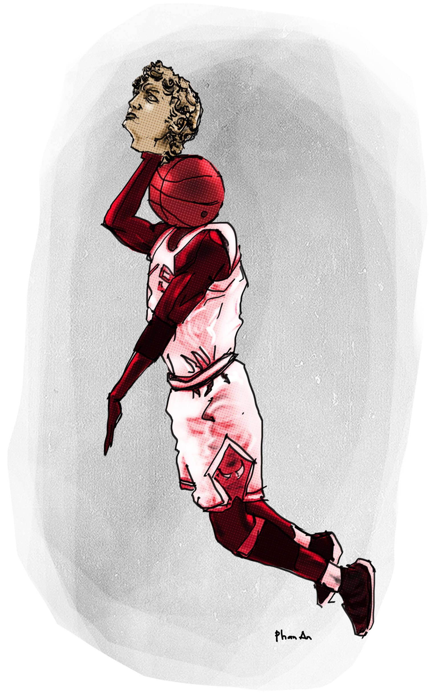

# 8

Trên trần, ở góc tường gần cửa ra vào có một con nhện. Tám cái cẳng của nó dài ngoằng, lông lá, nhìn gớm chết, nhưng nó lại tỏ ra tuyệt đối hiền lành bằng cách nằm hoàn toàn bất động suốt từ đầu buổi đến giờ. Chỉ có lúc lão thầy Hợi vung bàn tay sáu ngón lên đập bàn và khi chuông reng kết thúc câu nói của ông thầy Tôn, nó mới uể oải nhúc nhích đôi chút. Trên lưng nó có một cái đốm màu đỏ rực hình dấu cộng, nhìn giống như cái áo giáp của lính thập tự chinh ở châu Âu hồi thế kỉ mười một. Lúc này thì Quang Tèo và Hải Lẹo đang nháy nhau mà cùng nghiên cứu về loài nhện nói riêng và lớp côn trùng nói chung một cách say sưa, chúng nó lại thì thà thì thào về chuyện phương Tây có Spider Man mà phương Đông lại có Tôn Ngộ Không và bảy con yêu nhền nhện. Còn tôi thì ngồi thừ ra, nhìn ông thầy Tôn bằng một ánh mắt vô thức và suy nghĩ một cách đầy tiếc nuối về cái bài đồ án hoành tráng của mình. 

Thật vậy, thề với tất cả các thể loại trời đánh thánh đâm từng tồn tại trên cõi đời, từ thánh nữ Giăng Đa đến thiện nam Giăng Giắc Rút Xô và bô lão Giăng Van Giăng, thề luôn với bức tượng thằng cha David cởi truồng chim sun đang đứng tự kỉ một mình trong góc cái phòng họp này, bài đồ án đó là bài tôi đầu tư nhiều công sức nhất từ trước đến nay. Thậm chí tôi đã cày cục mượn được của thằng Cường học bên nhạc viện thành phố cái thẻ thư viện mà nó vẫn để lên mốc lên meo trong bóp, đột nhập vào nghiên cứu cả xê-ri sách “Cách phân biệt đờn Xen-lô với đờn Công-tra-bát và danh ca Bằng Kiều đã làm điều đó như thế nào mà cuối cùng anh lại đi uýnh đờn bầu” chỉ để về vẽ cái mặt bằng công trình cho ra hình cây vĩ cầm Stradivarius[^1]. Tôi đặt cái hành lang nằm ngang ngay ngắn ở chỗ ngựa đàn. Tôi cho trồng bốn hàng cây thẳng tắp để tạo hình dây đàn, lại ghi chú tử tế “Đây là cây vân sam, không phải cây vân sam thì làm ơn đừng trồng thầy nhé, vì như thầy biết đấy chỉ có ở Hóc Môn xứ ta người ta mới dám làm vĩ cầm bằng gỗ mít mà thôi.” Tôi đặt bốn cái xí bệt ở hàng chốt đàn bên phải để làm toilet nữ, xong lại sắp xếp tám cái máng tiểu cho nam bên trái, đúng theo quy luật muôn đời là tham nhũng – tất nhiên ý tôi là nam tả nữ hữu. Lại tuân theo phong thủy, hai cái khe chữ S bên thành đàn được tôi cách điệu thành hai cái hồ bơi cong cong, tôi đổ phẩm màu xanh vào cho giống nước cờ-lo, đường đi thì tôi dựng đá tảng, trên mỗi viên đá tảng tôi lại buộc một sợi dây thừng để cho các loại khán thính giả xem biểu diễn nhạc kịch xong thì đeo đá vào chân nhảy xuống bơi luôn. Tóm lại đó là một bài đồ án hoành tráng. Tôi nói thật. Đến như ông thầy Mẫn khi sửa bài cho tôi cũng phải gật gù khen “Được” thì bạn phải hiểu là nó hoành tráng cỡ nào rồi.

Tại vì, nếu bạn mới chân ướt chân ráo từ trên trển xuống và không biết rằng xăng lại mới thò thụt tăng giá lúc nửa đêm hôm qua, thì ông thầy Mẫn chính là một đại yêng hào nhân vật trong cái ngành này. Quả thật, trong cái ngành này không ai là chưa nghe tiếng giảng viên Đặng Mẫn, người Việt Nam duy nhất được giải thiết kế trẻ của châu Á từ những năm một ngàn chín trăm năm mươi trở lại đây. Ổng từng học trường tôi, kì thi đầu vào ổng được hai mươi chín điểm rưỡi vì bị trừ nửa điểm chữ xấu, và ổng giựt cái giải thiết kế trẻ châu Á đó khi ổng còn là sinh viên năm nhất. Nghe nói khi đi nhận giải ở Hàn Quốc thì ổng đi với một ông thầy hướng dẫn, và khi người ta trao giải ổng liền cảm ơn người ta bằng cả tiếng Anh lẫn tiếng Hàn, và ổng nói luôn bằng cả tiếng Anh lẫn tiếng Hàn rằng ổng hi vọng giải thưởng của ổng sẽ làm động lực cho giới trẻ lụn bại hiện vẫn còn đang đập đá ở Việt Nam, tuy nhiên cái bục nhận thưởng này cao quá, như thế là bọn thiết kế sân khấu còn khá cạn suy; trong khi ông thầy hướng dẫn thì giơ hàm răng vẩu bổ vào ống kính máy quay phim mà rằng “Hê lô hi hi, gút gút, thanh kiều vé ri rất nhiều,” chỉ riêng mấy việc ấy thôi cũng đủ cho thấy cái đẳng cấp kinh điển của ổng rồi. Đến lúc ổng bay về, thì ủy ban nhân dân thành phố cử một đoàn cầm bông huệ ra sân bay đón ổng, vẫy cờ Phật Đản búa xua, rồi một mụ phóng viên mới tấn tới dí mi-cờ-rô vào mồm ổng mà hỏi “Chẳng hay em nghĩ gì về sự đón tiếp vĩ mô này?” và ổng trả lời “Thúi.” Tờ tạp chí _Rất Điệp (Và Thật Lan)_ đã chộp ngay lấy câu nói đó, đăng lên trang bìa cùng với hình ổng đang nhìn xa xăm, lại chua thêm vài lời ca ngợi khắm thối phía dưới, bên cạnh mấy mẩu quảng cáo dung dịch vệ sinh phụ nữ, và từ đó đến nay bán được hàng vạn bản mỗi số, giữ vững ngôi vị tạp chí hàng đầu của ngành, đồng thời tăng giá quảng cáo dung dịch vệ sinh phụ nữ lên gấp bốn lần. Ổng học tới năm ba thì được đặc cách học vượt, và tốt nghiệp thủ khoa năm ấy, được học bổng đi Nhật, ngồi uống trà xanh đàm đạo với Tadao Ando. Ổng giỏi bà cố. Khi lên lớp sửa bài lúc nào ổng cũng nồng nặc mùi rượu, nhưng khi ổng nói thì thôi rồi, kiến thức ổng vừa cao rộng vừa thâm sâu, nó tuôn chảy từ miệng ổng như sông Đà vỡ toác đập thủy điện, ổng tìm ra được mối tương quan mĩ thuật giữa tháp Eiffel ở Pháp và thành Himeji ở Nhật mà ổng đặt tên là đỗ tương, ổng kể khi qua Mỹ chỉ tại vì người ta thiết kế cái nhà xí công cộng theo thuyết vị nhân sinh mà ổng đứng đái không tới máng, phải đi tiểu vào cái lỗ hút nước trên sàn, ổng nói “Ghế bành là ba cái đồ tư sản” và “Tụi tôi chỉ khác nhau ở chỗ tôi uống rượu từ trước năm năm mươi tuổi, còn lại thì tôi giống lão ấy toàn bộ.” Nghe ổng giảng sinh viên chúng tôi chỉ còn biết há hốc mồm ra nghe và xuýt xoa “đù, đù, đù hast, đù hast mich,” có thằng hí hoáy chép, thằng nào có laptop thì mở Word ra gõ, những thằng còn lại thì bật máy thu âm chìa về phía ổng càng gần càng tốt, giống như ổng là đức Đạt Lai Lạt Ma đang thuyết giảng cho chúng sinh, hay Osho nói về tự do, hay là một dạng thầy bùa nào đó tương tự. Ổng cạo nhẵn một bên ria mép và một bên lông mày rồi tuyên bố với những tên nhà báo tọc mạch rằng đó là sự giao thoa giữa truyền thống và hiện đại, giữa Á Đông và Tây Âu, nhưng với những ai quen biết thì ổng nói đó là cách ổng để tang mẹ ổng, đến đầu năm nay là đã hai mươi mốt năm rồi. Nhà ổng, ổng tự dựng cột, tự lợp ngói, tự mọi thứ. Ổng thuê xe chở bùn, phân trâu với rơm về để đắp tường, xong cho đào giếng và thiết kế luôn hệ thống pin mặt trời, ổng tự hào không ăn một cắc tiền điện tiền nước nào của chính phủ, ổng nói những tên thu tiền điện tiền nước chỉ còn cách lấm lét nhìn ổng mà mặt đỏ mắt lăm le. Ổng trổ cái cửa chính nhà ổng cao đúng một thước năm mươi bốn phân, vừa vặn một mình ổng đi, đứa nào cao hơn ổng thì hoặc phải cúi lom khom hoặc đập đầu vỡ sọ, mặc kệ. Mà không phải cứ ai muốn vào nhà ổng là vào. Không phải ổng nuôi chó như ông thầy Tôn – ổng không thích chó mèo chim chóc gì hết – mà là do phía trước sân nhà ổng trồng hai hàng cau, chính giữa lát gạch đỏ mỗi viên dài hai mươi phân rộng mười phân, trên đúc chìm hai chữ “ĐM” tức là viết tắt tên ổng. Không bao giờ ổng khóa cổng – làm như ổng đang sống đời Thái Tổ Thái Tông chứ không phải cái đời mét vuông sáu thằng ăn cắp – nhưng khi có người mở cổng thì ổng ở trong nhà dòm ra, nếu thấy chân người ta lỡ bước đè lên chữ “ĐM” thì ổng thẳng cánh đuổi về. Sinh viên chúng tôi đứa nào cũng thích ổng. Nhưng các thầy cô thì không. Ổng như con ễnh ương, người ổng bé choắt nhưng cổ họng ổng to, ổng hay đứng giữa hội đồng chấm thi mà cãi tay đôi với mấy ông thầy khác dù ổng ít tuổi hơn nhiều, một tay ổng đút túi quần, một tay ổng đặt sau đít, và ổng chửi “Ngu như bò!” Ổng khét tiếng vì những chuyện quái dị như vậy, tới mức năm ngoái lão Toàn Tô-nát đã trở thành thần tượng của một đống các ẻm sinh viên năm dưới vì bằng cách nào đó lão đã chui vào được nhà ổng và khi quay về lại cuỗm theo nguyên một cái quạt tai voi hiệu Sanyo và cắm điện vào cho nó quay phành phạch suốt ngày đêm. 

Với tất cả những thứ như thế, chắc bạn cũng thấy là được ông thầy Mẫn khen còn khó hơn lên trời. Từ lúc ổng tốt nghiệp tiến sĩ ở Nhật Bản rồi về trường tôi dạy đến nay, số sinh viên được ổng khen chắc còn ít hơn số gái thất tình treo cổ tự tử và thành ma hứng tình đêm đêm đi lang thang hú khóc liên miên trong kí túc xá. Ổng không bao giờ khen theo kiểu “tốt, giỏi, tuyệt, hay, tôi thích anh chị rồi đó hô hô hô” rồi vỗ đùi bành bạch như những mụ nái xề đạo đức giả. Ổng chỉ nói “Được!” Một cách vô cùng tiết kiệm. Suốt mấy năm học ở trường, tôi chỉ mới tận mắt chứng kiến ổng “Được” với sinh viên có đúng một lần. Đó là cái lần thằng Tuấn mập vẽ bài nhà thi đấu thể thao. Ban đầu nó định vẽ nhà thi đấu bóng rổ, cũng giống như tất cả những thằng khác, đứa thì bóng chuyền, đứa thì bóng đá, đứa sân quần vợt, đứa hồ bơi. Nó biết chơi bóng rổ lõm bõm nhờ ngày xưa được bố mẹ dắt đi học cho ốm bớt, vì hồi lớp sáu nó cân nặng bảy mươi ki lô. Tất nhiên lên lớp bảy nó nặng tám mươi kí, và lên đại học nó tròn một tạ tây, mặt phính như mặt con lợn, nhưng mỗi khi đi học thể dục nó vẫn ra cái điều vận động viên chuyên nghiệp mà bô bô với tụi tôi về luật ba bước, cú úp rổ cối xay gió, cú vòng cầu, cú cao bồi, cú vác cày qua núi, và những cách tính điểm huyền bí, đâu như là bạn phải đứng xa liệng banh vào rổ, liệng càng xa bạn càng được nhiều điểm, và kỉ lục liệng thuộc về một tên da đen nhìn rất gớm tên là Michael Angelo Hô-xê. Nó nói để lập được kỉ lục đó, vào năm một ngàn chín trăm chín mươi ba hắn đã phải chạy ra tới tận đường cái rồi quay mông về phía sân bóng, nhắm mắt liệng banh qua bức tường mà vào rổ, được ngay bốn mươi mốt điểm, trở thành huyền thoại của giải nhà nghề NBA. Chúng tôi bán tín bán nghi vì Tuấn mập chưa hề nổi tiếng về sự trung thực phi thường, giống như anh công an giao thông nào đó nhặt được cái bóp tiền đem trả cho người ta mà được quay phim đăng báo ầm ĩ, nhưng miễn cưỡng mà nói thì nó cũng có đủ kiến thức để thiết kế một cái nhà thi đấu bóng rổ. Cho nên cái lần thiết kế đồ án nhà thi đấu tự chọn ấy, nó quyết định làm một phát. Buổi lên bài mọi việc diễn ra êm xuôi, cho đến khi nó tuột dây cây thước T, và thay vì kẻ đường ngang, cây marker của nó kẻ nguyên một đường chéo đậm đen cắt đôi tờ A1[^2], thành ra cái mặt bằng nhà thi đấu của nó đang hình chữ nhật trở thành một cái hình tam giác nhọn hoắt. Đúng lúc đó thì ông thầy Mẫn đi qua, một tay ổng để sau đít, một tay ổng đút túi quần. Nhìn thấy cái bài kì  dị của thằng mập, ổng nhướng bên mắt không có lông mày lên hồi lâu, rồi hỏi:

“Cậu vẽ cái gì đây?”

“Dạ nhà thi đấu... rất đấu...” Tuấn mập lắp bắp, mồ hôi chảy đầy trán. Như tất cả những thằng mập khác, nó rất nhát gan và dễ xúc động, mà ông thầy Mẫn lại nói giọng ồm ồm, hình dung kì dị, và khi chăm chú làm cái gì thì mặt ổng nhìn rất ngầu, mặc dù khi nói chuyện với nó thì ổng phải ngước lên tới mức xém rớt mũ. Cũng phải nói thêm là ổng luôn luôn đội một cái mũ bê-rê màu đen. Lí do ổng đưa ra là tại vì trên đời có quá nhiều thằng vừa ngu si dốt nát vừa hãnh tiến vô đạo, tới mức việc phải đội chung trời với chúng nó đối với ổng là cả một nỗi niềm nhục nhã.

“Nhà thi đấu gì mà kì ôn vậy? Đấu kiếm à?” Ổng trợn mắt nhìn nó, bên con mắt có lông mày của ổng giật giật. 

“Dạ đấu... đấu kiếm... rất kiếm...” Không còn đầu óc đâu để suy nghĩ nữa, Tuấn mập nhắm mắt lại, thều thào đáp bừa. 

Thế là ổng dùng tay vê vê một bên ria mép còn sót lại, tay kia vẫn để điềm nhiên sau đít. Hồi sau ổng nói:

“Được!”

Rồi ổng quay đít ổng đi, để lại thằng Tuấn mập với cái mồm há hốc. Nó ngạc nhiên cũng phải, vì trước nay khi nó vẽ bài thì mấy ông thầy chỉ chăm chăm hỏi mấy câu bới móc dạng như “Tại sao mấy con chim Lạc của em lại bay theo chiều kim đồng hồ?” rồi ông thầy Hợi lại chen ngang vào đại để “Hí hí nó làm gì có con chim nào lạc.” Hai tiếng đồng hồ sau, sau khi quá trình định thần hoàn tất, nó lao vào múa cọ tít mù và sửa cái bài thành “Nhà thi đấu kiếm thuật” phía góc nó lại ghi “Bản tặng thầy Đặng Mẫn rất sáng suốt,” xong nó lấy củ khoai lang khắc tên Tuấn Mập làm triện, ịn dấu đỏ vào. Khi bài nó được dựng lên chấm, ông thầy Mẫn đã tả xung hữu đột giữ vòng vây các giảng viên khác, giống như đó là bài của chính ổng chứ không phải bài của thằng Tuấn mặt lợn, ổng nói đây mới là phá cách, là hiện đại, và nhiệm vụ của chúng ta phải khơi nguồn sáng tạo cho bọn sinh viên, ổng nói đứa nào vì cái đầu hủ lậu mà bóp chết sức sáng tạo của mấy thằng sinh viên là đứa đó ngu như bò. Con mắt có lông mày của ổng giật giật, và ổng quát thêm mấy câu sau đây: “Các thầy phải nhớ cho kĩ, tôi với các thầy rồi cũng sẽ chết ngỏm cù đeo hết ráo, các thầy tưởng mình là thánh thật sao mà đòi bất tử, làm người thôi đã khó bỏ mẹ rồi. Cho nên tương lai của cái ngành này thì phụ thuộc cả vào chúng nó. Ví dụ các thầy có lỡ ngu không đi chung được thì dạt ra cho chúng nó đi, đừng đứng đó cản đường! Còn cái con dấu bằng củ khoai lang thì kệ mẹ tụi nó chứ, công sức tụi nó vẽ cái bài ra, tụi nó muốn đắp khoai lang khoai từ gì chẳng được!” Ổng gạt ông thầy Bành văng ra một bên, ghi con số chín vào bài, và kí hai chữ “ĐM.” Tuấn mập đứng bên ngoài cửa kính nhìn cái cảnh sấm sét trời long đất lở đó mà nước mắt nước mũi ròng ròng, tay nó bấu tường tróc cả vữa. Tối hôm ấy không biết nó kiếm đâu ra bức hình của ổng, cái bức ổng miệng nói “Thúi” mắt nhìn xa xăm trên tờ _Rất Điệp (Và Thật Lan)_, và nó chong đèn lên vẽ một bức truyền thần dách lầu, xong nó lộng kiếng để đầu giường, lâu lâu nó lại mua nước javel rửa kiếng về lau chùi cẩn thận. Phiền một nỗi nó lại góp gạo thổi cơm chung với một con bé học bên Kinh tế, mà con này lại trái tính trái nết, có lần phát ghen lồng ghen lộn lên, rồi lại hô hoán rằng “Anh pê-đê à? Anh biến thái sao?” Thế là để mọi chuyện êm thấm, sau mấy lần giải thích vô vọng, Tuấn mập bèn giọt cho mấy cái tát thật sự nghiêm túc, đẩy con bồ mặt mày sưng vù ra đường, vứt theo cái va-li quần áo, khóa trái cửa lại và bắt đầu ở vậy mình ên. 

Đó, đó là cái lần duy nhất tôi tận mắt thấy ông thầy Mẫn nói “Được” với một thằng sinh viên. Tôi cũng có nghe ổng “Được” vài phát nữa, nhưng chỉ nghe thôi chứ không được chứng kiến thực mục. Ví dụ ổng “Được” khi chấm bài tốt nghiệp của một lão năm trên – lão này quê ở Tiền Giang, khi bạn bè lão thiết kế ủy ban nhân dân huyện thì lão vẽ nguyên một cái chòi nuôi rắn. Ổng lại “Được” thêm một cái nữa với cái mô hình bệnh viện lạ đời của một con bé sinh viên lớp dưới. Mẹ của con bé này bị ung thư gan kì cuối, nhưng nhà nó không có tiền nên cứ phải chạy vạy mấy bài thuốc Nam của mấy tay lang băm. Bả đã uống bất cứ thứ gì có thể sắc ra uống được, bao gồm cả cỏ gà, vỏ cây ổi, rễ dừa nước, lá đu đủ, giun đất phơi khô cắt làm đôi vân vân, và khi chuyển vào bịnh viên ung bướu thì bụng bả đã trương phình như cái trống. Cứ chiếu theo mức tiền đóng viện phí, người ta xếp cho bả nằm dưới gầm cầu thang đầy cứt gián, trên một cái chiếu rách teng beng, cùng với một đám chuột chạy xung quanh cả đêm lẫn ngày. Những tối bả đau quá không ngủ được, người ta hay thấy con bé thân hình cỏm nhỏm còm nhom cõng mẹ nó đi loạng choạng, vòng hết cái khuôn viên bệnh viện tối lờ mờ lại trèo lên trèo xuống mấy cái cầu thang, vừa đi nó vừa khe khẽ hát cho mẹ nó nghe mấy bài hát ru đến khuya lơ khuya lắc. Được mấy hôm thì bả nắm tay nó, trợn trắng mắt lên, duỗi chân ra, thở hắt một cái, và chết ngay trên cái chiếu rách ấy, giữa mấy con chuột vẫn đang chạy lui chạy tới. Con bé đưa mẹ về chôn bên cạnh nhà rồi toan bỏ học luôn, nhưng ông thầy Mẫn đã chạy xe máy xuống tới nhà nó ở Vĩnh Long để biểu nó đi học lại, ổng đài thọ tiền học phí cho cả nó và thằng em nó mới học tới lớp chín. Bọn năm dưới đồn rằng khi ổng đứng trước cái mô hình bệnh viện có thiết kế giường tầng kết hợp với gầm cầu thang thì ổng khóc. Ổng cứ đứng đó, bàn tay trái nắm lại nổi gân xanh lè, bàn tay phải vò cái mũ bê-rê mà đây là lần đầu tiên chúng nó thấy ổng lột khỏi đầu, và từ hai con mắt đỏ ngầu của ổng, hai dòng nước đục lờ chảy ra. Đó là tôi nghe nói vậy thôi, chẳng biết hư thực thế nào. Nói gì thì nói, cái bộ mặt dị dạng của ổng mà khóc thì chắc là buồn cười phải biết. Thế và cũng nói thêm, con bé mất mẹ ấy thì giờ ở Mỹ rồi, người Mỹ người ta cho nó cái học bổng gì đó tôi không rõ. Năm ngoái nó có lên báo, trong loạt bài gì mà “Những tài năng Việt Nam tỏa sáng chói lọi ở xứ người.” Nhà báo nói nhờ được đào tạo tại một ngôi trường danh tiếng như trường tôi mà nay nó giật được giải thưởng thiết kế quốc tế, nhà báo lại cho biết thêm rằng tuổi thơ nó rất bất hạnh, mẹ nó mất sớm cho dù đã được các y bác sĩ tận tình cứu chữa. Trên báo nó cũng nhìn xa xăm, y như ông thầy Mẫn vậy, miệng nó cũng chu lại như khi ổng nói chữ “Thúi” vậy, và báo lại ghi một dòng chữ rất to rằng “Còn bạn, vâng, chính bạn, bạn đã làm gì cho Tổ Quốc hôm nay?” vâng, thật là một bài báo rất hay. 

Cho nên, cái chữ “được” hiếm hoi phát ra từ miệng ông thầy Mẫn khi ổng gật gù nhìn cái mặt bằng nhà hát hình cây đàn Stradivarius làm tôi sướng rêm. Những ngày lên bài, tôi vừa vẽ vừa hát “Tiếng đàn bầu của ta, cung thương là tiếng mẹ, cung trầm là giọng cha í ơ,” điếu thuốc vắt vẻo nơi miệng, tôi gằn giọng lại rung thanh quản như danh ca Trọng Tấn, rất là ngầu cồi. Bọn Hải Lẹo Quang Tèo cũng lâu lâu tạt qua khen “Ghê nha ghê nha,” giống như những thằng bạn nối khố mà ai trên đời cũng có ít nhất một lần, nhưng tôi biết tỏng là lũ chúng nó chỉ đợi bài tôi được điểm cao để làm cớ bắt tôi mua bia về chiêu đãi. Chúng nó thừa biết một khi ông thầy Mẫn đã khen thì ổng sẽ giành chấm, mà một khi đã giành chấm rồi thì ổng sẽ bảo vệ bài tôi như đã từng bảo vệ cái nhà thi đấu kiếm thuật của thằng Tuấn mập, và ổng sẽ cho điểm không tiếc tay. Tôi đã nhẩm tính, Hải Lẹo là cái thằng cùi bắp, chừng vài ba chai bia là lăn quay, Quang Tèo cao đô hơn, được năm chai, cộng với hai chai tôi uống nhín theo phương pháp tiết kiệm của Đảng và Nhà nước là mười chẵn, thêm cơm cháy với xoài xanh các thứ, không quá trăm rưỡi ngàn. Trăm rưỡi ngàn thì tôi liệu chừng có thể đương cự được. Tôi chỉ sợ ông thầy Mẫn lăn ra ốm thôi. 

Mà hóa ra tôi lo hão. Cuối cùng thì ổng không ốm không đau gì sất. 

  

[^1]: Đàn Stradivarius là một loại đờn vĩ cầm nổi tiếng do dòng họ Stradivari chế tạo. Nghe nói âm thanh của nó rất hay, nhưng cụ thể hay như thế nào thì tôi không biết, vì tất cả những kiến thức âm nhạc tôi được học hồi Trung học cơ sở còn không đủ để tôi phân biệt được tiếng vĩ cầm với tiếng đờn nhị nữa.
[^2]: Khổ giấy A1 có kích thước là 594x841mm, dùng cho những bài đồ án cỡ trung bình vào năm 3 hoặc cuối năm 2. Năm 1 thì chủ yếu dùng A3 và A2, còn từ năm 4 trở đi thì dùng A0. Bài tốt nghiệp thì dùng mười sáu tờ A0 một lúc.
